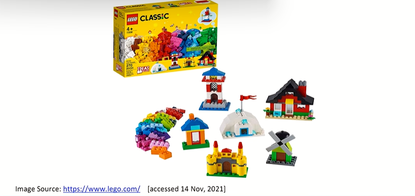
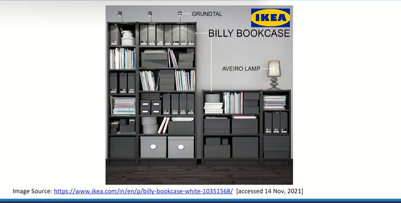
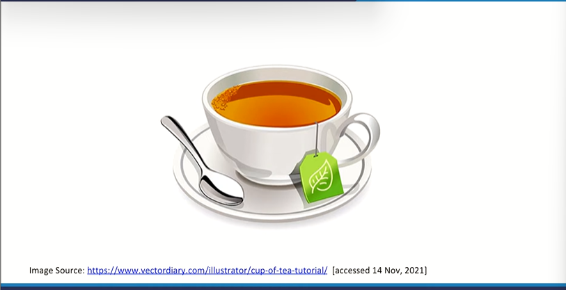
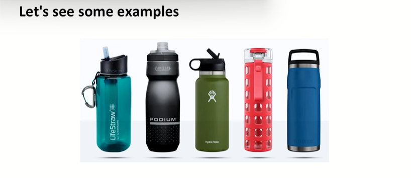
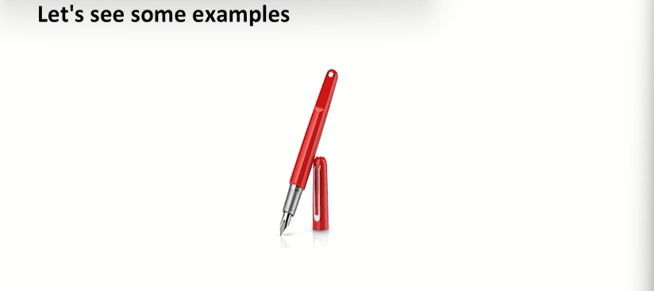
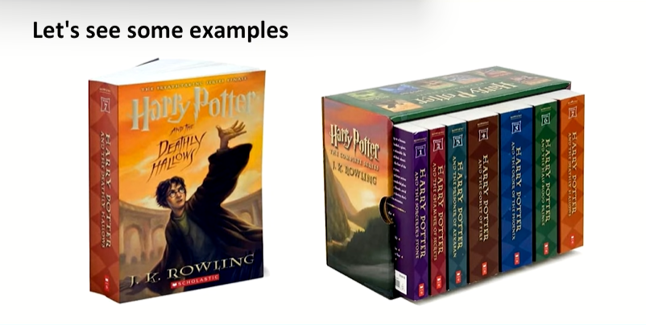
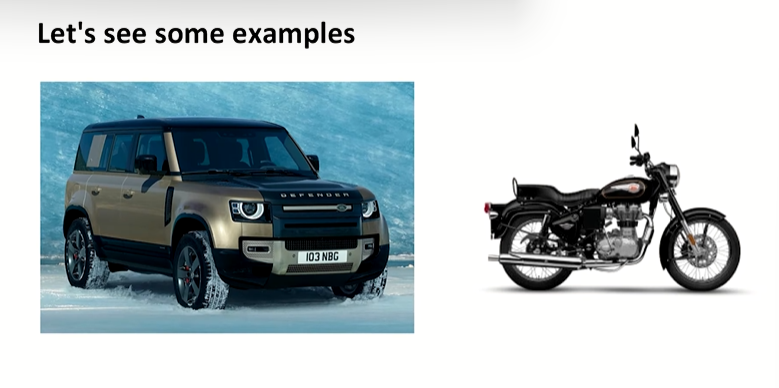

# Defining Product

* "A man is but the product of his thoughts. What he thinks, He becomes"
  * A product probably is the reflection of a man's thought or a human's thought, that human can be seen as the creator of that product or the originator of that product
* The product can be seen with the prespective of reflection of it's customers as well
  * How customer wants to look at the products?
* "The end-product of education should be a free creative man, who can battle against historical circumstances and adversities of nature" ~ Dr Sarvepalli Radhakrishnan
  * intellect, personality, persona
  * professional capabilities
  * Education institution - A raw student seeking information knowledge capability comes and then whole of the system supports that student to become a professionally capable individual
  * to develop professional capabilites of student which can be utilized for further development and other forms of contributions for several organizations or economies at large
  * Look at yourself as a resource which would be contributing somewhere and so on.

Example 1 -

> Is barbie actually only a toy? or is shea a part of a young girl , mind and personality?

Example 2 - House

Example 3 - 

Example 4 - IKEA furniture - Billy Bookcase

> It becomes a part of life and after sometime we stop noticing that. But if you eliminate that product from that particular space which it has occupied for quite some-time , that what happens? would you feel the vacuum? that is where it becomes part of your life

Example 5 - Tea

> when you feel like I am unable to think further, you go to your kitchen, you start preparing your favorite tea, and when you start pouring that and you know the aroma comes in and at that particular moment you feel like talking to your tea and you know how much to pour in.

> Gifting your pen to your friend or colleague is a very respectable thing. I feel utmost respect for you and I am giving you one of my most important things basically

> JK Rowling has taken you through so many things. Sometimes books are just being products but are so important that you keep those books for life with you.

