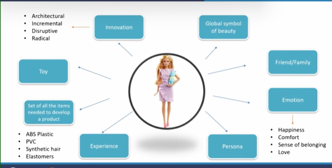

# Defining Product

* "A man is but the product of his thoughts. What he thinks, He becomes"
  * A product probably is the reflection of a man's thought or a human's thought, that human can be seen as the creator of that product or the originator of that product
* The product can be seen with the prespective of reflection of it's customers as well
  * How customer wants to look at the products?
* "The end-product of education should be a free creative man, who can battle against historical circumstances and adversities of nature" ~ Dr Sarvepalli Radhakrishnan
  * intellect, personality, persona
  * professional capabilities
  * Education institution - A raw student seeking information knowledge capability comes and then whole of the system supports that student to become a professionally capable individual
  * to develop professional capabilites of student which can be utilized for further development and other forms of contributions for several organizations or economies at large
  * Look at yourself as a resource which would be contributing somewhere and so on.

