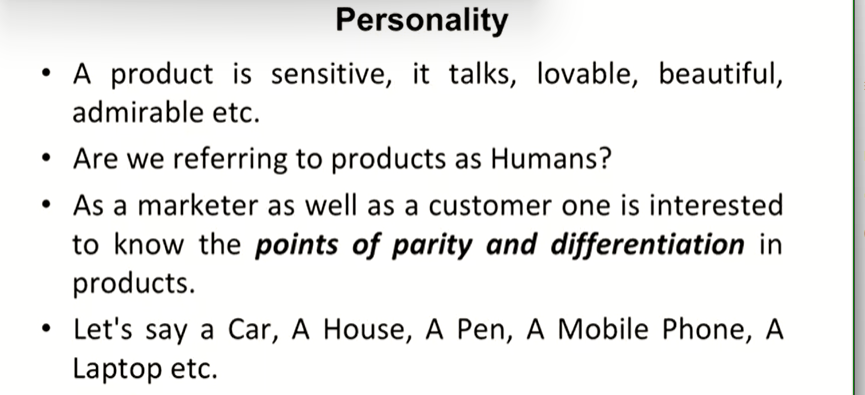
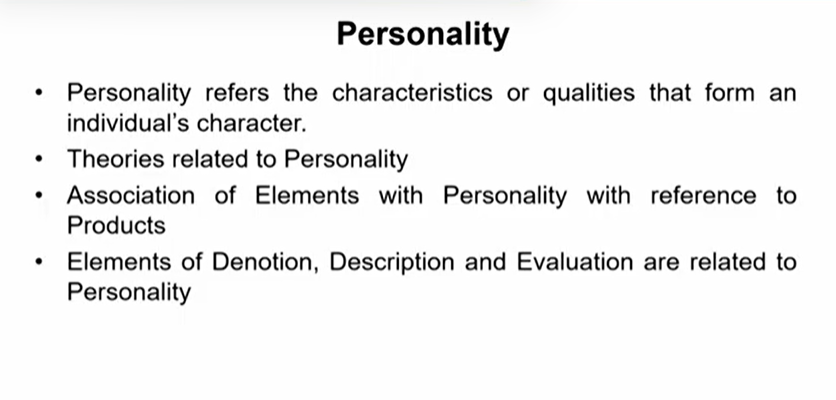
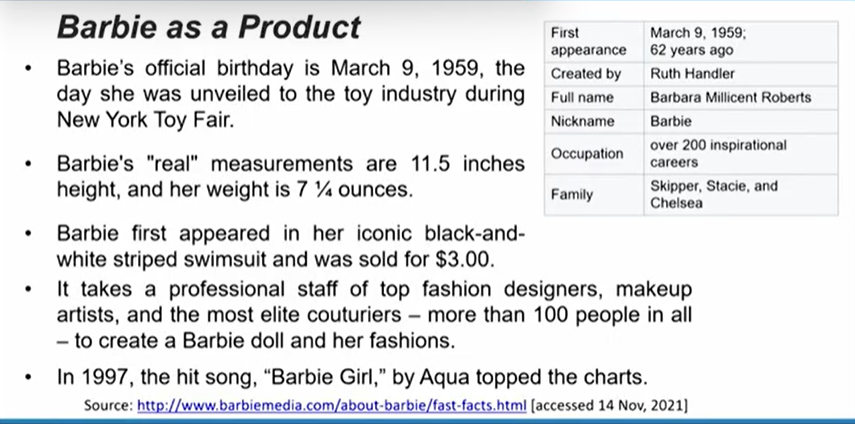
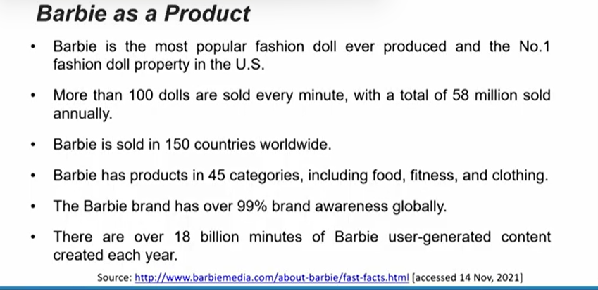
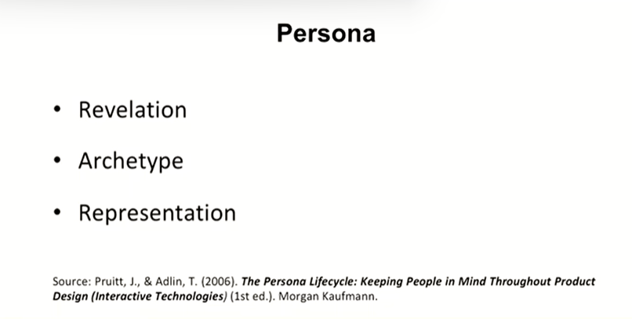
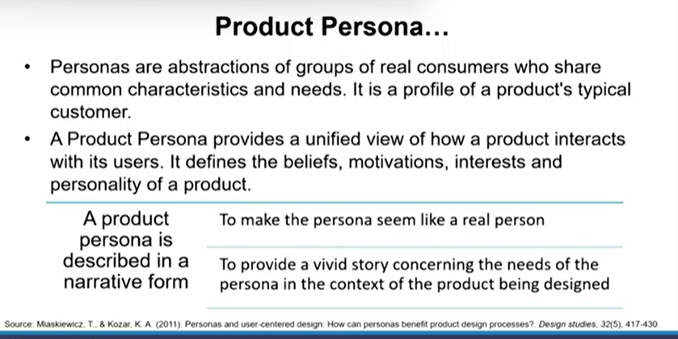
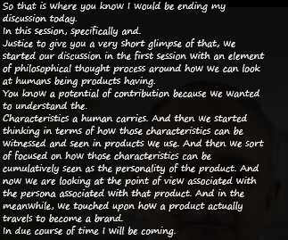

# Lecture 02 : Defining Product

Example - House

> How special a house is for an individual who would have constructed it by himself, definitely with the help of so many people

> People get very different kinds of houses constructed for themselves wherein every house is the reflection of the thought process of the owner as well as the architect

Example - Pillow

Example - Jacket, Sneakers, burger , donut

* **Product Defintion**

* **How a product becomes a brand?**

* Example - 
*  Despite of the fact that some products are generic they are known by people in their own language, but still that particular connotation becomes a brand in itself.
*  For example - a professor who teaches local students is locally so well known, that students always attend their classes to for example - pass a competitive examination

* Search engine becomes google
* A mobile phone when becomes an apple
* Ultimately every marketer has a dream of taking his or her product to become a brand an intense part of people's lives

> Book - Strategic brand management - By Kevin Lynn keller

> An element of personality is associated with all those examples

> For example we talk about some products with the perspective of being lovable, sometime beautiful or call them admirable
> > This book is so admirable

* You see that expression about a product is related to that product possessing a personality carrying a personality

> How many times do you let someone else touch your mobile phone?  
> Your laptop - it is associated with all your collections of documents, passwords, your site linkages. your habits can be expressed by your mobile phone and your laptop. That is how profiling of customers is being done nowdays

## Persona

> Persona is related to represenation, basically how you want yourself to be expressed and seen
> How marketers look at their customers, how they want to be seen and then those marketers put up the products to resonate with that thought process of the customer so that products reflects on the thought of the customer as the customer's thought would reflect on the product actually and that is where you know we are referring to this understanding of persona

e.g. Amul butter

> That is why I have tried to elaborate this thing in front of you so that now onwards whenever you look at a product you have the elements of characteristics of that product in terms of personality of that product and persona as your own reflection  
> you know that is what you want to see in that product you persona reflected by that product  
> Basically the picture which directs your thought towards the point that this product is not just something to be used. This is something part of my life  

