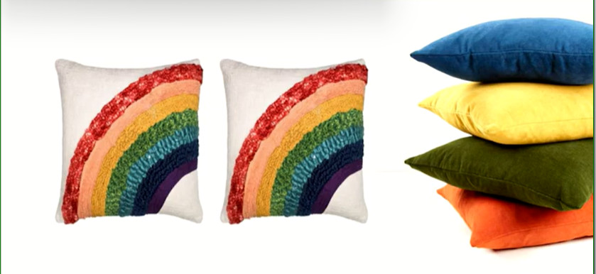
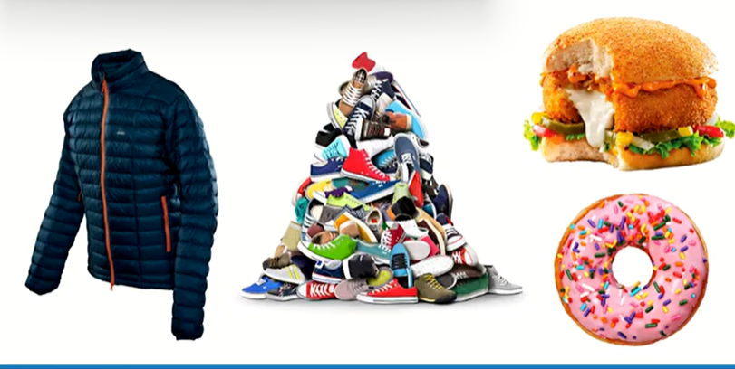
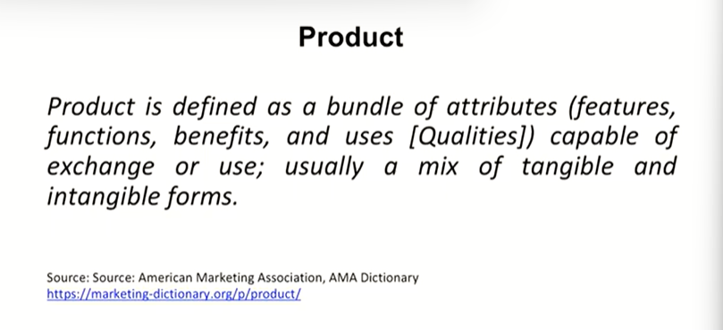
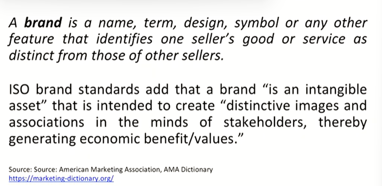
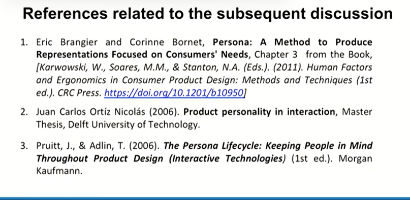

# Lecture 02 : Defining Product

Example - House

> How special a house is for an individual who would have constructed it by himself, definitely with the help of so many people

> People get very different kinds of houses constructed for themselves wherein every house is the reflection of the thought process of the owner as well as the architect

Example - Pillow

Example - Jacket, Sneakers, burger , donut

* **Product Defintion**

* **How a product becomes a brand?**

* Example - 
*  Despite of the fact that some products are generic they are known by people in their own language, but still that particular connotation becomes a brand in itself.
*  For example - a professor who teaches local students is locally so well known, that students always attend their classes to for example - pass a competitive examination

* Search engine becomes google
* A mobile phone when becomes an apple
* Ultimately every marketer has a dream of taking his or her product to become a brand an intense part of people's lives

