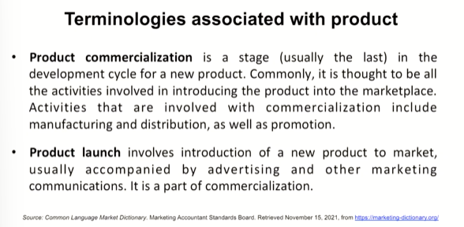
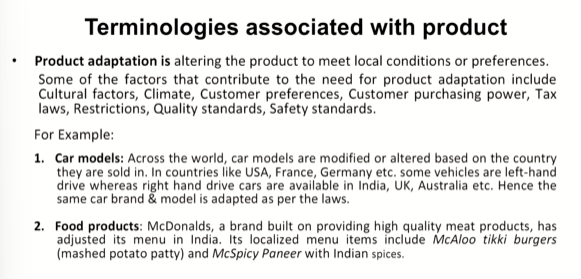
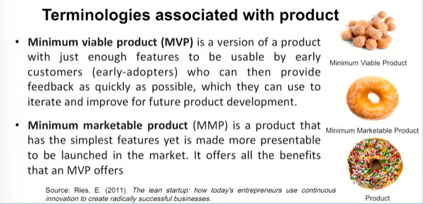
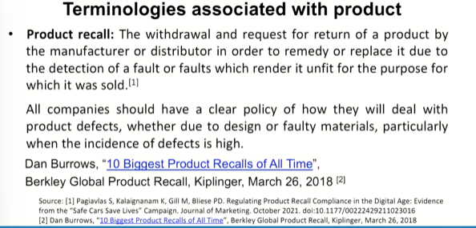
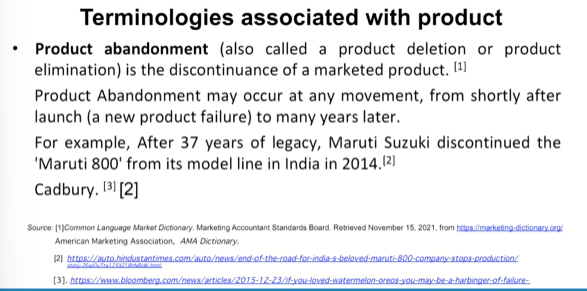
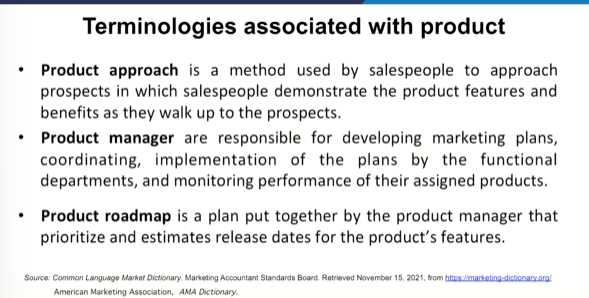
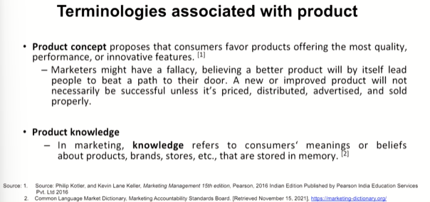
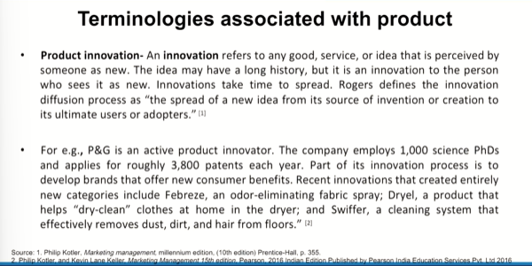

# Lecture 06: Terminologies Associated with Product - 4
* Product actually has an intense association with problem solution. But the point is that are we able to conceive a problem

e.g. Launch of an automotive or new model of a car

## Product Adaptation

## MVP and MMP

## Product Abandoment

> If you take my advice call it product exit
> I would refrain from calling it a product failure, a failure per say.
> Reason - We could not assess the core need of the customer rightly, we could not put in you know a match between the need and the product itself and so on.

## Product Approach

> Product Manager - One of the most important aspects because these are the people who actually drive all these things. They are at the hub of , they are the center of the situation you see. You are the person who understands everything related to product, who understands all the terms, who understands everything in detail, what is going on around.

## Product Concept

> Product must match the consumers thought. Product must carry the reflection of what consumer expects in the product.

> Developing a product should be a culmination wherein it becomes the part of the life of a consumer actually

## Product Innovation

