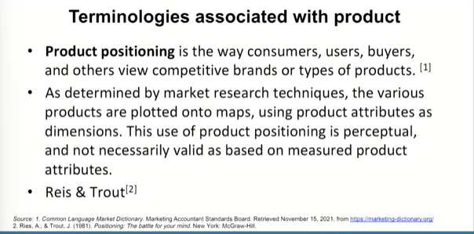
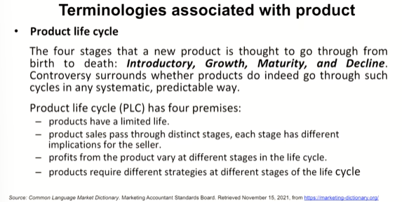
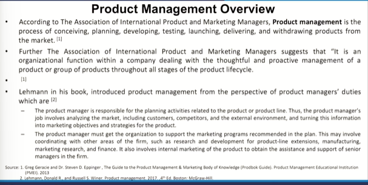
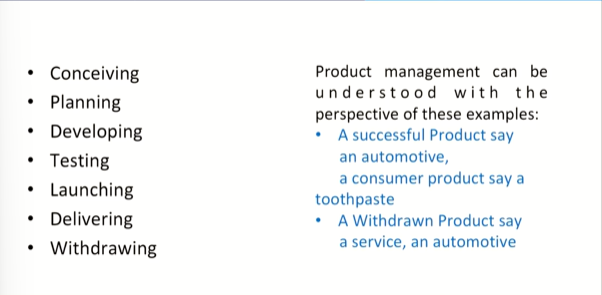
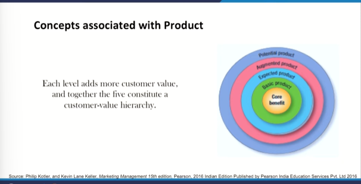
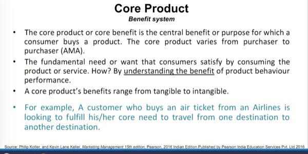
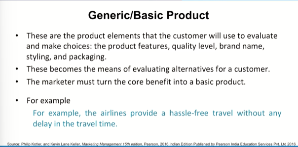
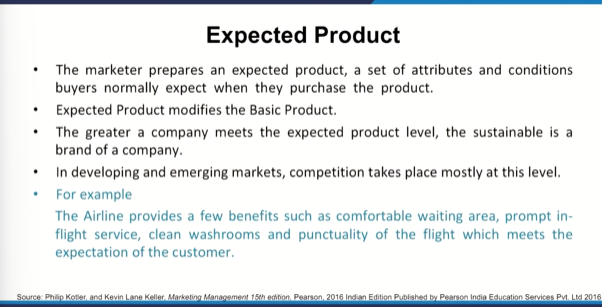
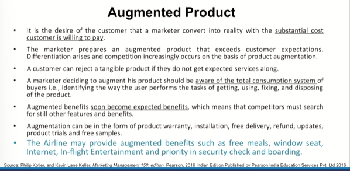
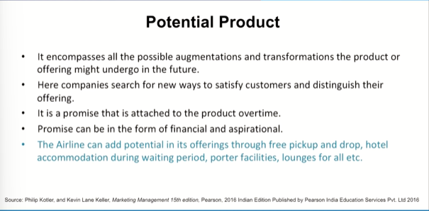

# Lecture 07: Product Management & Concepts Associated with Product

## Product Positioning

* How a consumer actually conceives a product and when you are conceiving a product that means putting up the image in the minds of the consumers you know, positioning a product.

Creating an image in the minds of the consumers and that image
can connote with a name symbol, a product itself or or let us say
generic name also.  
For example, **when you say a pair of genes**, now
a particular name and a brand may come to your mind that is
where you know that brand might enjoy a particular positioning in
resonance with the product generic product itself.
For example, **one says calcium** and one particular brand of calcium
comes to your mind.  
**One says protein supplement** and one particular brand comes to
you and   
**one says tea**, a particular brand comes to you and that is
where you know positioning comes in.

* When someone says burger, what comes to your mind?
* When someone says Mcdonald's what comes to your mind?
* When someone says school, a teacher comes to your mind? school comes to your mind? playground?
* When someone says IIT. Technology comes to your mind?

## Product Life Cycle

* Can you remember those products which vanished for a while, they came back and they look like as if they are in newer form. If you have definitely they have rejuvenated those products

## Product Management Overview

e.g. Dantkanti came into being and actually overwhelmed the market

## Concepts associated with Product

## > Core Product

## >> Generic or Basic Product

## >>> Expected Product

## >>>> Augumented Product

## >>>>> Potential Product

* **What is the desire of a product manager about his products?**
  * Large number of people use my product
  * Taking it higher and higher in terms of perceived quality, satisfaction, loyality
    * Base model of a product, next stage of that and another premium model of the product