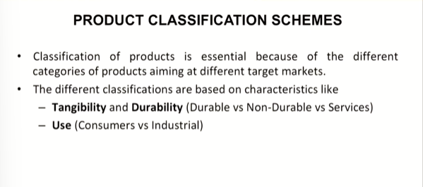
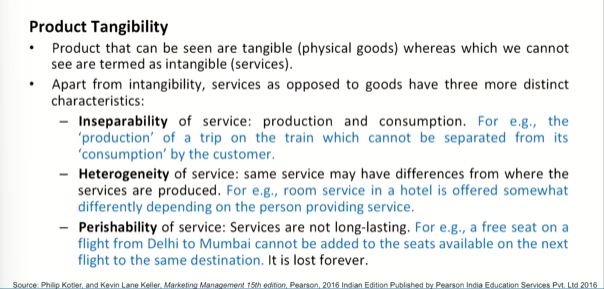
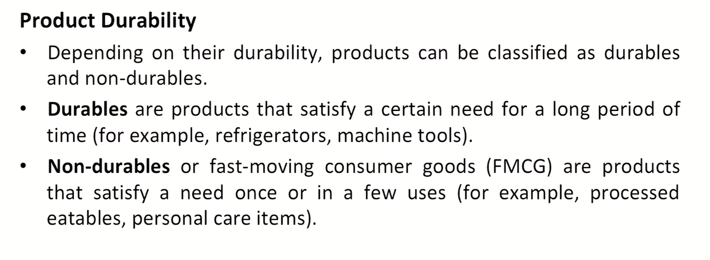
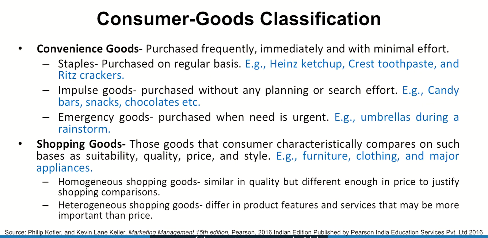

# Lecture 08: Product Classification

> This is probably the last session on the sequence of terminologies and classifications and concepts

## Product Classification Schemes

## Product Tangibility

## Product Durability

## Consumer-Goods Classification

