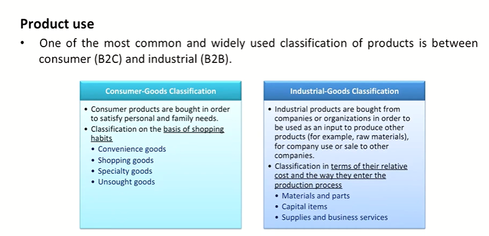
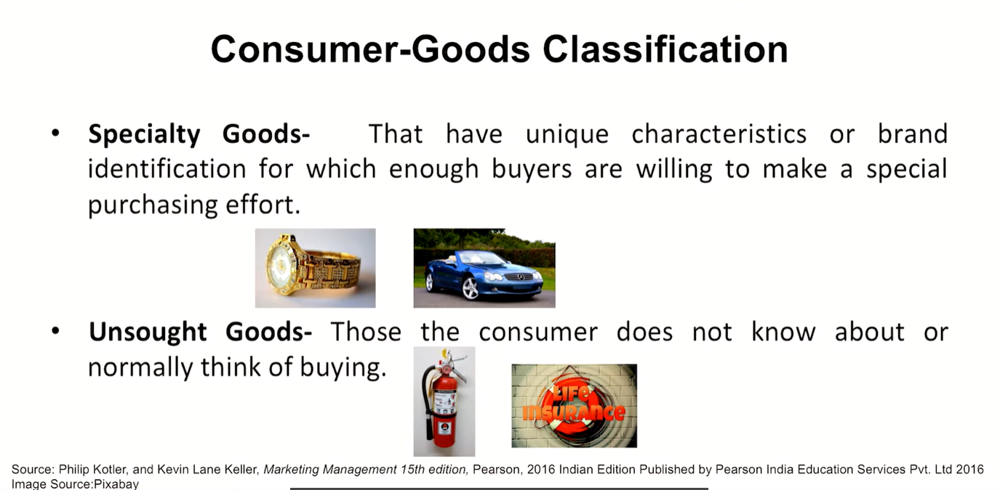
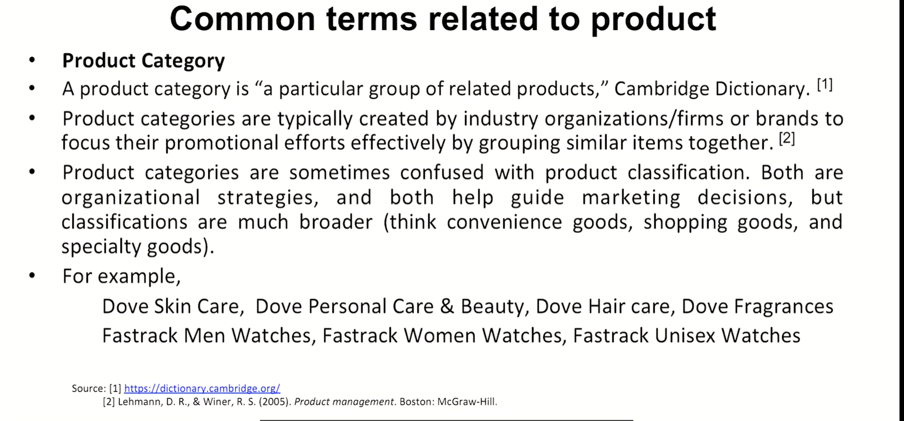
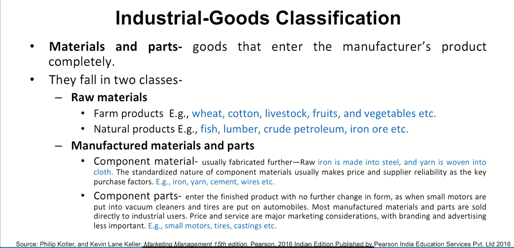
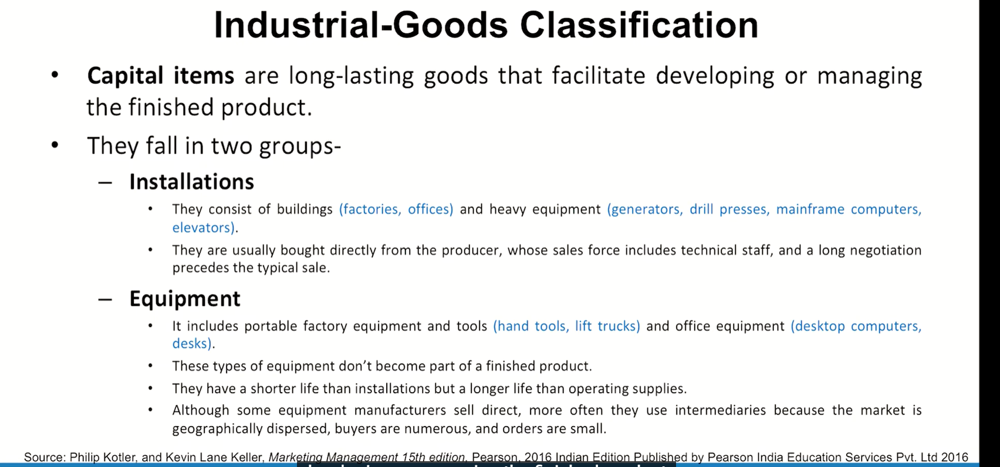
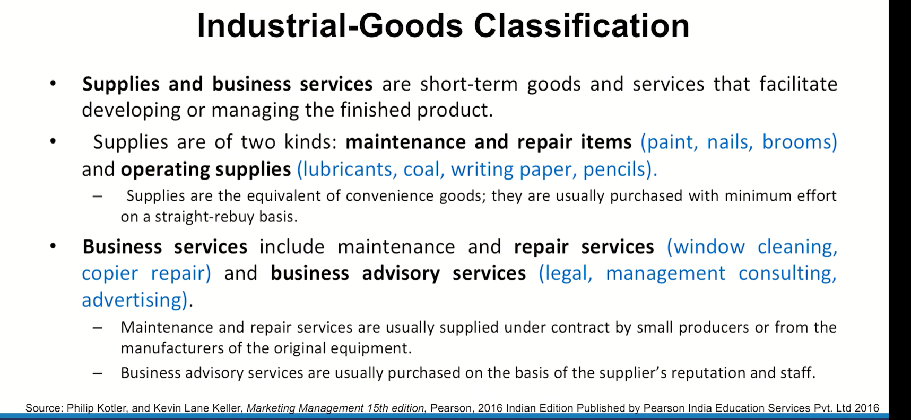

# Lecture 08: Product Classification

> This is probably the last session on the sequence of terminologies and classifications and concepts

## Product Classification Schemes

## Product Tangibility

## Product Durability

## Consumer-Goods Classification

## Product Use

## Consumer Goods Classification

## Common terms related to product

## Industrial-Goods Classification

# Product
* Product acceptance
* Product strategy and Planning
* Product Management

> I will now be initiating a discussion in my subsequent sessions on product management at the core