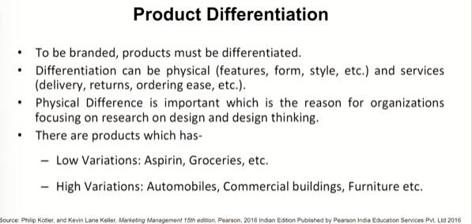
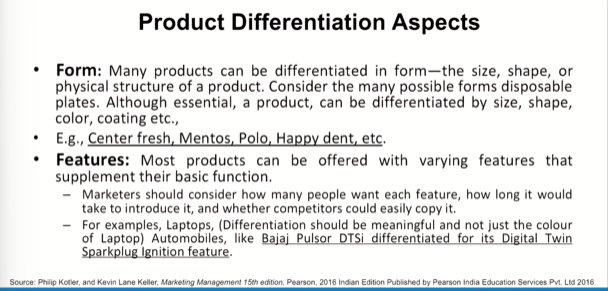
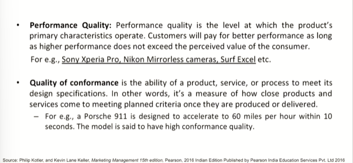
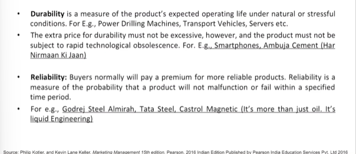
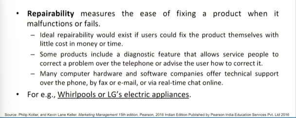

# Lecture 09: Product Differentiation and its Elements - 1

> Uptill now we have tried to build up our conceptual understanding through terminologies, product related concepts, philosophical perspective.  
> And I feel that you are aware of the fundamentals which would come up in due course of time in most of our discussions starting from today.
> Fro today onwards we will be talking about the stragetic and management perspective of the product and later on product being a brand and branding  

> It will become more interesting and interesting in due course of time wherein it will create a picture in your mind wherein you would be observing everything around yourself with the perspective of product and brand management

> e.g. Water bottle for kids. It should be safer, sturdy and should not break. because kids can use bottles as bats and throw them on wall.  
 

## Product differentiation

## Product Differentiation Aspects

e.g. Tide surf hai to white hai

## Performance Quality

e.g. Tyres - That is where durability perspective comes in
e.g. wires that don't catch fire

> So above are the some of the sublime in character or nature are on of the most important differentiating factors when you start using a product and when you become loyal to a product.