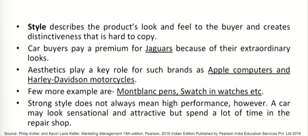
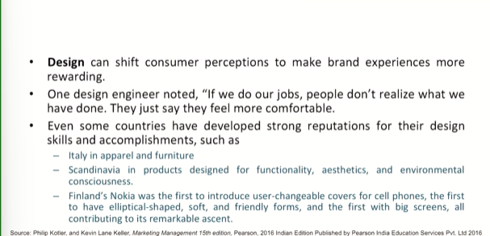
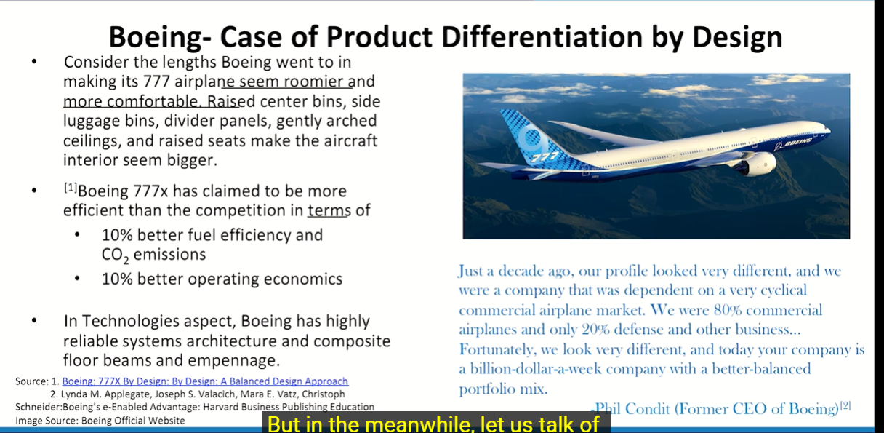

# Lecture 10: Product Differentiation and its Elements - 2

> The brand element, which means the customer would stay with you, more customers would come to you with reference to branding in mind  
> And the elements of differentiation have one more purpose which is related to dependability.  
> The more dependent is the customer on your product, the more loyal he may become in due course of time. And I am talking about wilful dependability.  
> And that means customer is handing over his belief and trust to you in due course of time.  

## Style

## Design

e.g chair, sleep well mattresses, headphones, earphones,tooth cap, mobile cover

## Boeing - Case of Product Differentiation by Design

