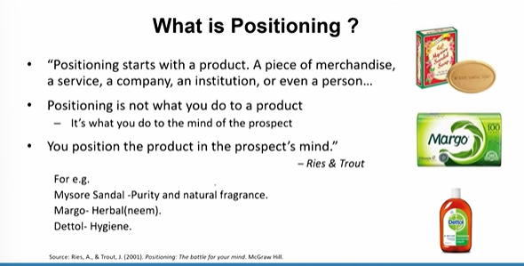
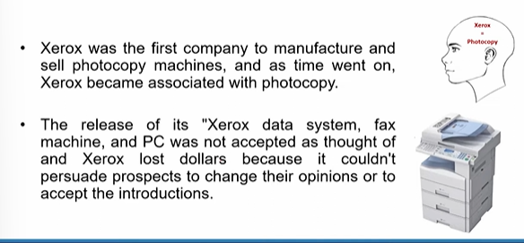
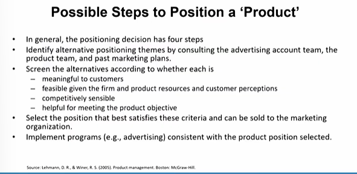
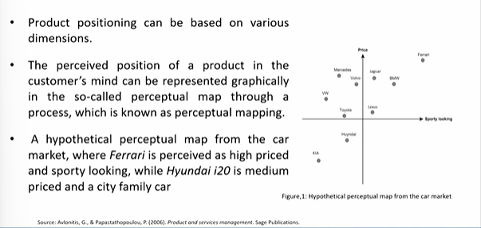
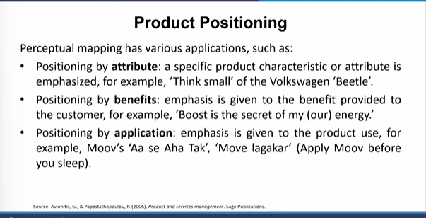
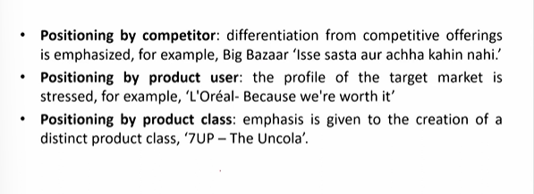
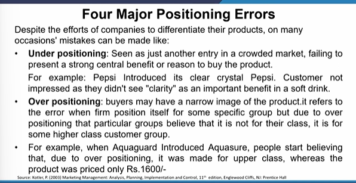
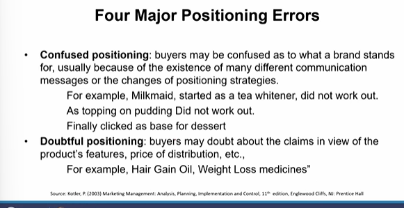

# Lecture 11: Product Positioning - 1

## What is positioning?

## Why positioning?

"Positioning is the single largest influence on the buying decision"  

Geoffrey Moore in his book "Crossing the Chasm"  

## Possible Steps to Position a 'Product'

## Product Positioning

## Four Major Positioning Errors

