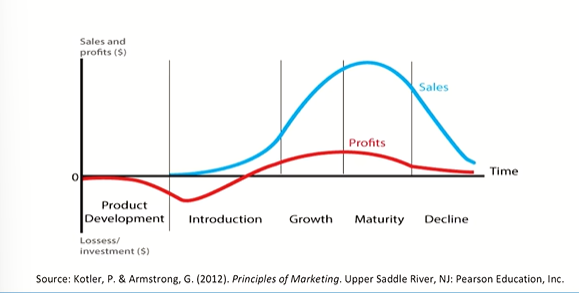
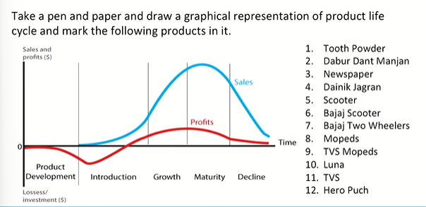
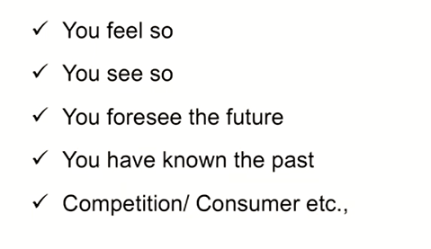
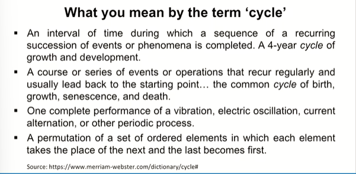
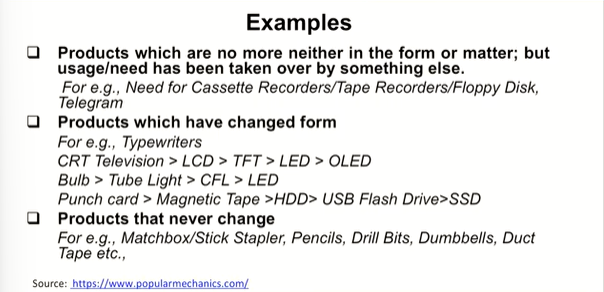
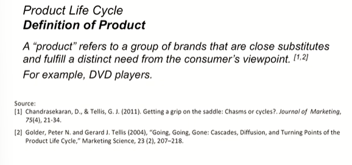

# Lecture 13: Product Life cycle -1

> Let me take you through a brief discussion on the elements related to PLC





## Why have you marked the names whereever you have?



> e.g. Black and white television  
> Cricket as an event, as a product traversing into forms basically  
> 5 day crickte, 1 day cricket, IPL  

> Same Songs with different tune imposed overtime

## What do you mean by the term "cycle"

 

> Whenever you have to understand a concept, revisit the roots of that concept or the dictionary meaning of that concept and the definitional frameworks of related to that concept  

## Examples






## **Cyclically a product may decline, but do brands also**?  

> I don't think so

```txt
Keep thinking till then and keep exercising. You know, keep not
physical exercise, just just keep putting marks on the product life
cycle graph. As I tried to suggest. Imagine different kinds of
products and combinations and brands there and you know,
choose something from consumer products, choose something
from you know, Patanjali's products, choose something from levers,
products and so on and I will come back to you till then. Goodbye
```
