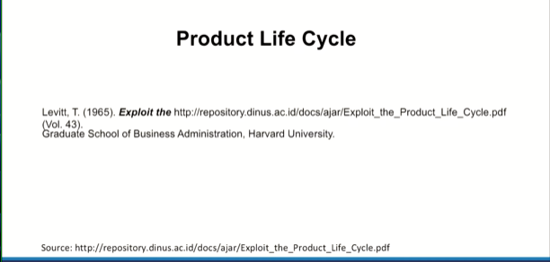
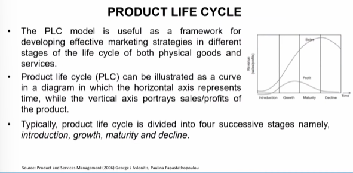
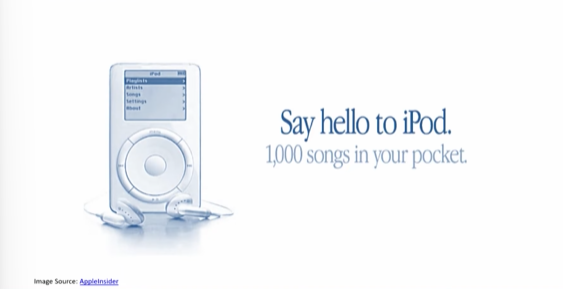
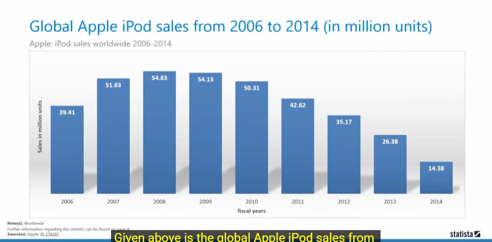
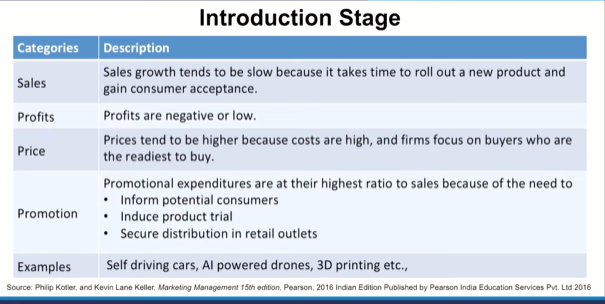

# Lecture 14: Product Life Cycle - 2

## Product Lift Cycle

Product Life Cycle is related to foresee while
acknowledging.  
How should drive the product?  
Foreseeing future- prepare for the growth of the product or
stability of the product.  
For e.g., Glass related products converted into plastic
related products.  
Steel based products, Earthenware, Toys.  
Acknowledging where we are?.....and thinking in terms of
What to do..?  

## Introduction Stage

