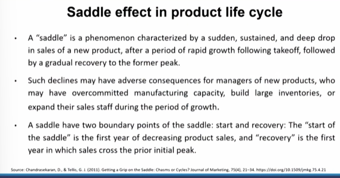
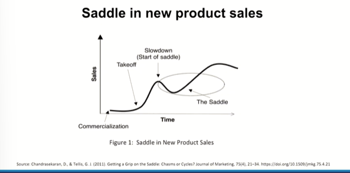

# Lecture 15: Product Life Cycle - 3

## Rejuvenation/Revival

> Jauss polymers. 
* Above cannot fall into an example of Product lifecyle of Introduction, growth, maturity and decline. 
* It has unobservable growth, but sudden decline comes  

> In Today's competitive era, should we be focusing so intensely upon a product?  

## Saddle effect in Product Life cycle

> It is a phenomena characterized by a sudden, sustained and deep drop in sales of new product

## Saddle in new Product sales

> Organizations which are strong in terms of as far as their product mix goes, they have a total revenue which is higher and they can offset the cost of this stage in case of one product by the sales volume and the sales revenue from the other products. In totality they can manage the costs , should I say thy can sustain that