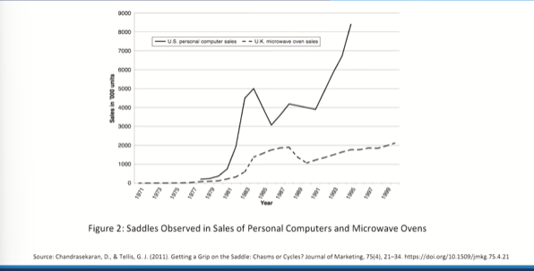
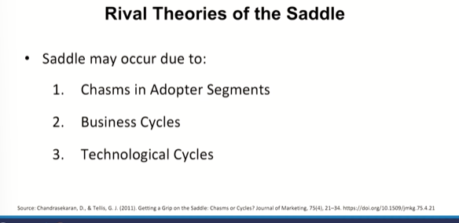
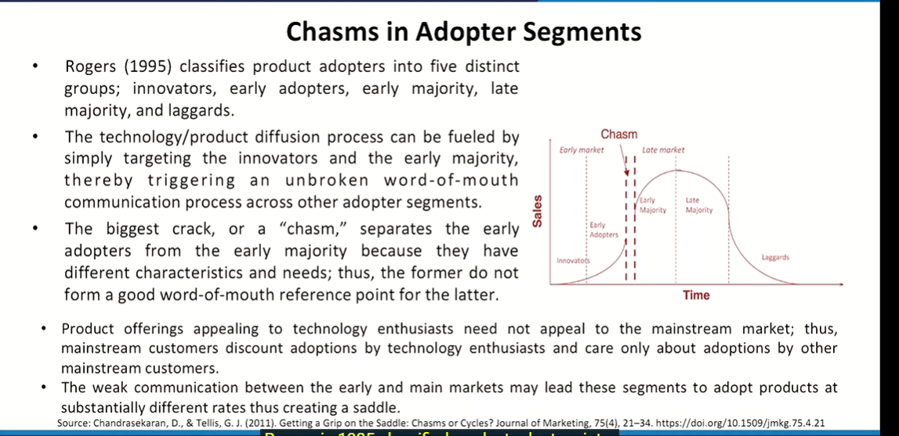
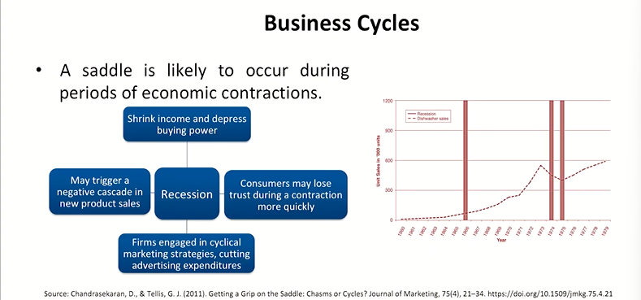
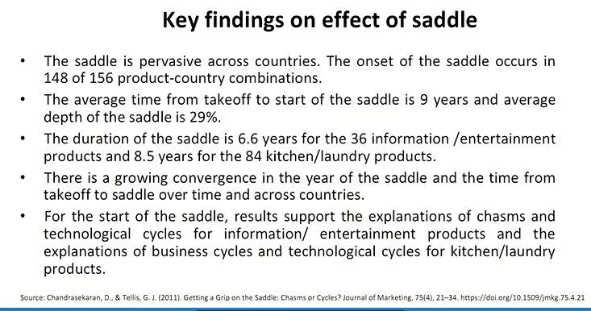
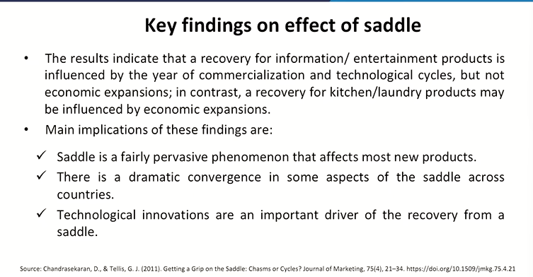
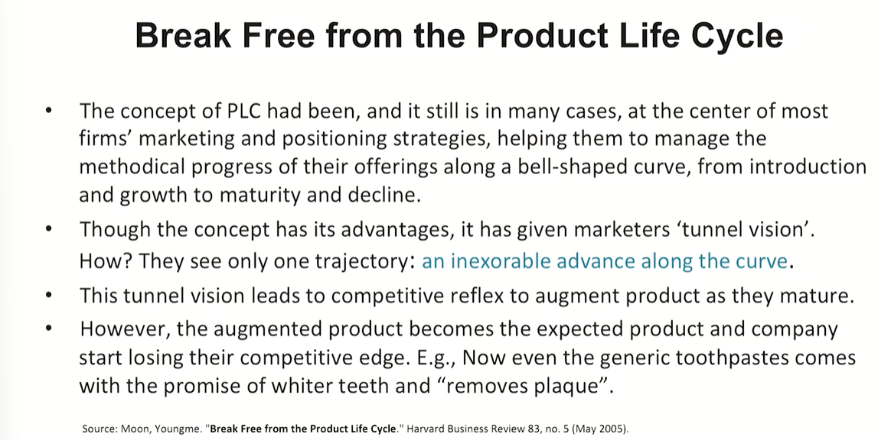
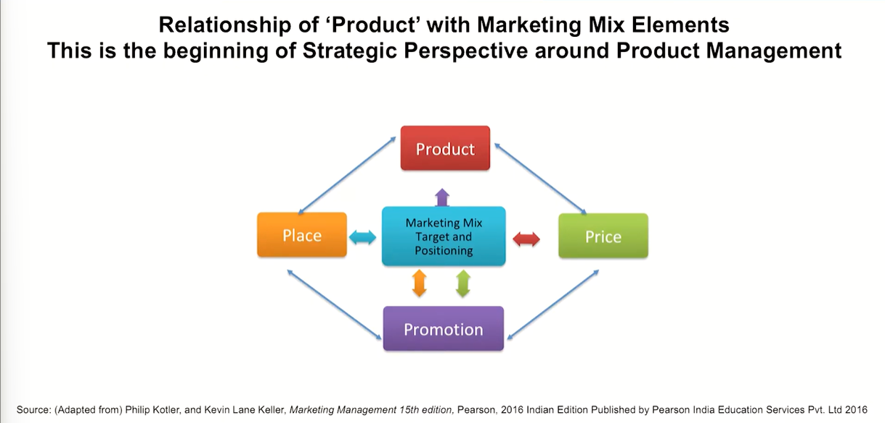
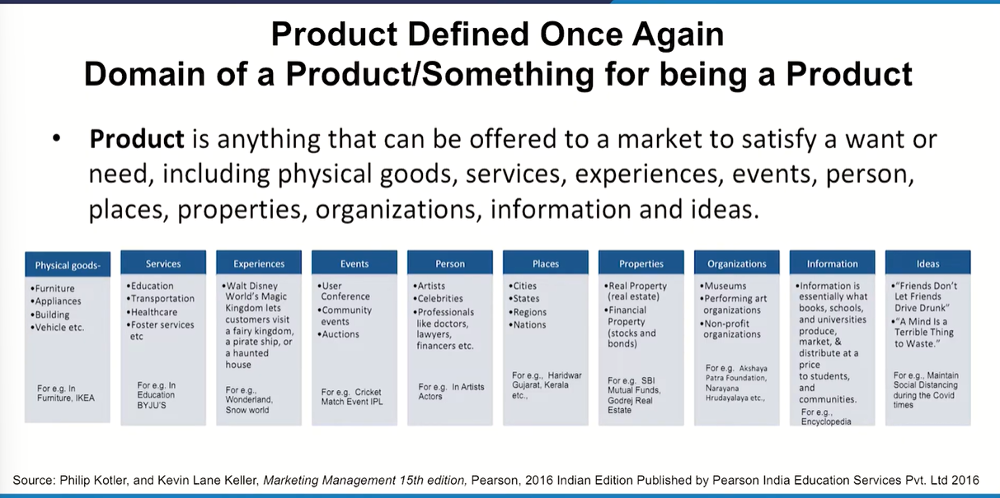
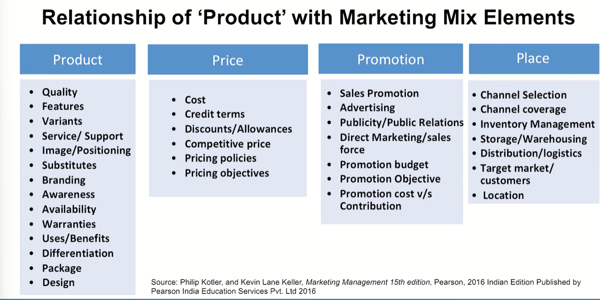

# Lecture 16: Saddle Effect & Relationship of Product with Marketing Mix Elements

## Rival Theories of the Saddle

## Chasms in Adopter Segments

## Business Cycles

## Key findings on effect of saddle

## Break Free from the Product Life Cycle

## Relationship of 'Product' with Marketing Mix Elements

> Remember all the terms and concepts related to products

## Decathlon

* Decathlon's product portfolio includes all the sports equipment (more popular, or less popular),
their accessories, clothing, footwear and everything required. The wide collection is spread over
various categories of sports namely, football, basketball, baseball, cricket, badminton, archery,
billiard, darts, field hockey, roller skates, volleyball, scuba diving, and many more. **In short, each
and everything of your requirement is present, for both men and women** (Product)
* Decathlon keeps its prices 20 percent lower than its competitors, without compromising on quality.
The **pricing is Iow because of the optimization of internal processes in design and logistics.** (Price)
Decathlon has an immensely distributed network with over 800 stores all over the world because it
has attracted customers of almost every sport towards its attractive product portfolio.
(Distribution)
* Decathlon also has products of all kinds from its own brands, which it heavily promotes. Decathlon
has a very high product-quality relation, because of its affordability factor with its quality as its
differentiator. The customer's in-store experience, where people spend their time in knowing more
about the sport, is also spread by the word-of-mouth, the most delicate form of promotion.
(Promotion)

Source - https://www.decathlon.in/  
https://www.marketingmind.in/marketing-strategies-using-which-decathlon-has-beaten-nike-adidas-in-sportswear-market/ 

* Let's take some more examples  
  * A News Paper---Hindi---English
  * Price of Copy---Price of Space
  * Target--- Promotion----Positioning—Place---
  * Let's take a Tourist Destination say Bangkok
and Singapore
  * Price of Facilities and Spots
  * Target--- Promotion----Positioning—Place---

