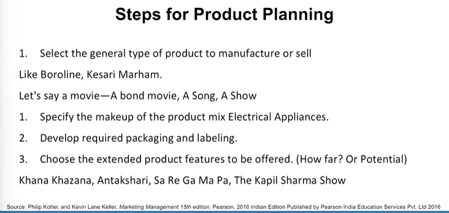
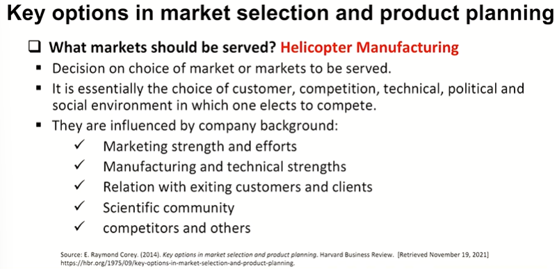
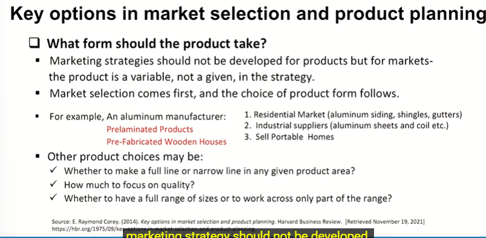
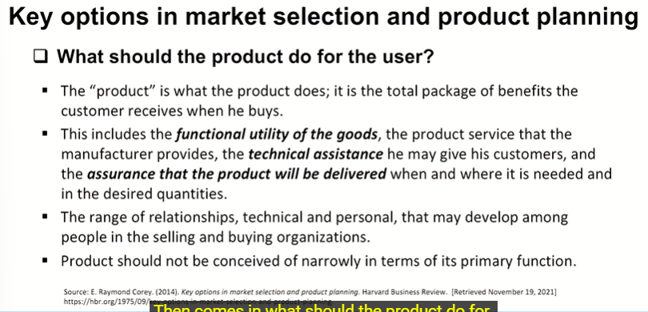
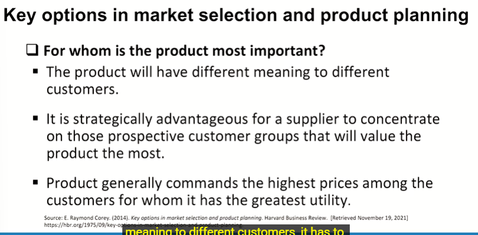
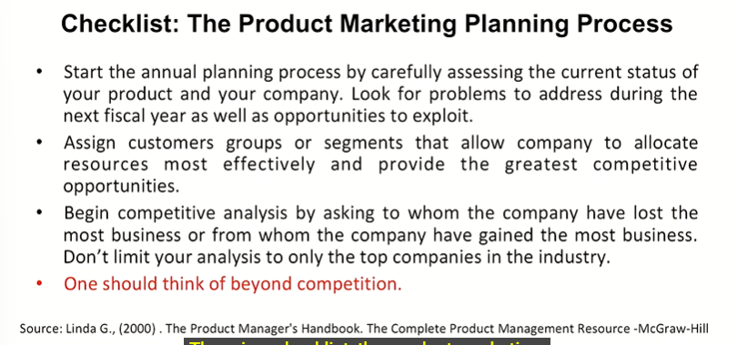
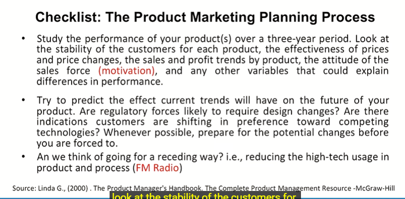

# Lecture 18: Market and Product Planning - 2

## Steps in the planning process

> We have Data sciences, AI based methodlogies and several statistical tools available but reflexive perspective is a key element for a product manager because that is what he does.  
> He is at the fore front of the organization in terms of the product and he is the person who is communicating with someone at the backend.  

## Components of Marketing Plan - The Kapil Sharma Show

## Product Planning

## Steps for Product Planning

## Key options in market selection and product planning

* **What form should the product take ?**

* **What should the product do for the user ?**

* **For whom is the product most important?**

## Checklist : The Product Marketing Planning Process

> Case Study - TWG Tea