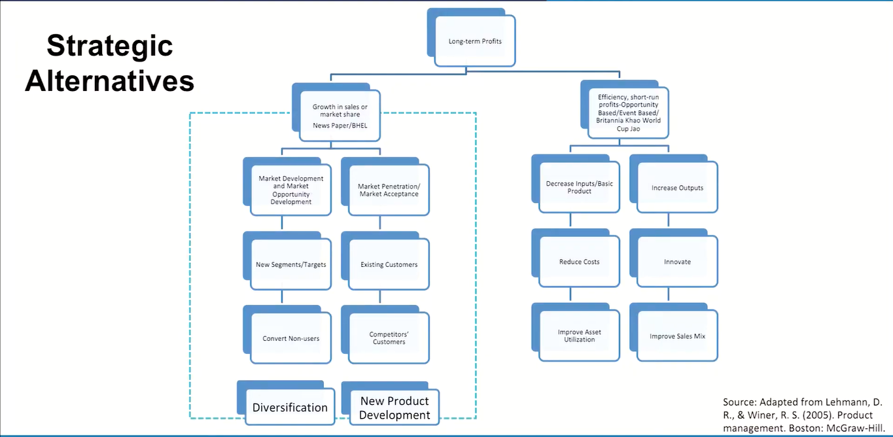
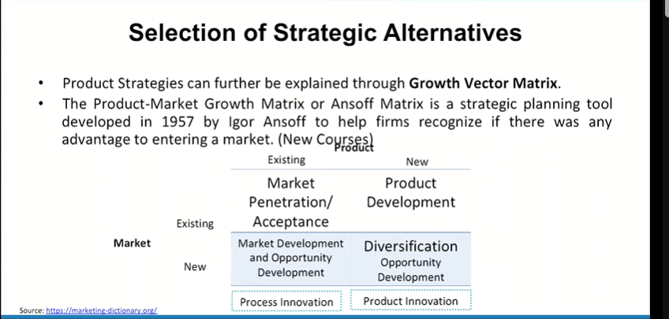
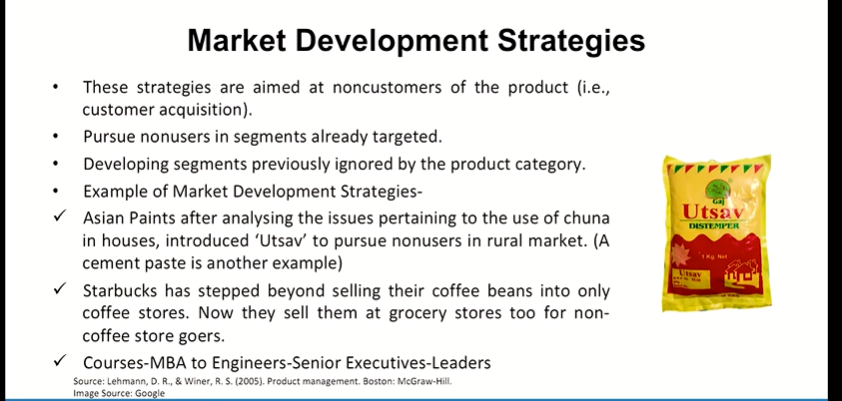

# Lecture 19: Product Strategy and Decisions- 1

## Product Strategy

* Product Strategy should address three related questions:
  * Where are we headed? (Objectives)
  * How will we get there? (addresses issues such as whether to focus on existing versus new customers)
  * What will we do? (specific programs to be employed in order to implement the core strategy)

## Strategic Alternatives

## Selection of Strategic Alternatives

## Market Development Strategies

## Course
* Masters in Innovation Management (MIM)
* MBA with AI
* MBA for home makers
* 