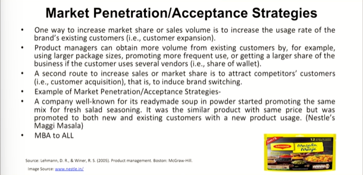
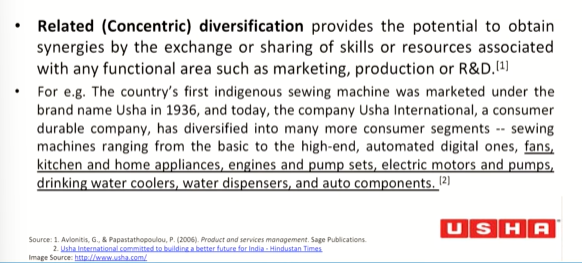
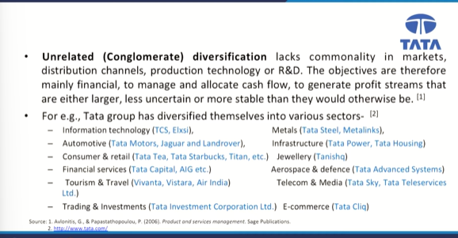
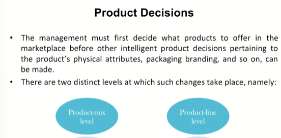

# Lecture 20: Product Strategy and Decisions- 2

## Market Penetration/Acceptance Strategies

## Diversification Strategies

* The decision to add new product lines to the mix to capture new market is ordinarily described as diversification and it can be materialized through internal R&D, licensing, merger and acquisitions, joint ventures or alliances.
* Diversification can be distributed further as:-
* Related (Concentric) diversification
* Unrelated (Conglomerate) diversification

## Related(Concentric) Diversification

## Unrelated (Conglomerate) diversification

## Product Decisions

## Product Mix

* The Committee on Definitions of the **American Marketing Association** defined product mix as 'the composite of products offered for sale by a firm or business unit'.
* A company's product mix has a certain width, length, depth, and consistency.
  * The **width** of a product mix refers to how many **different product lines** the company carries,
  * The **length** of a product mix refers to the **total number of items** in the mix.
  * The **depth** of a product mix refers to how many **variants are offered of each product in the line.**
  * The **consistency** of the product mix describes how **closely related the various product lines** are in end use, production requirements, distribution channels, or some other way
