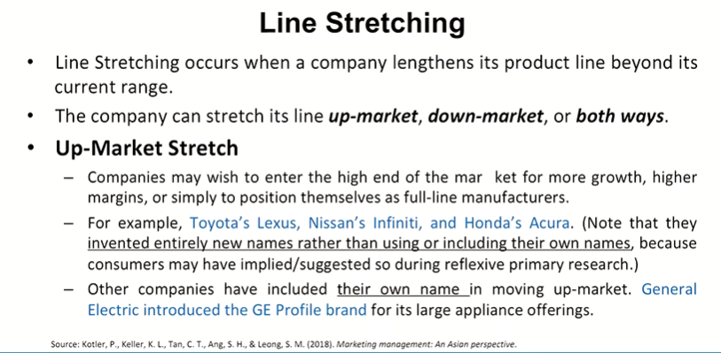
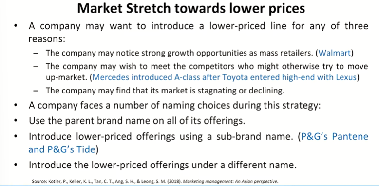
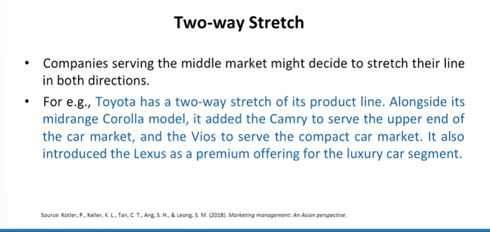
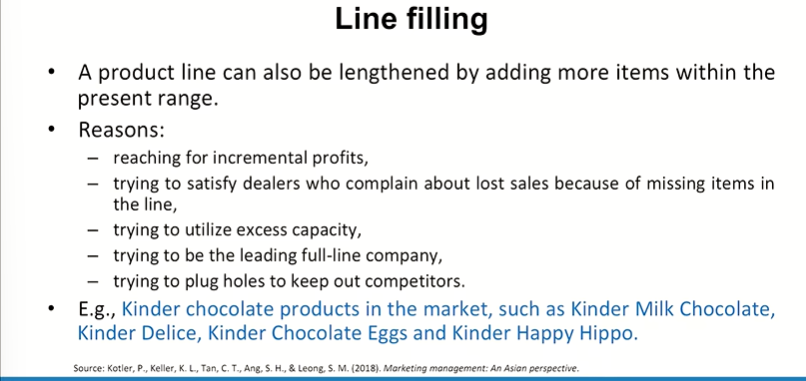
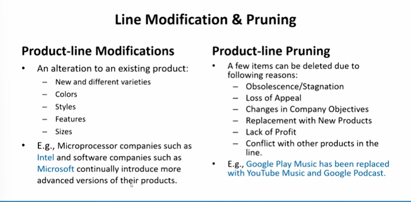
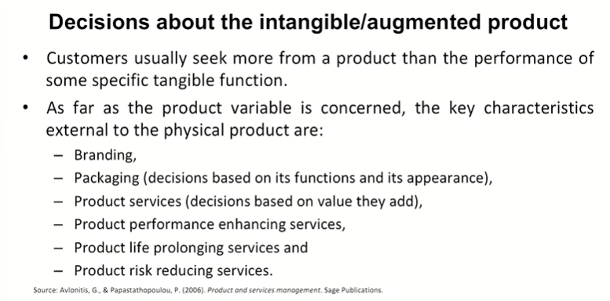
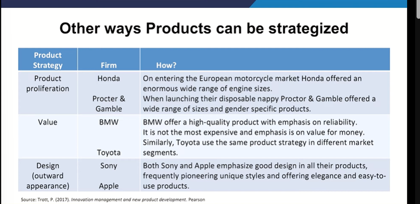

# Lecture 21: Product Decisions

## Product Line Level Strategies

* Company objectives influence product-line length.
  * Expand a product Line
  * Modify a Product Line
  * Reduct/Exit a Product or Product Line

## Line Stretching

## Market Stretch towards Lower prices

## Two way Stretch

## Line filling

## Line Modification & Pruning

## Decisions about intangible/augumented product

