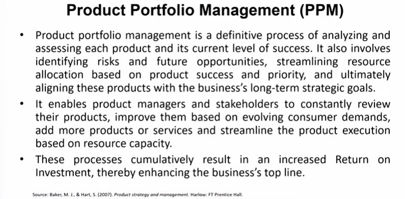

# Lecture 22: Product Portfolio Management

## Product Portfolio Management(PPM)

> Product Manager might feel comfortable with this thought that the product is successful, but success must be seen with reference to the potential success of the product.  

## Some examples of successful product portfolio management

* Apple's expansion of its portfolio to include the iPod has not only
launched a whole economy of "i-" add-ons, including the iPhone, but
also boosted sales of Apple's existing computers.
* The Indian network Star TV saw its prime-time viewer share increase
from less than 5% to more than 80% in one year after a single hit
show, Kaun Banega Crorepati (the Indian version of Who Wants to Be a Millionaire), helped all its productions become more popular.
* The benefits can even extend to other firms.
* Author Dan Brown had written three books with optimal sal
prior to his best seller The Da Vinci Code. When his form
publishers then re-released the older works, they became be
sellers as well.
* Maruti Suzuki—800, Desire, Hero Motors, Tmes of India
* Can we do this for academic programs?
