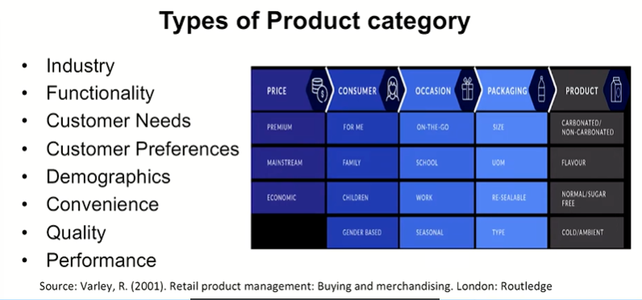
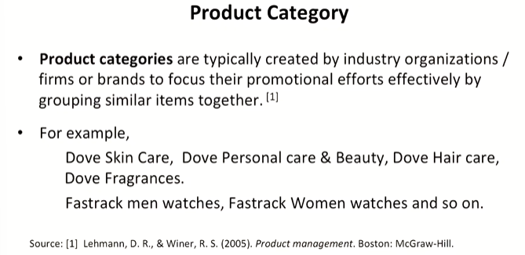

# Lecture 23: Product Category Management

## Crucial steps in Product Portfolio Management

1. Product Portfolio analysis
2. Resource Allocation
3. Forming the Product Portfolio Roadmap
4. New Product Development and acquisitions
5. The logic is Life Cycle, Potential, Mutual Strength within Families and
Lines, between families and lines.
6. The objective is to satisfy customers, gain loyalty, push the
competition aside, be profitable, stay forever.

## Product Category

* Industry---Components, Capital Machinery, Manufacturing, Tools
* Functionality---Makers, Enablers, Processors, Mixers
* Customer Needs—Bed Linen ---- Along with Home Textiles
* Customer Preferences---Movies
* Demographics---Sports Bike, Sports Cars
* Convenience—Shampoos, Pencils
* Quality---Food like Atta
* Performance---Mobile, Cars, Electrical Appliances

## Types of Product Category

  

## Product Category Management

* Product category management is a process implying an organization
of stock-keeping units or SKUs into separate categories based on
particular characteristics
* Once the products are grouped into categories, coherent pricing,
promo, and marketing strategy is applied by the category
management team to make sure the business goals and targets are
achieved

## Category Attractiveness Analysis

The important factors in assessing the underlying attractiveness of a
product category are:

1. Aggregate Market Factors  
2. Category Factors  
3. Environmental Factors  

## Aggregate Market Factors

* Category size (measured in both units and monetary value)
* Category growth
* Stage in product life cycle
* Sales cyclicity
* Seasonality
* Profits