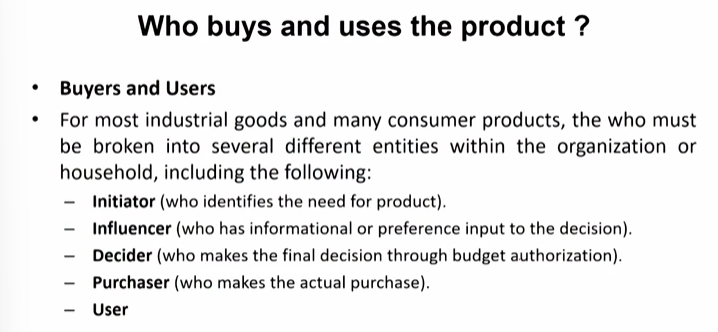
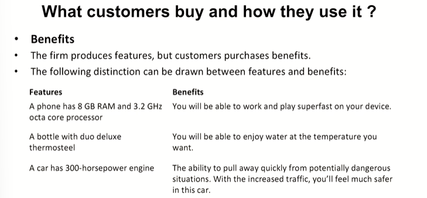
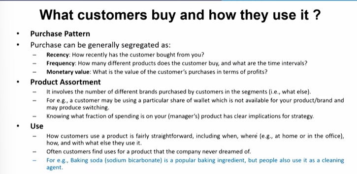
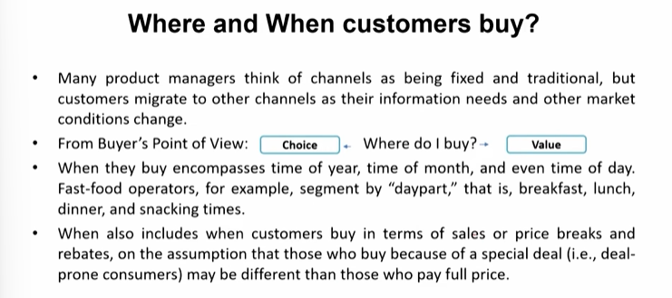
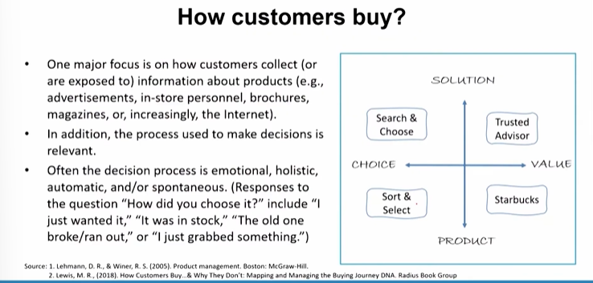

# Lecture 24: Customer Analysis

## Customer Analysis

* Customer is not limited to current customers of a given product. It is
also including customers of competitors and current noncustomers of
the product category (i.e., potential customers).
* The term customer refers both to  
— **Immediate customers** (i.e., supermarkets and discount stores like  
Wal-Mart for consumer product companies such as P&G and  
manufacturers for component manufacturers such as Intel)  
— **Final customers** (i.e., individuals and businesses).

## What a Product Manager needs to know about "Customers"

Who buys and uses the product ?  
What customers buy and how they use it ?  
Where customers buy ?  
When customers buy ?  
How customers choose ?  
Why they prefer a product ?  
How they respond to marketing programs ?  
Will they buy it (again)?  

## Who buys and uses the product?

## What customers buy and how they use it?

## Where and When customers buy?

e.g. Iron knob(cotton, silk)
e.g. Gandhi Gram udyog  

## How customers buy?

