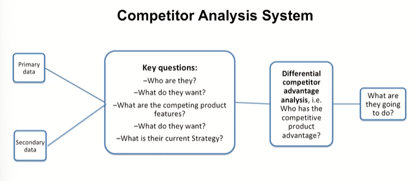
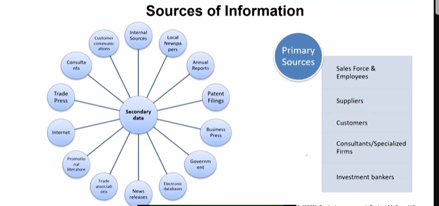
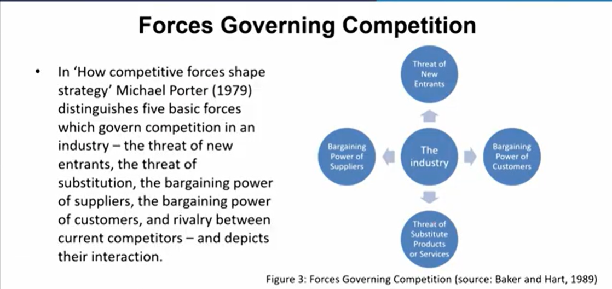
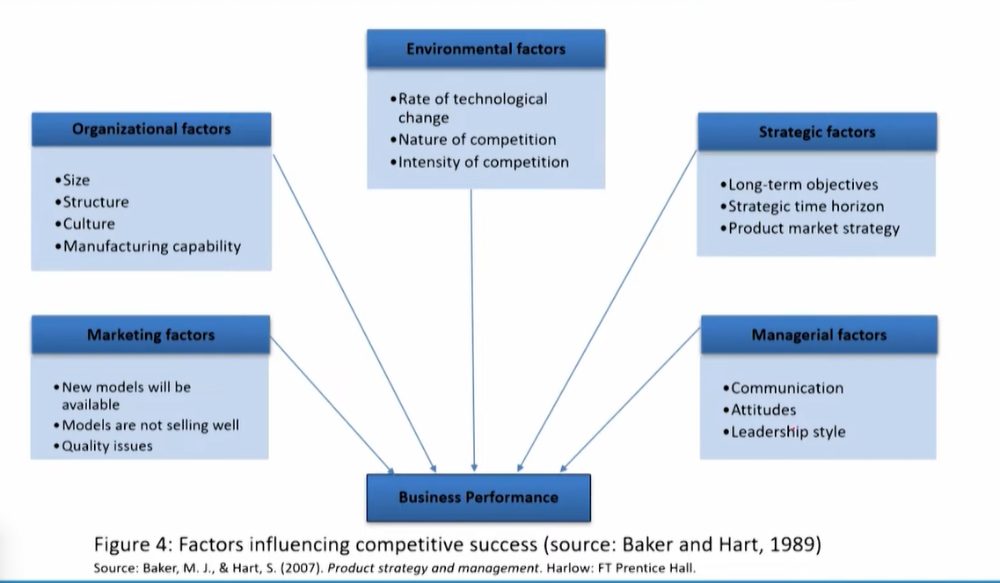
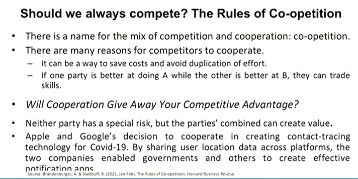
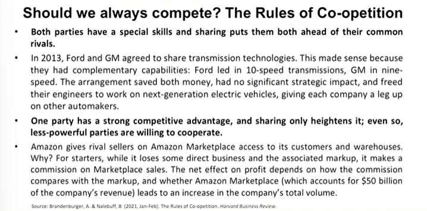
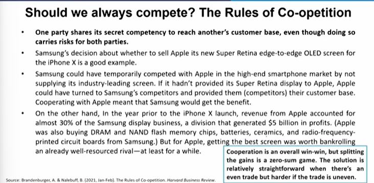

# Lecture 25: Competitors Analysis

## What is Competition?

* Competition refers to the rivalry among sellers trying to achieve such
goals as increasing profits, market share, and sales volume by varying
the elements of the marketing mix: price, product, distribution, and
promotion.
* It is the product vying for customers by the pursuit of differential
advantage, i.e., changing to better meet consumer wants and needs.
* In economic theory, various competitive states such as monopolistic
competition, oligopoly, perfect competition, and monopoly are
delineated based on the degree of control that sellers have over price.

## Competitor Analysis System

## Sources of Information

> I told you that we must develop an art of reading, the hearts of customers. Here I would suggest develop an art, along with scientific procedures to read the minds of competitors

## Forces Governing Competition

## Should we always compete? The rules of Co-opetition

Examples when Patanjali came in.  
They acknowledged every competition they have or
they might have.  
But then while keeping that acknowledgement alive,  
they started producing products for bypassing the  
competition while positioning the products differently  
in front of the existing users and the non users of  
those products as well, while focusing largely on non users   
and then coming to the users of competitors or  
you know, users of customers as well. I would  
Not say that they snatch the customers from their
competitors or they fought for those customers,
They either sold another product to those customers
while adding on completely, you know, different users
to their bracket of customers.  
So that can also be done and it is slightly difficult to understand in terms
of consumer products.  
In terms of durables and larger products, it is slightly, you know, easier to understand.

> Try to find out that is a product which is not focusing on the customer of the similar products but looking for someone else. If you can find such products start enumerating those.