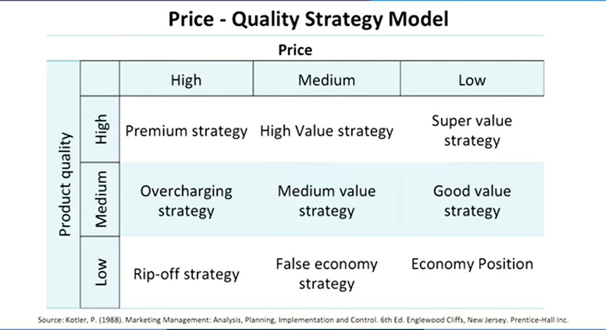
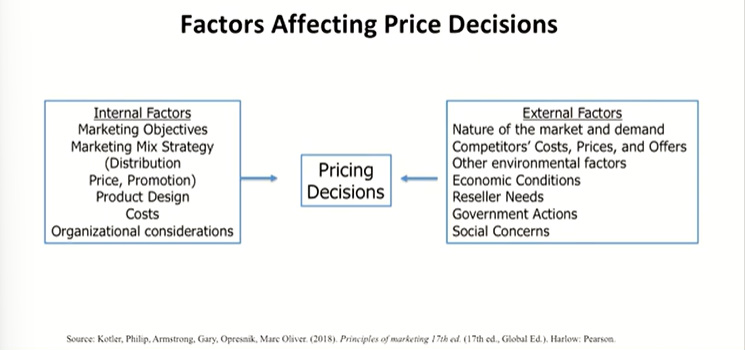
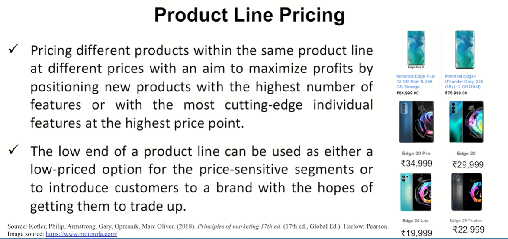
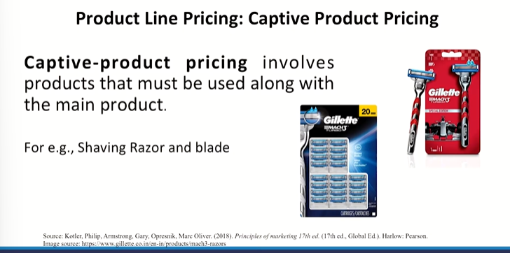
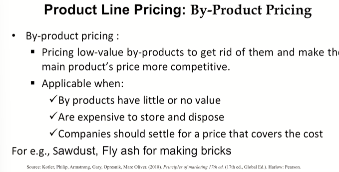
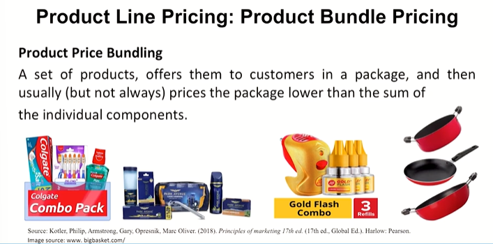
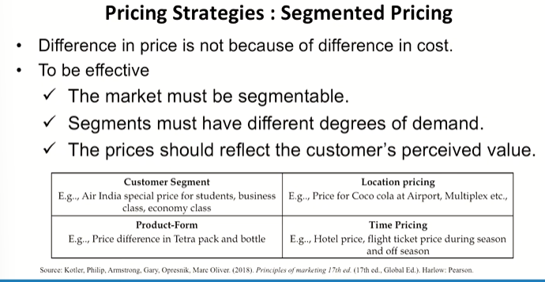

# Lecture 26: Product Pricing

## Product Pricing

* Pricing is one of the most vital decisions made by management
  * Price too high and you lose the sale  
  * Price too Iow and you can't make money  
* Two fundamental ways to grow revenue
  * raise your price
  * increase the quantity you sell  
* Price is the easiest of all marketing variables to influence but among the most complex decisions to make
  * price changes may be implemented immediately

## Price - Quality Strategy Model



## Factors affecting price decisions



## New-Product Pricing Strategies

**Market Skimming Price**  

* Setting a high price for a new product to "skim" maximum revenues
layer by layer from the segments willing to pay the high price.
* Results in fewer, but more profitable sales.
* Use Under These Conditions:
  * Product's quality and image must support its higher price.
  * Costs can't be so high that they cancel the advantage of charging more.
  * Competitors shouldn't be able to enter market easily and undercut the high price

**Market Penetration Price**  

* Setting a low price for a new product in order to "penetrate" the
market quickly and deeply OR GET THE ACCEPTANCE QUICKLY.
* Attract a large number of buyers and win a larger market share.
* Use under these conditions:
  * Market must be highly price-sensitive so that a low price produces more market growth
  * Production/ distribution costs must fall as sales volume increases.
  * Must keep out competition & maintain its low-price position or benefits may only be temporary.

> I would say Market Acceptance Price  

**Cost Based Pricing**  
**Cost-Based Pricing:** Firms determine the costs of producing and supplying  
a product and then add money on top of this calculated costs to  
determine the selling price.  
**Cost-Plus Pricing:** Adding a fixed mark-up for profit to the cost of the item.
This method is popular with retailers. They take the cost of the item and  
add a mark up percentage to determine selling price.  

Cost of bought-in materials: Rs. 40  
50% markup on cost = Rs. 20 **Selling price: Rs. 60**  

**Full-Cost Pricing** (or absorption-cost pricing)  
* This pricing strategy is similar to cost-plus pricing.  
* Used in manufacturing companies.  
* The fixed and variable costs are allocated to manufactured products to
determine cost, then a markup is added to determine selling price. 

**Marginal-Cost Pricing**  
* Basing the price on the extra cost of making one additional unit.
* This pricing scheme could gain market share and increase sales.

## Product Line Pricing



* Optional Product Pricing  
* Captive Product Pricing  
* By-Product Pricing  
* Product Bundle Pricing  

## 1. Product Line Pricing : Optional Product Pricing
* Pricing optional or accessory products sold with the
main product.
* For e.g., Wireless Mouse, bags, printers with laptops.

## 2. Product Line Pricing : Captive Product Pricing



## 3. Product Line Pricing : By-Product Pricing



## 4. Product Line Pricing : Product Bundle Pricing



## Pricing Strategies : Segmented Pricing



## Pricing Strategies : Geographical Pricing

* Uniform Delivered Pricing: Easier to manage and advertise
nationally.
* Zone Pricing: Rather than individual city or town, pricing is
done on a zone basis.
* Basing-Point Pricing: use another city as base.
* Freight Absorption Pricing: Absorb all or part of the cost to
penetrate the market.

```txt
We must start thinking that what other kinds of
pricing methods can be generated, can we think of
something else which can be brought in the picture as
far as the pricing goes? Can we go for, you know
innovative pricing like daily reducing pricing? It is
there, it is there, it is a method basically you see
Nokia introduced a weekly reducing pricing basically.
```

## Pricing Strategies : Psychological Pricing

* Psychological pricing occurs when sellers consider the psychology of
prices and not simply the economics.
* Reference prices are prices that buyers carry in their minds and refer to when looking at a given product.
  * Noting current prices  
  * Remembering past prices  
  * Assessing the buying situations  

> e.g. Bata's pricing Rs. 99. It is below 100 and again I would refer to great thinkers like Daniel Kahneman who has explained why it works. Just read one of it's articles. Like 101 might create a huge difference in terms of thought process or moving towards a customer, towards a product. If it is 101, you might resist. If it is 99, you might move towards that product. That is the magical of psychological pricing