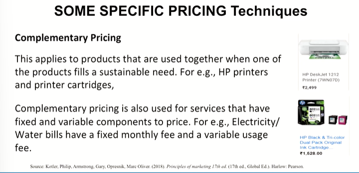
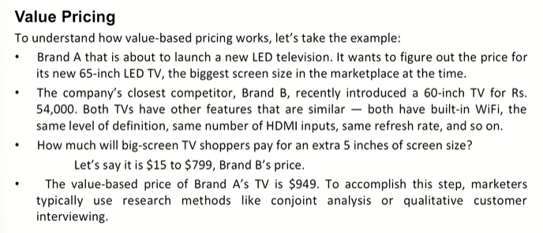
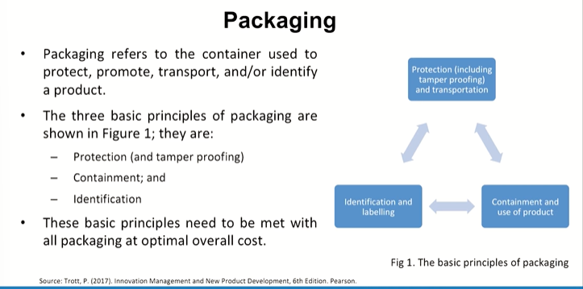
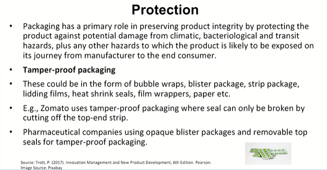
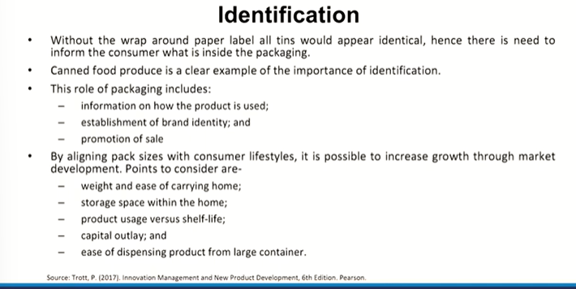

# Lecture 27: Product Pricing and Packaging

## Pricing Strategies : Promotional Pricing

* Promotional pricing is when prices are temporarily priced below list price or cost to increase demand
  * Loss leaders
  * Special event pricing
  * Cash rebates
  * Low-interest financing
  * Longer warrantees
  * Free maintenance

## Some Specific PRICING Techniques

* **Complemenatary Pricing**

* **Value Pricing**

Value-based pricing is the method of setting a price by which a company
calculates and tries to earn the differentiated worth of its product for a particular
customer segment when compared to its competitor

Now let's apply value-based pricing by considering each part of the definition carefully:
1. Focus on a single segment.  
2. Compare with next best alternative.  
3. Compare with next best alternative.  
4. Compare with next best alternative.  

* **Everyday Low Pricing(EDLP)**

A policy or strategy of retail pricing whereby presumably low prices are
set initially on items and maintained, as opposed to the occasional
offering of items at special or reduced sales prices. For the consumer,
EDLP simplifies decision making and search costs (Monash Business school)  

For the company, EDLP minimizes marketing costs, staff efforts, and
helps with demand forecasting.
**For example, Walmart, Home Depot**

* **Hidden Price Increases**
  * A policy or strategy to raise prices without explicitly increasing the posted price.
  * For example, Kimberly-Clark tried to sneak in a 5 percent price increase by
cutting the number of diapers in each package of its Huggies brand of disposable diapers.

* **Price Discrimination**
  * Price discrimination maximizes products' profits by charging each market segment the price that maximizes profit.
  * It is difficult to implement a price discrimination policy, particularly in consumer markets, due to the fragmentation of the customer base and the existence of firms that buy at one segment's low prices and resell to others (such as consolidators in airline tickets).

* **Second-Market Discounting**
  * A useful pricing strategy when excess production exists is called second-market discounting
  * This policy sells the extra production at a discount to a market separate from the main market.
  * If the product is sold at a price greater than variable cost, the contribution margin
produced can help cover corporate overhead. Some examples of secondary
markets are generic drugs, private-label brands, and foreign markets.

* **Periodic Discounting**
  * This pricing strategy varies price over time. It is appropriate when some customers are willing to pay a higher price to have the product or service during a particular time period.
  * For example, utilities such as electricity and telephone service use peak load pricing policies that charge more during the heaviest usage periods, partly to encourage off-peak usage. Theater tickets are more expensive on weekends.

## Steps in Setting Prices

These are the six steps in determining a price for an item:  
* Determine pricing objectives.
* Study costs.
* Estimate demand.
* Study competition.
* Decide on a pricing strategy.
* Set price.

### 1. Determine the Pricing Objectives

What is your purpose in setting a price?  
• Do you want to increase sales volume or sales revenue?  
• Establish a prestigious image?  
• Increase your market share and market position?  
Answering these questions will help you keep your prices in line with
other marketing decisions.

### 2. Study the costs
* Since the main reason for being in business is to make a profit,
consider the costs involved in making or acquiring the goods or
services you will offer for sale.
* Determine whether and how you can reduce costs without affecting
the quality or image of your product.

### 3. Estimate Demand

* Employ market research techniques to estimate consumer demand.
* The key to pricing goods and services is to set prices at the level
consumers expect to pay.
* In many cases, those prices are directly related to demand.

### 4. Study Competition

* Investigate your competitors to see what prices they are charging
for similar goods and services.
* Study the market leader.
* What is the range of prices from the ceiling price to the price floor?
* Will you price your goods lower than, equal to, or higher than your
competitors'?

### 5. Decide on Pricing Strategy

* You may decide to price your product higher than the competition's
because you believe your product is superior.
* You may decide to set a lower price with the understanding that you
will raise it once the product is accepted in the marketplace.

### 6. Set Price

* After you have evaluated all the foregoing factors, apply the pricing
techniques that match your strategy and set an initial price.
* Be prepared to monitor that price and evaluate its effectiveness as
conditions in the market change.

## Common Pricing Mistakes
* Determine costs and take traditional industry margins.
* Failure to revise price to capitalize on market changes.
* Setting price independently of the rest of the marketing mix.
* Failure to vary price by product item, market segment, distribution
channels, and purchase occasion.

## Packaging

### Protection

### Containment

* There is a requirement for such packaging to have dispensing and
resealing features for fluids like milk, orange juice and hair spray.
* Effective containment clearly involves ensuring the pack does not
leak, fall apart or otherwise annoy the end user.
* Caps that do not reseal properly, bags that split on opening, and
cartons that fall apart are irritants, and they deter repeat purchases.

### Identification

### Labelling
As well as the functional requirements that the label has to perform such as
providing information on the following:  

Source of the product  
Contents  
How to use the product  
Universal product code (UPC) or bar code (used by retailers and producers for price and
inventory control purposes)  
Warnings  
Certifications  
How to care for the product  
Nutritional information  
Type and style of the product  
Size and number of servings.  