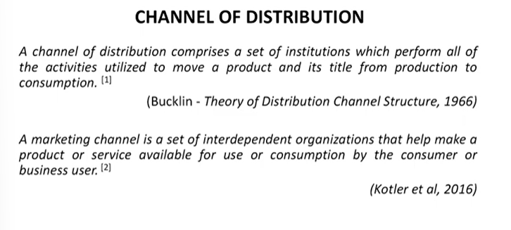
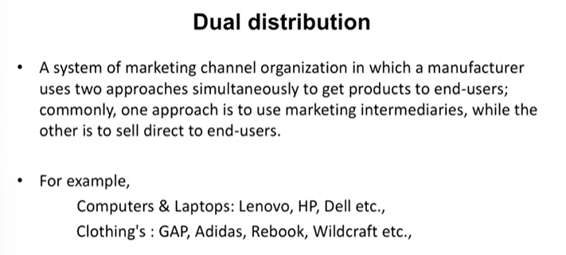
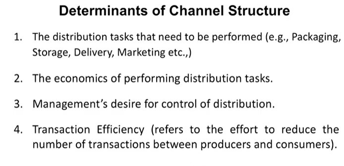

# Lecture 28: Product Distribution

## Channel of Distribution

## Basic 'Channel' decisions

* Do we use direct or indirect channels? (e.g., 'direct' to a consumer,
'indirect' via a wholesaler).
* Single or multiple channels ?
* What should be the cumulative length of the multiple channels?
* Types of intermediaries (Wholesaler/agents/brokers/retailers)
* Number of intermediaries at each level
* Which companies as intermediaries to avoid 'intrachannel conflict' (i.e.,
infighting between local distributors).

## Channel Management Decisions

1. Setting channel objectives
   1. Determine what the company is trying to achieve.
   2. Meet the needs and wants of their target market.
   3. Give their product a competitive edge.
2. Channel members:
   1. Selection
   2. Management
   3. Motivation
   4. Evaluation

## How do we decide upon a distributor ?

* Market segment — the distributor must be familiar with the target consumer
and segment.
* Changes during the Product Life Cycle — different channels can be used at
different points in the PLC e.g., Covid Vaccines like Covishield & Cowaxin are
now available most Of the hospitals. At the time Of introduction, they were
sold via govt hospitals.
* Producer/distributor fit — Is there a match between their polices, strategies,
image, and your company? Look for 'synergy'.
* Qualification assessment — establish the experience and track record of the
intermediary.
* How much training and support will the distributor require?

## Distribution Decisions

1. Multiple channels
2. Control vs. costs
3. Intensity of distribution desired
4. Involvement in e-commerce

### 1. Multiple Channels

* Some products meet the needs of both industrial and
consumer markets. (For e.g., Fans for household and
industrial purposes)
* J & J Snack Foods sells its pretzels, drinks and cookies using
multiple channels to:  
— Supermarkets  
— Movie Theaters  
— Stadiums  
— Schools  
— Hospitals  

### 2. Control vs Costs

* All manufacturers and producers must weigh the control they
want to keep over the distribution of their products against
the costs and profitability.  
- **Direct sales force** — company employees are expensive with payroll,
benefits, expenses; may set sales quotas and easily monitor
performance
- **Agents** — work independently, running their own businesses; less
expensive = less control; agents sell product lines that make them
more money

**Management's Desire for Control of Distribution**  
* In general, the shorter the channel structure, the higher
the degree of control, and vice versa.
* The lower the intensity of distribution, the higher the
degree of control, and vice versa.

### 3. Distribution Intensity  
* How widely a product will be distributed..?
  * Marketers want to achieve the ideal market exposure; determining distribution patterns.
  * **Ideal market exposure** (make their product available without overexposing and losing money)
  * To achieve market exposure, marketers must determine **distribution intensity**

1. **Channel intensity:** the number of intermediaries at each level of the marketing channel.  
Exclusive Distribution  
Selective Distribution  
Intensive Distribution  

* **Intensive Distribution**

* Intensive distribution mainly means distribution on a
large-scale and displaying the product in as many ways
and places as possible so that the customer sells in high
volume due to large scale distribution.
* The objective is complete market coverage, and the
final goal is to sell to as many customers as possible.
* Ex. FMCG products, consumer durables etc.

* **Exclusive Distribution**

* Exclusive distribution is an agreement between a distributor and a
manufacturer that the manufacturer will not sell the product to
anyone else and will sell it only to the exclusive distributor.
* The protected territories for distribution of a product in a given
geographic area; business maintains tight control over a product
* E.g., Companies like ROLEX, LAMBORGHINI, MERCEDES, BMW will
appoint only a handful of distributors in a region and regularly enter
exclusive distribution.

* **Selective Distribution**

* A limited number of outlets in a given geographical area are
used to sell the product.
* Very important to select channel members that maintain the
image of the product & are good credit risks, aggressive
marketers & good inventory planners.
* For e.g., Armani, Gucci Brands sell their clothing only through
top department stores that appeal to the affluent customers
who buy its merchandise. It does not sell in a chain megastore
or a variety store.

* **Dual Distribution** 

### 4. Involvement in E-commerce

* Means by which products are sold to customers and industrial
buyers through the Internet.
* Consumers have also become accustomed to buying products
online.
* One-stop shopping and substantial savings for industrial buyers.
* E-marketplaces provide smaller businesses with the exposure that
they could not get elsewhere.

## Dimensions of Channel Design

* Length of the channel. (number of levels in a distribution
channel)
* Intensity of various levels (Exclusive, Selective, Intensive)
* Types of intermediaries involved (agents, wholesalers,
distributors, and retailers).

## Determinants of Channel Structure

