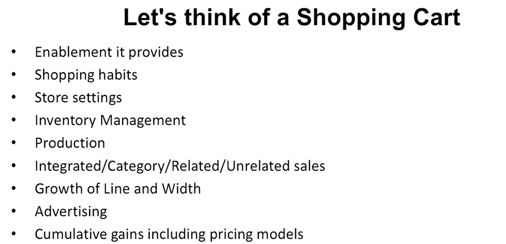
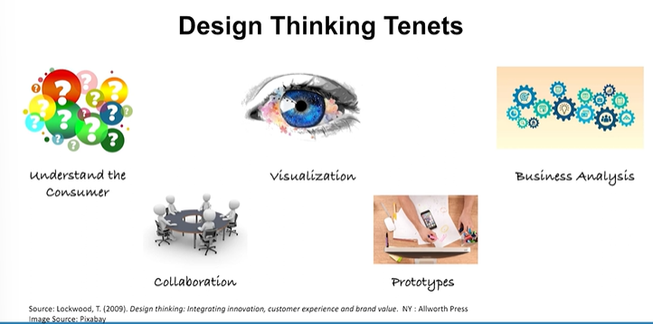
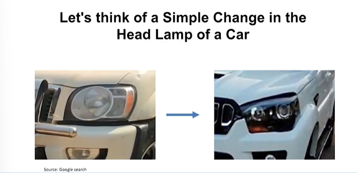

# Lecture 29: Design Thinking- 1

## Let's think of a Shopping cart

## Design Thinking

* The objective is to involve consumers, designers, and businesspeople in
an integrative process, which can be applied to product, service, or
even business design.
* It is a tool to imagine future states and to bring products, services, and
experiences to market.
* The term design thinking is generally referred to as applying a
designer's sensibility and methods to problem solving, no matter what
the problem is.
* It is not a substitute for professional design or the art and craft of
designing, but rather a methodology for innovation and enablement.

## Design Thinking Tenets

## Let's think of Multiplexes

Experience  
Shopping habits through time spent around  
Food Habits  
In multiplex habits  
Integrated/Category/Related/Unrelated sales  
Growth of Line and Width  
Advertising  
Cumulative gains including pricing models  
Types of Movies and Production—Big Screen/3D etc.  
Movies taking to integrated experience—A world of related product sales  

## Let's think of a Scotch Brite

Enablement it provides  
Habits  
Utensils  
Redesign??  
Production  
Integrated/Category/Related/Unrelated sales like dishwashers  
Growth of Line and Width  
Advertising  
Cumulative gains including pricing models  

