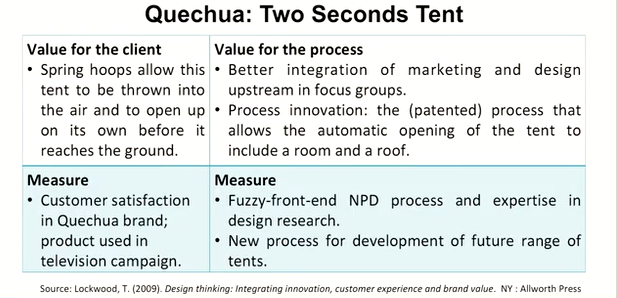
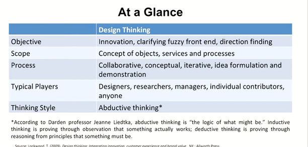
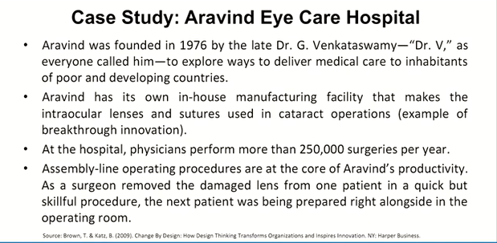
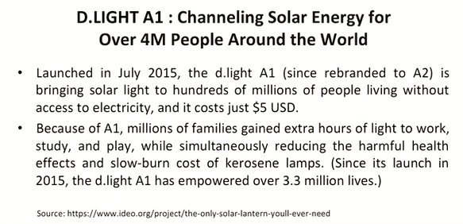

# Lecture 31: Design Thinking – 3

## Shifts in social and economic areas that are affecting the role of design in business:

* Globalization: Changing and Rechanging form; Transportation/Self
Dependence/Dynamics of Oil Production/Alternative Energy/Raw
Material.
* Most of all Human Resource, Education; Shift of acumen and talent.
* Web 4.0
* The "triple bottom line"- People Profit Planet or Social Environmental
and Business-Sustainability at large.
* Innovation drives business, and design enables innovation.
* Seeking meaning in an "experience economy."
* From mass media ads to brands as stories and relationships.
* From manufacturing-centric to consumer-centric.
* The integration of customer touchpoints.

## THE FOUR POWER OF DESIGN

* **Design as differentiator:** a source of competitive advantage on the
market through brand equity, customer loyalty, price premium, or
customer orientation.
* **Design as integrator:** a resource that improves new product
development processes (time to market, building consensus in teams
using visualization skills); design as a process that favors a modular
and platform architecture of product lines, user-oriented innovation
models, and fuzzy-front-end (An Opportunity is seen, and idea is
taken to the formal development)project management.
* **Design as transformer:** a resource for creating new business
opportunities; for improving the company's ability to cope
with change; or (in the case of advanced design) as an
expertise to better interpret the company and the
marketplace.
* **Design as good business:** a source of increased sales and
better margins, more brand value, greater market share,
better return on investment (ROI); design as a resource for
society at large (inclusive design, sustainable design).

## Principles of Design Thinking

* Develop empathy for the customer.
* Engage unique design processes.
* Connect with corporate culture.
* Set design strategy and policy.
* Align business strategy and design strategy.
* Design for innovation and transformation.
* Design for relevance at each touchpoint.
* Focus on the customer experience.
* Empower creativity.
* Be a design leader.

## Ten Categories to Evaluate the Performance of Design

* Purchase influence or emotion
* Enable strategy and new markets
* Enable product and service innovation
* Reputation, awareness, and brand value
* Time to market and process improvement
* Customer satisfaction
* Cost savings, ROI, and IP
* Developing communities of customers
* Usability
* Sustainability

## Decathlon : Designing Value into the Process

* An award-winning Decathlon product is the **Quechua two seconds tent**, which radically reduces the time needed to erect a tent.
* This tent can literally be thrown into the air and will open on its own before it reaches the ground.
* The idea was to preassemble the tent's various elements (room, double roof, hoops) to simplify the camper's life as much as possible.
* Once the tent is up, the camper has only to put six tent pegs in the ground to secure it.
* Roomy enough for two, the two Seconds Tent is reasonably priced at 49€, offering everyone the chance to go off and camp, even if he or she has never put up a tent.
* At the same time, it is a real tent, with all the technical features of, for instance, a coated double roof with waterproof seams and anticondensation, or breathable,
fabric.

Example -  

Example -  

