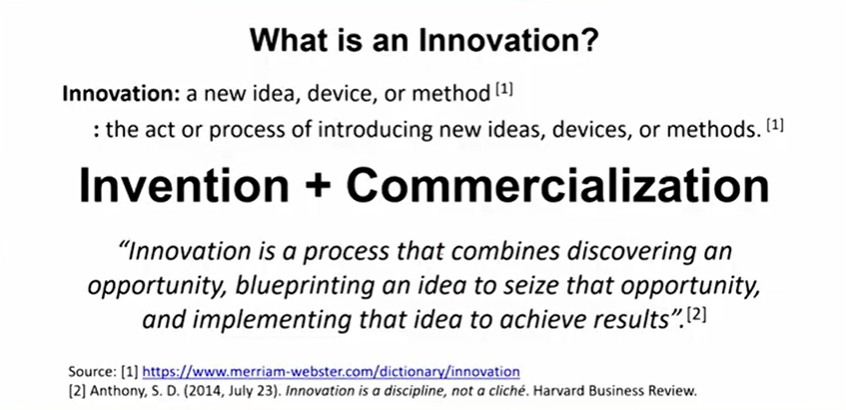
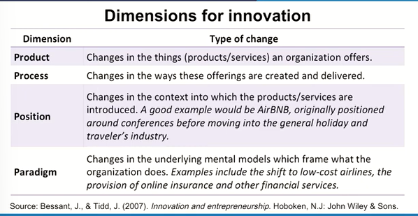
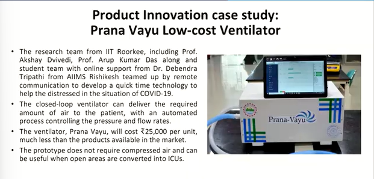
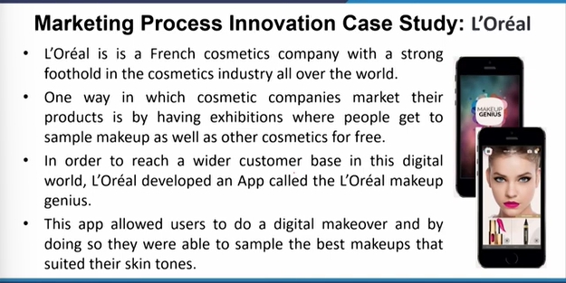
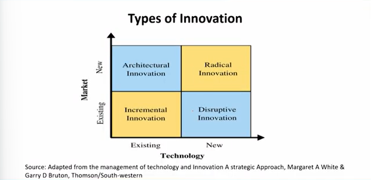
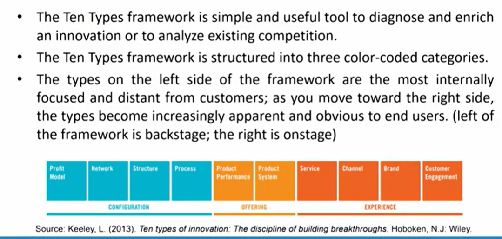
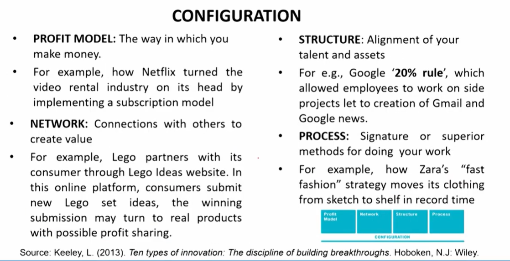
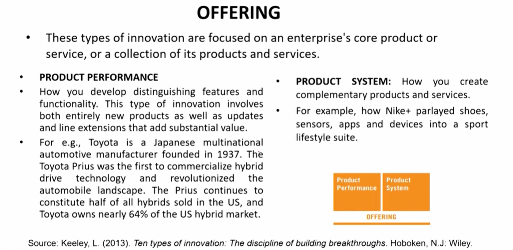
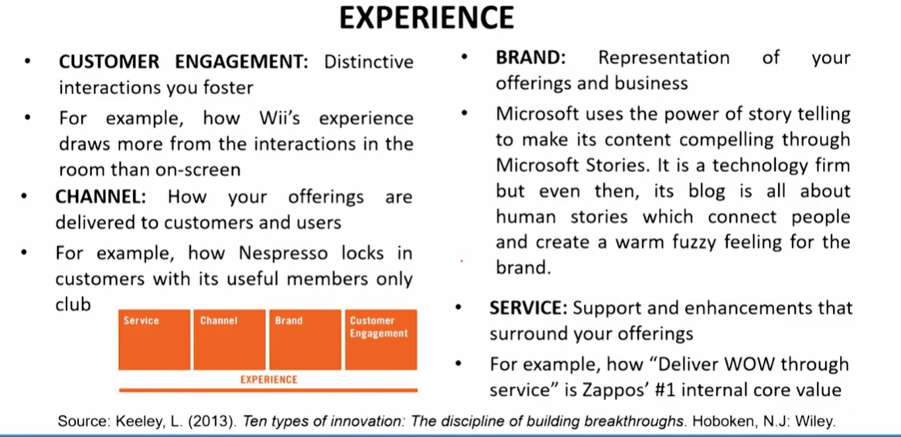
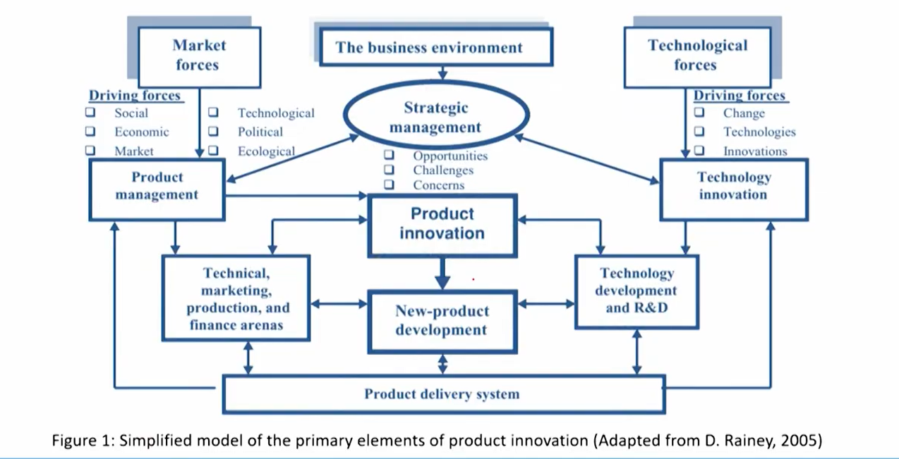

# Lecture 32: Product Innovation -1

## What is Innovation



```txt
Welcome back to yet another session of product and brand
management we have passed a stage of.
Where we try to develop an understanding towards design thinking
at this stage, I would suggest that you try to recollect the
fundamentals which we have discussed and then try to put up all
those fundamentals into the elements of design thinking which we
have talked about.
Because I am sure by this time you would have started noticing the.
Replicable changes instigated by processes or product designs or
you see overall for example, you would have started noticing that
what kind of sitting habits you have generated because of the
comfort you are getting in your chairs nowadays, the ergonomics
and those kind of things and from where has it come. So all these
kind of you know correlations or integration you you have started
noticing by this time, so after.
This let us start building up our thought process around.
Innovation.
It is, you know, an interconnected element of whatever we have
been discussing up till now, but let us focus on this, because this
has to be marked, this has to be noticed, the ultimate objective All of you with varied experiences and varied objectives in life, but
definitely oriented towards marketing and product and brand
management, you would like to know where you have a scope of
developing innovation, putting up innovation in due course of time
in your practical lives.
```

## Dimensions for Innovation



## Product Innovation case study: Prana Vayu Low-cost Ventilator



## Market Process Innovation Case Study : L'Oreal



## Types of Innovation



1. **Incremental Innovation** (Existing Technology, Existing Market) The goal is to improve an existing offering by adding new features, changes in the design, etc.
For example;

* Each new version of Apple's iPhone that comes out is typically incremental innovation. iPhone features such as the camera and processor are tweaked to make an improvement over the previous model.
* When Gillette went from a single razor blade to a double blade, to now up to six blades, no new markets were created, as the same consumers are buying the blades. There was no new technology involved, so this is incremental innovation.
* Residential washers and dryers have been transitioning from top-loading to side-loading and can handle larger loads. This incremental innovation used existing technology and created no new markets, but stimulated demand for more purchasers at higher prices.

2. **Disruptive Innovation** (Existing Market, New Technology) occurs when
firms introduce offerings that are so unique and superior that they
threaten to replace traditional approaches.
Existing markets are disrupted by new technology. It may create a "blue
ocean" by finding a new market while disrupting an existing one, but
this is not typically the case.  
**For Example;**  
Tablet computers disrupted laptop sales due to their versatility and
portability. Reading books can be awkward on traditional computers,
but user-friendly devices such as iPad, Nook, and Kindle are popular
platforms for aggressive textbook publishers.

3. **Architectural Innovation** (Existing Technology, New Market) occurs when new products or services use existing technology to create new markets and/or new consumers that did not purchase that item before.
For example,
* The smart watch used existing cell phone technology and was repackaged
into a watch. This opened a new market of purchasers by repackaging an
existing technology.
* Firms alter the architecture of the product to create a new product that opens up sales to new markets
* Digital ecosystem propellers like Amazon use this innovation strategy to enter new markets. They use existing expertise in building apps, platforms, and their existing customer base to offer new services and products for different markets.
* A recent example for this: Amazon recently entered the medical care field.

4. **Radical Innovation** (New Technology, New Market) that uses new
technology to reach new consumers is radical innovation. Firms who are
successful with a new product of service using radical innovation may
then employ a strategy of incremental innovation to continually improve
the product or service and generate more sales.
For example,  
The Magnetic Resonance Imaging (MRI) machine uses electro-magnetic
forces instead of x-rays to produce images internal to the body. This new
technology generated a brand new market for hospitals to buy these
machines for new diagnostic capabilities.

## Doblin's 10 Types of Innovation

* The ten types of innovation were established by Doblin, an innovation
consultancy firm founded in 1971, by Larry Keeley and Jay Doblin.
* The company is now part of Deloitte and is managed by Larry Keeley,
the global thought leader for innovation effectiveness.
* The book "Ten Types of Innovation: The Discipline of Building
Breakthroughs" explores these patterns of innovative moves to identify
opportunities within organizations and to evaluate how companies are
performing against competitors.
* The three categories of innovation are Configuration, Offering and
Experience.



## Configuration



## Offering



## Experience



## Overview of Product Innovation

* The primary objectives of product innovation are to create
value, to obtain a competitive advantage, and to achieve
long-term success through the development and commercialization of new products and services.
* The principal drivers of product innovation are customers,
markets, stakeholders, and the other constituents in the
business environment.
* Product innovation focus is on meeting customers needs
and expectations as they evolve. 

Product innovation includes several essential aspects;

1. Examining the needs for new products, processes, and services.
2. Determining the proper direction and fit for new products.
3. Establishing the appropriate game plan of the entire management
system for developing and commercializing new products.
4. Selecting new-product opportunities for investment.
5. Enhancing the organizational capabilities to create successful new
products.
6. Creating the new product and executing the new-product
development (NPD) program.

