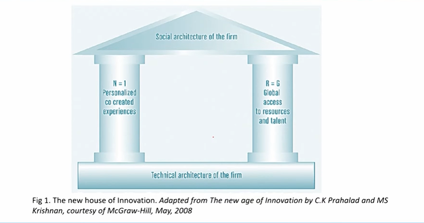
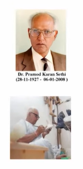
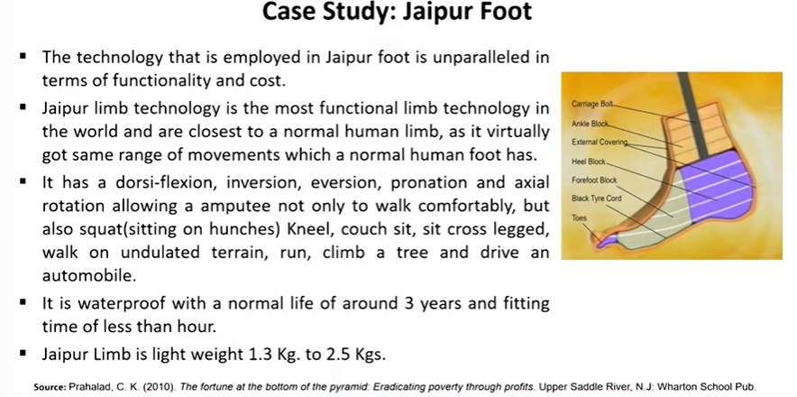
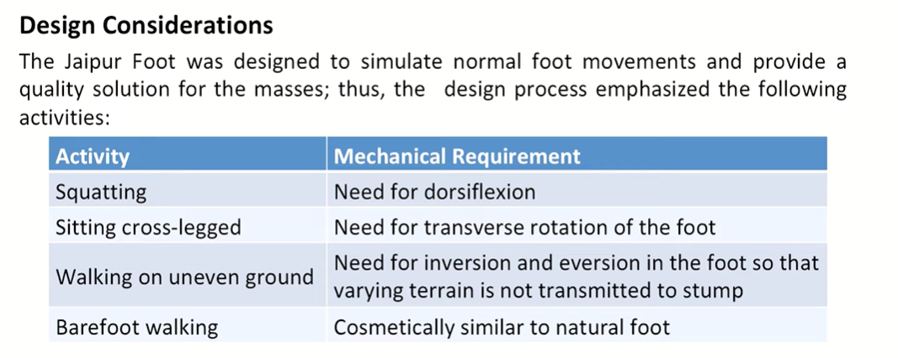
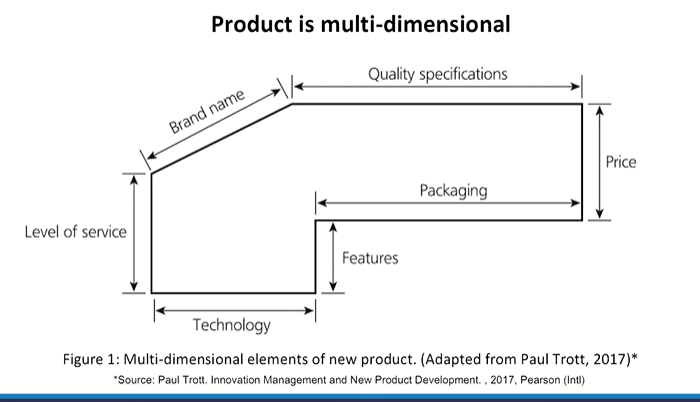

# Lecture 33: Product Innovation – 2

Three aspects of Innovation and value creation:

1. Cocreated consumers.
2. Access resources from multiple sources.
3. The emerging markets can be a source of innovation.

* Source: Prahalad, C.K., & Krishnan, M.S. (2018). The new age of innovation: Driving cocreated value
through global networks.

* TWO PILLARS OF THE NEXT GENERATION OF INNOVATION - N=1 & R=G

## They Key Element of transformation of Business

* The value is based on unique, personalised experience of customers- the
focus is on the centrality of the individual N=1 (one consumers experience
at a time).
* The focus is on access to resources, not ownership of resources.
* Value is shifting from products to solutions to experiences.
* No company has all resources it needs to create unique personalise experiences from the best source (R=G)
* Flexible systems are a prerequisite and must be developed.
* Resources in the ecosystem must be continually configured.
* Specific models must be developed to focus on one consumer from the millions.

## Principle 1. N = 1

* Value creation must focus on the individual consumer.
* Low cost (mass production) and differentiation (variety) were seen as clear
strategic choices.
* Mass customization cannot be scaled economically
* N = 1 goes beyond mass customization is that it is about understanding the
behavior, needs, and skills of individual consumers and cocreating with them a
value proposition that is unique to them.
* Elements need to consider: Flexibility, quality, cost and experience, collaborative
networks, Complexity, Customer Interfaces, Scalability.

## Priciple 2. R = G

* The principle R = G refers to the approach to understanding the nature of the resource
base of large firms and learning how to access high-quality resources at low cost.
* The challenges facing business in adopting the R = G perspective are the following.
* **Access to Resources:** all firms doesn't have access to all resources .Outsourcing is just
one way to access low-cost, high-quality talent.
* **Speed:** Cycle time and speed are critical elements of the N = 1 world.
* **Scalability:** The need for the continuous scaling and downsizing of operations is a
strategic imperative in the N = 1 world.
* **Innovation Arbitrage:** large firms better focus on small firms as sources of innovation

THE N = 1 AND R = G WORLD  

UNIQUE PERSONALISED EXPERIENCES AS THE  
BASIS FOR VALUE CREATION AND EXPANDING  
SOURCES OF RESOURCES  

## Case Study : Jaipur Foot

* The Jaipur leg also known as Jaipur Foot is a rubber-based prosthetic leg
for people with below-knee amputations produced under guidance of
Dr. P. K . Sethi, Shri. Ram Chander Sharma in 1969 for victims of
landmine explosions.
* Primarily fabricated and fitted by Bhagwan Mahaveer Viklang Sahayata
Samiti (BMVSS), a nongovernmental, nonreligious, and nonprofit
organization.
* With innovations in technology and management, as well as an
understanding of the needs of its patients, BMVSS developed a unique
business model.
* BMVSS has provided services to more than 11 lakh people in India and
more than 20 countries abroad since its inception and the numbers
have been increasing manifold.

### Development of the Jaipur Foot

## Bahubali :  A Unique insights of Product development

* **Idea & Vision:** Long term vision of director SS. Rajamouli that the very large scale of movie making ever produced in the Indian subcontinent with stunning sets breathtaking visuals VFX enhancements and animations.
He imagined, lived and never compromised on his idea or vision. It took 15000 Sketches, 20000 Weapons and once they are satisfied it evolved as a prototype and then to the actual element.
* **Planning:** Approx. 1000 people working for 1128 day with 250 Crores Expenditure.
* **Resources:** Baahubali was the product of quite a few million hours of teamwork and
dedication that went behind the scenes to bring an epic story to life
* There are no extraordinary people or team. It's taking ordinary people who are willing
to take an extra step in believing themselves and the whole team. There is no right
team/ decision - It's taking one and making it right.
* A good production design guarantees that the story has been told in the most effective
way possible. Baahubali would not have worked if viewers did not create an emotional
attachment to the characters, despite the fact that it is a larger-than-life mythical epic.
* Similarly, good products/apps must be developed with the user's experience in mind.
It is impossible to be successful with a completely working product that is poorly
designed.
* Designers have to put considerable thought into what elements are required in each
screen/component much like the movie makers pay attention to each frame in a
movie.
* **Development:** Product developer's role to include only the best features in the
product and package it in the most presentable format. Baahubali came up with
an engaging story and attained the core benefit of the product.
* **Execution and Marketing:** Rajamouli and his team has executed the Bahubali
project in right time by launching with Hybrid Marketing through traditional
marketing and digital marketing. The wide marketing effort and great content of Bahubali ensured the great word of mouth.
* **User retention:** "Why did Kattappa kill Baahubali?" built so much anticipation and hype so that anybody who watched the first movie would not dare miss out
on the second instalment.

## What is a new product?

* What is and what is not a new product is a trivial task?
* Whether the smartphone was indeed a new product or merely existing technology repackaged .....????
* Does the provision of different packaging for a product constitute a new product ......??????
* A product is a multidimensional concept. It can be defined differently and can take many forms (tangible product features & intangible aspects).
* Each dimension is capable of being altered. These alterations create a new dimension and in theory a new product, even if the change is very small.

## Product is multi-dimensional

