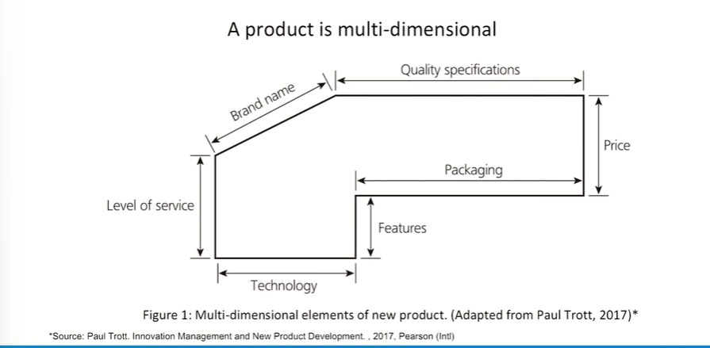

# Lecture 34: New Product Development

## A product is multidimensional

> That there are few products which probably would not change. I would not say never change, but probably would not change. For example pencil. Matchstick  

## Different examples of 'newness'

* **Changing the performance capabilities of the product**
(for example, a new, improved washing detergent)
* **Changing the application advice for the product**
(for example, the use of the Persil ball in washing machines)
* **Changing the after-sales service for the product**
(for example, frequency of service for a motor car)
* **Changing the promoted image of the product**
(for example, the use of 'green'-image refill packs)
* **Changing the availability of the product**
(for example, the use of chocolate-vending machines)
* **Changing the price of the product**
(for example, the newspaper industry has experienced severe price wars)

## Defining a new

* A new product has different interpretations of 'new'

**New product A**  
A snack manufacturer introduces a new, larger pack size for its best-selling savoury snack.
Consumer research for the company revealed that a family-size pack would generate
additional sales without cannibalizing existing sales of the standard-size pack.

**New product B**  
An electronics company introduces a new miniature compact disc player. The company
has further developed its existing compact disc product and is now able to offer a much
lighter and smaller version.

**New product C**  
A pharmaceutical company introduces a new prescription drug for ulcer treatment.
Following eight years of laboratory research and three years of clinical trials, the company
received approval from the government's medical authorities to launch its new ulcer drug.

* The three products are all new in that they did not exist before.
* However, many would argue, especially technologists, that Product A
does not contain any new technology.
* Similarly, Product B does not contain any new technology although its
configuration may be new.
* Product C contains a new patented chemical formulation; hence this is
the only truly new product.
* Marketers would, however, contend that all three products are new
simply because they did not previously exist.
* Moreover, **meeting the needs of the customer and offering products
that are wanted is more important than whether a product
represents a scientific breakthrough.**