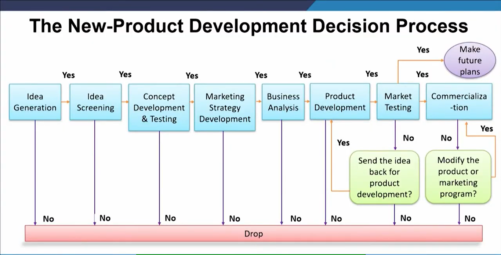
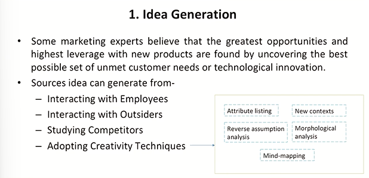
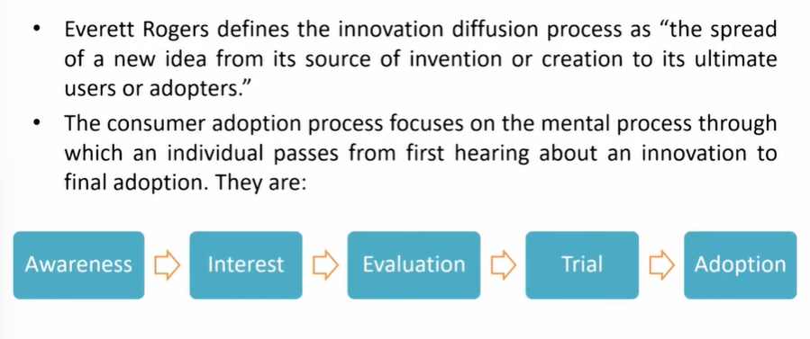

# Lecture 34: New Product Development

## A product is multidimensional

> That there are few products which probably would not change. I would not say never change, but probably would not change. For example pencil. Matchstick  

## Different examples of 'newness'

* **Changing the performance capabilities of the product**
(for example, a new, improved washing detergent)
* **Changing the application advice for the product**
(for example, the use of the Persil ball in washing machines)
* **Changing the after-sales service for the product**
(for example, frequency of service for a motor car)
* **Changing the promoted image of the product**
(for example, the use of 'green'-image refill packs)
* **Changing the availability of the product**
(for example, the use of chocolate-vending machines)
* **Changing the price of the product**
(for example, the newspaper industry has experienced severe price wars)

## Defining a new

* A new product has different interpretations of 'new'

**New product A**  
A snack manufacturer introduces a new, larger pack size for its best-selling savoury snack.
Consumer research for the company revealed that a family-size pack would generate
additional sales without cannibalizing existing sales of the standard-size pack.

**New product B**  
An electronics company introduces a new miniature compact disc player. The company
has further developed its existing compact disc product and is now able to offer a much
lighter and smaller version.

**New product C**  
A pharmaceutical company introduces a new prescription drug for ulcer treatment.
Following eight years of laboratory research and three years of clinical trials, the company
received approval from the government's medical authorities to launch its new ulcer drug.

* The three products are all new in that they did not exist before.
* However, many would argue, especially technologists, that Product A
does not contain any new technology.
* Similarly, Product B does not contain any new technology although its
configuration may be new.
* Product C contains a new patented chemical formulation; hence this is
the only truly new product.
* Marketers would, however, contend that all three products are new
simply because they did not previously exist.
* Moreover, **meeting the needs of the customer and offering products
that are wanted is more important than whether a product
represents a scientific breakthrough.**

## Classification of new products

**New-to-the-world products:** They are the first of their kind and create a new market. They are inventions that usually contain a significant development in technology, such as a new discovery, or manipulate existing technology in a very different way, leading to revolutionary new designs.
For e.g., the internet, antibiotics, vaccines etc.,

**New product lines (new to the firm):** Although not new to the marketplace, these **products are new to the particular company.** They provide an opportunity for the company to enter an established market for the first time.
For example, Alcatel, Samsung and Sony-Ericsson have all entered the cell phone market to compete with market leaders Nokia and Motorola originators of the product.

* **Additions to existing lines:** This category is a subset of new product lines above.
The distinction is that while the company already has a line of products in this
market, the product is significantly different from the present product offering but
not so different that it is a new line. The distinction between this category and the
former is one of degree.
For example,  
Hewlett Packard's colour ink-jet printer was an addition to its established.
McDonald's introduced pudina flavored burgers for Indian consumers.
* **Improvements and revisions to existing products:** These new products are
replacements of existing products in a firm's product line.  
For example, Hewlett-Packard's ink-jet printer has received numerous
modifications overtime and, with each revision, performance and reliability have
been improved.

**Cost reductions:** This category of products may not be viewed as new
from a marketing perspective, largely because they offer no new benefits
to the consumer other than possibly reduced costs.  
For e.g., Reliance Jio

**Repositioning:** These new products are essentially the discovery of
new applications for existing products. This has more to do with
consumer perception and branding than technical development.  
*Following the medical science discovery that aspirin thins blood, for
example, the product has been repositioned from an analgesic to
an over-the-counter remedy for blood clots and one that may help
to prevent strokes and heart attacks.*

## The New-Product Development Decision Process

## 1. Idea Generation

## 2. Idea Screening

* The purpose of screening is to drop poor ideas as early as possible.
* The rationale is that product-development costs rise substantially with
each successive development stage.
* Most companies require new-product ideas to be described on a
standard form that can be reviewed by a new-product committee.
* The executive committee then reviews each idea against a set of
criteria.
* As the idea moves through development, the company will constantly
need to revise its estimate of the product's overall probability of
success.

## 3. Concept Development - A

. **Consumers do not buy product ideas; they buy product concepts.**
. A product idea can be turned into several concepts.
. The first question is: who will use this product?
. Second, what primary benefit should this product provide?
. Third, when will people consume this product?
. By answering these questions, a company can form several concept.
. Each concept represents a category concept that defines the product's
competition.
. Next, the product concept has to be turned into a brand concept.

## 3. Concept Testing - B

* Concept testing involves presenting the product concept to target
consumers and getting their reactions.
* The concepts can be presented symbolically or physically.
* Visualization techniques can help respondents match their mental state
with what might occur when they are actually evaluating or choosing
the new product.
* Today firms can use rapid prototyping to design products on a
computer, and then produce plastic models of each and get reactions.
* Companies are also using virtual reality to test product concepts.
Virtual reality programs use computers and sensory devices (such as
gloves or goggles) to simulate reality.

## 3. Conjoint Analysis - C

* Conjoint analysis is a method for deriving the utility values that
consumers attach to varying levels of a product's attributes.
* Respondents are shown different hypothetical product offers formed
by combining varying levels of the attributes, then asked to rank these
offers.
* From this ranking, management can identify the most appealing offer
and the least appealing offer and determine the importance level of
each attribute.
* Management can then estimate the market share and profit the
company might realize from different product offers.

## 4. Market Strategy Development

* Following a successful concept test, the new-product manager will
develop a preliminary strategy plan for introducing the new product
into the market.
* The plan consists of three parts.
- The first part describes the target market's size, structure, and
behavior; the planned product positioning; and the sales, market
share, and profit goals sought in the first few years.
- The second part outlines the planned price, distribution strategy,
and marketing budget for the first year.
- The third part of the marketing-strategy plan describes the long-run
sales and profit goals, and marketing-mix strategy over time.

## 5. Business Analysis

* After management develops the product concept and marketing
strategy, it can evaluate the proposal's business attractiveness.
* Management needs to prepare sales, cost, and profit projections to
determine whether they satisfy company objectives. If they do, the
concept can move to the development stage. As new information
comes in, the business analysis will undergo revision and expansion.
* Estimating Total Sales
* Estimating Costs and Profits

## 6. Product Development

* Up to now, the product has existed only as a word description, a
drawing, or a prototype.
* This next step involves a jump in investment that dwarfs the costs
incurred in the earlier stages.
* At this stage the company will determine whether the product idea can
be translated into a technically and commercially feasible product.
* If it cannot, the accumulated project cost will be lost except for any
useful information gained in the process.

## 7. Market Testing

* After management is satisfied with functional and psychological
performance, the product is ready to be dressed up with a brand name
and packaging and go into a market test.
* Market testing can yield valuable information about buyers, dealers,
marketing program effectiveness, and market potential.
* The main issues are: how much market testing should be done, and
what kind(s)?
* Market testing is influenced by-
  - Investment cost and risk
  - Time pressure and research cost

## 8. Commercialization

* Commercialization is the ultimate act of launching the product in the
product with proper strategies and correct timing.
* Most new-product campaigns also require a sequenced mix of market
communication tools to build awareness, preference, choice, and
loyalty.
* Points to consider are-
  - When (Timing)- First entry, Parallel entry, Late entry
  - Where (Geographic Strategy)
  - To Whom (Target-Market Prospects)
  - How (Introductory Market Strategy)

## Stages in Consumer Adoption Process

