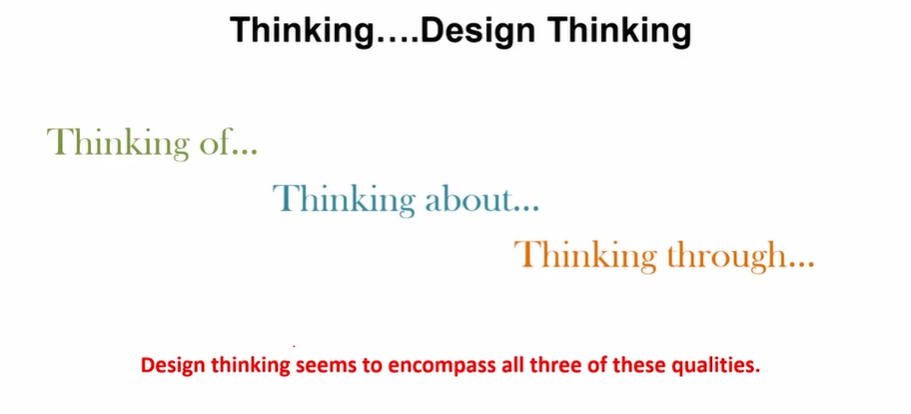
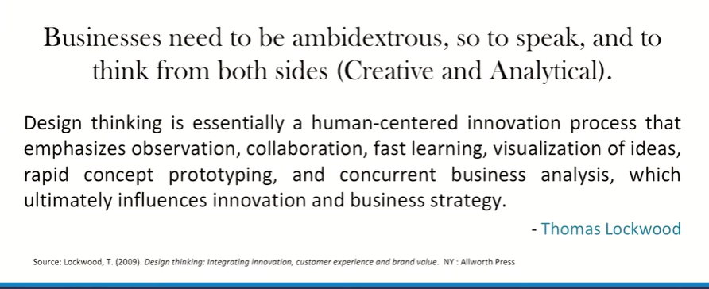
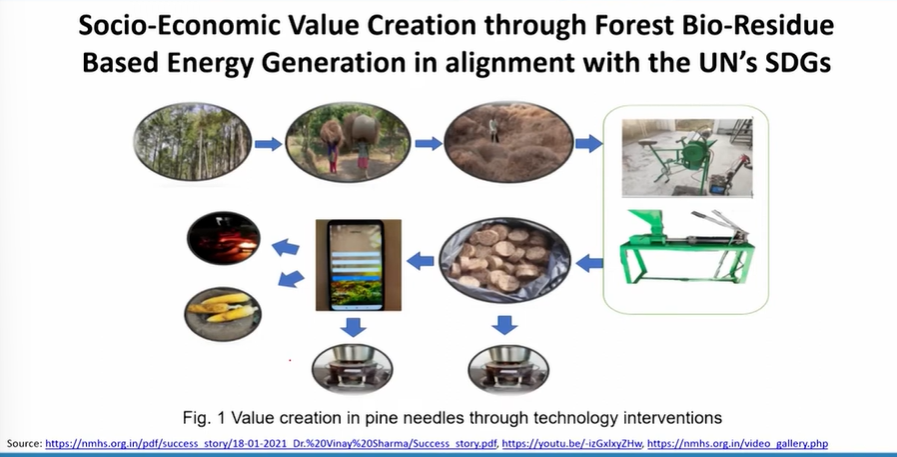
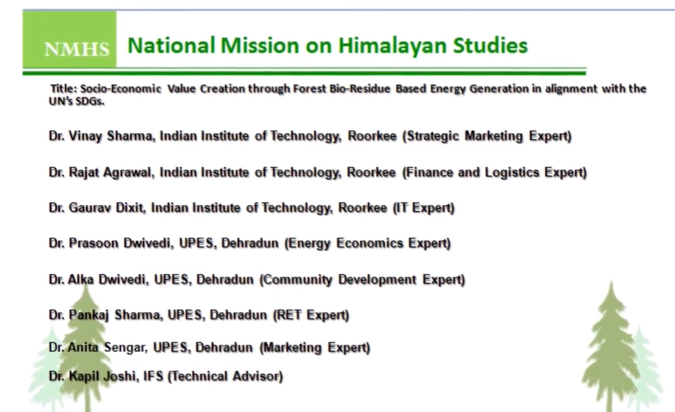
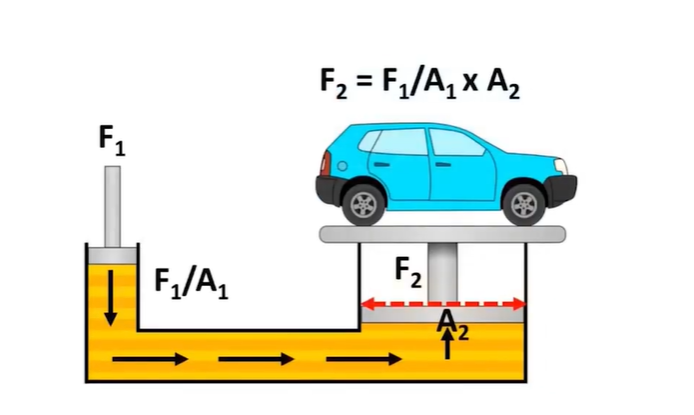
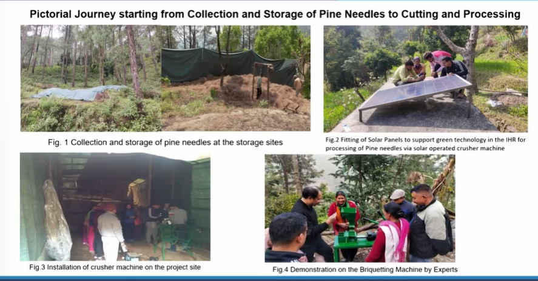

# Lecture 35: Reflexivity, Insight, and Value Co-Creation

## Reflexivity

'Reflexivity means interpreting one's own interpretations,
looking at one's own perspective from other's perspective,
and turning a self-critical eye onto one's own authority as
an interpreter and author'  
~Alvesson and Skoldberg, Reflexive Methodology(2000)

## Reflection and Reflexivity

* Reflective Practice can enable enquiry into.
* What you know but do not know you know.
* What you do not know and want to know.
* What you think, feel, believe, value, understand about your role and
boundaries.
* How your actions match up with what you believe.
* How to value and take into account personal feelings.

## Design Thinking

## Insight

* Connections,
* Contradictions,
* Coincidences,
* Curiosity and
* Creative Desperation.

Source - Source: Klein, G. (2013). Seeing what others don't: The remarkable ways we gain insights. Public Affairs.

## Reflexivity : Key words

**Reflective thinking** is thinking about the process and parts of our research
systematically, in depth, seeking multiple and alternative perspectives.

**Reflexivity** is a state of thinking and being in which, we strive to
understand 'the ways in which one's own presence and perspective
influence the knowledge and actions which are created' (Fook in Bolton
2009: 14).  

**Critical reflexivity** has a sociological and political edge; it is concerned with
the social conditions of truth itself, and with problems of power in
academic research.

## Specific Objectives

1. Development of the Improved version of a manually operated Briquetting Machine.  
2. Installation of Briquetting machine in the field.  
3. Production of Pine Briquettes in the field by beneficiaries.  
4. Developing value chain for above product.  
5. Deployment of IT enabled system. (Mobile Application)  

