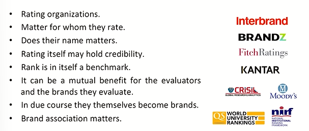
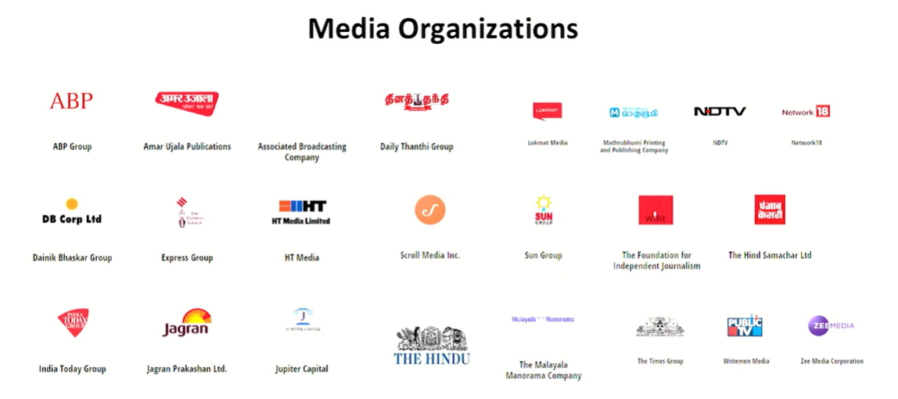
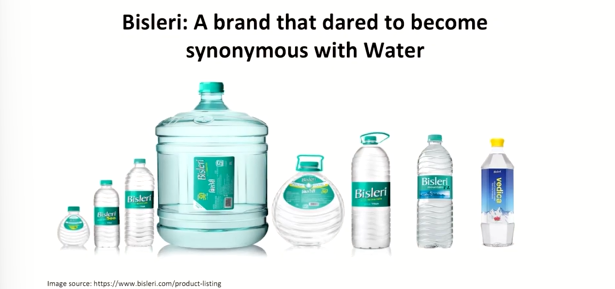
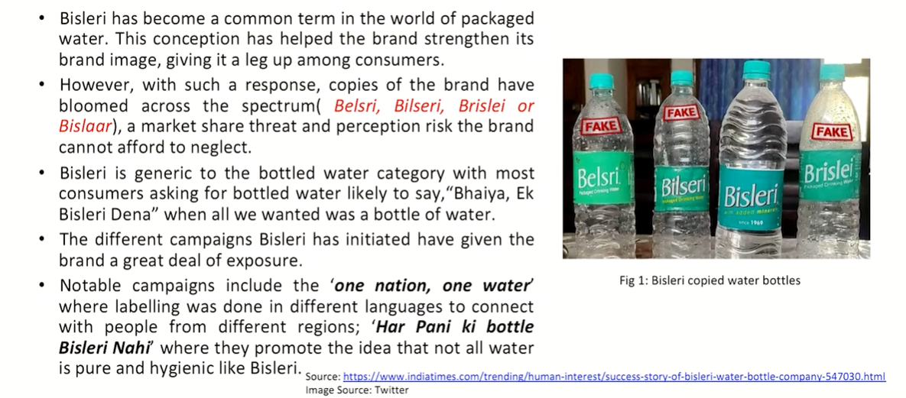

# Lecture 36: Brand Management

> A product being a brand, how product takes a leap to become a brand  
> It's a beautiful kind of a journey which product takes from being itsel to being a brand.  
> Branding is a one of the most enduring elements of whole  
> It matters when a product becomes a brand, a service becomes a brand and then the new journey of that product or service begins.  

## Indian Institue of Technology/IIT

e.g. IIT Roorkee  

what does IIT means to you?  

Then talk to a recruiter, an organization which hires from IITs

talk to an alumunus  

Talk to someone who has graudated e.g. 50 years ago  

What role IIT Roorkee has played in your life? Every role it has played in our life. That is the kind of perspective they carry  

## Brand and Brand Evaluators

## Media Organizations  

## Bisleri

### Bisleri : A brand that dared to synonymous with water  

* Bisleri was originally an Italian company created by Signor Felice Bisleri. He first brought the idea of selling bottled water in India.
* In1965, Bisleri setup a plant in Mumbai and started manufacturing of packaged drinking water in glass bottles in two varieties Bubbly and Still.
* Parley bought over Bisleri (India) Ltd in 1969 and started manufacturing under the brand name Bisleri.
* Bisleri was synonymous with branded water market early 1990s.
* The market was segmented into premium, popular and bulk. Bisleri's products are affordable and offer more quantity with less cost.
* Bisleri uses a location-based pricing strategy, products sold in restaurants, theatres, etc. are costlier compared to retail shops.

