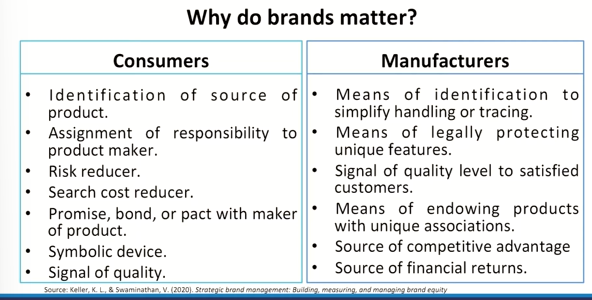
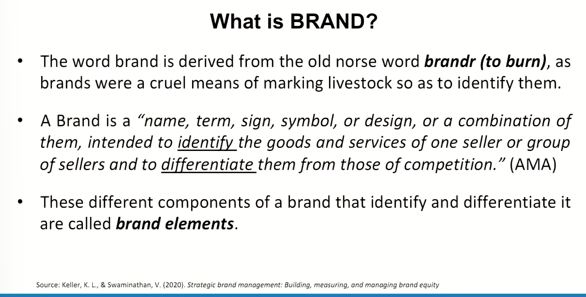
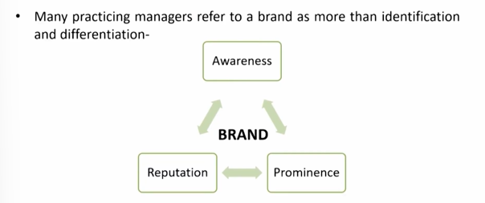

# Lecture 37: Defining Brand

## Product vs Brand

* A product is anything we can offer to a market for attention,
acquisition, use, or consumption that might satisfy a need or want.
* Brand is therefore more than a product, because it can have
dimensions that differentiate it in some way from other products designed to satisfy the same need.
* These differences may be rational and tangible-related to product performance of the brand-or more symbolic, emotional, and intangible-related to what the brand represents.

**"Brand carry associations, even stronger ones."**

## Small 'b' & Big 'B'

* For example,
Paracetamol- Calpol  
Mosquito Repellent  
* There is a relationship between a product being Core,
Augmented, Potential with being small to big B but it is
evident in all the stages.
* The question is **"when does a brand takes birth"**?

## Why do brands matter?

## Can Anything be Branded?

* The key to branding is that consumers perceive differences among brands in a product category.
* Basic Commodity- a product so basic that it cannot be physically differentiated from competitors in the minds of consumers.
* Can you Brand a commodity? HOW?
* **Soap**- Dove, Fiama Di Wills, Lux
* **Salt**- Tata- Desh ka Namak, Catch
* **Aata (Flour)**- Aashirvaad, Patanjali
* **Milk**- Amul- Amul Dudh Peeta hai India, Mother dairy
* **Diamond**- De Beers Group - "A Diamond Is Forever",
* **Nakshatra Diamonds**- Heera hai sada ke liye”
* **High-Tech Technology**- Infosys, Google, Boeing
* **Services**- Taj hotel, Accenture, TCS, Uber, Netflix, Adobe
* **People**- Amitabh Bachhan, Sachin Tendulkar, Sanjeev Kapoor
* **Organizations**- UNICEF, WHO, FIFA
* **Sports, art and Entertainment**- Harry Potter, Bahubali, Cricket
* **Geographic Locations**- 'Aamchi Mumbai', Kerala- God's own Country, Incredible India, New Zealand's marketing in relation to The Lord of the Rings movie franchise.
* **Ideas and Causes**- Education, freedom, social, justice, health etc.

## What is BRAND?

**Prominence** means the state of being important, well-known, or easily noticed.

Examples:  
The scientist gained prominence after her groundbreaking discovery.  
→ She became well-known and respected.  
The mountain's prominence makes it visible from miles away.  
→ It stands out because of its height.  
The company rose to prominence in the tech industry.  
→ It became influential and important.  

