# Lecture 38: Strategic Brand Management Process

## Rolex

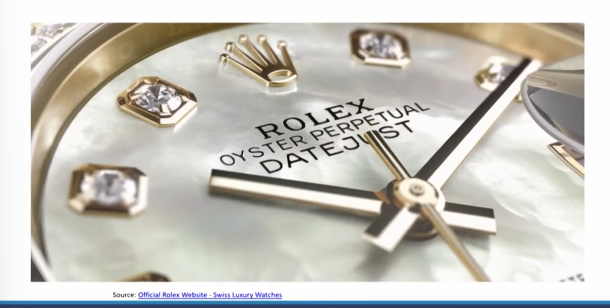

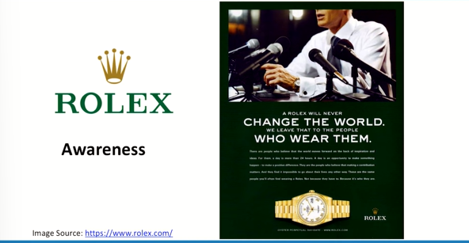

* The 2014 Global RepTrak 100 study by the Reputation Institute places Rolex in an exceedingly high position as tied for second place on their overall list of the 100 most reputable companies, and number one when it comes to a reputable company as measured by consumers.
**(Reputation)**
* As a wristwatch, a Rolex is a more personal item with less regular visibility even though Rolex is a major international advertiser. What is so impressive is that, despite all this, Rolex has succeeded in keeping their product not only in a state of high-regard among consumers, but also on their minds. **(Prominence)**

## Strategic Brand management Process

* Strategic brand management involves the design and implementation
of marketing programs and activities to build, measure, and manage
brand equity.
* Strategic brand management process have four main steps:
- Identifying and developing brand plans (Brand Positioning Model,
Brand Resonance Model, Brand Value Chain)
- Designing and implementing brand marketing programs
- Measuring and interpreting brand performance
- Growing and sustaining brand equity (Brand architecture)

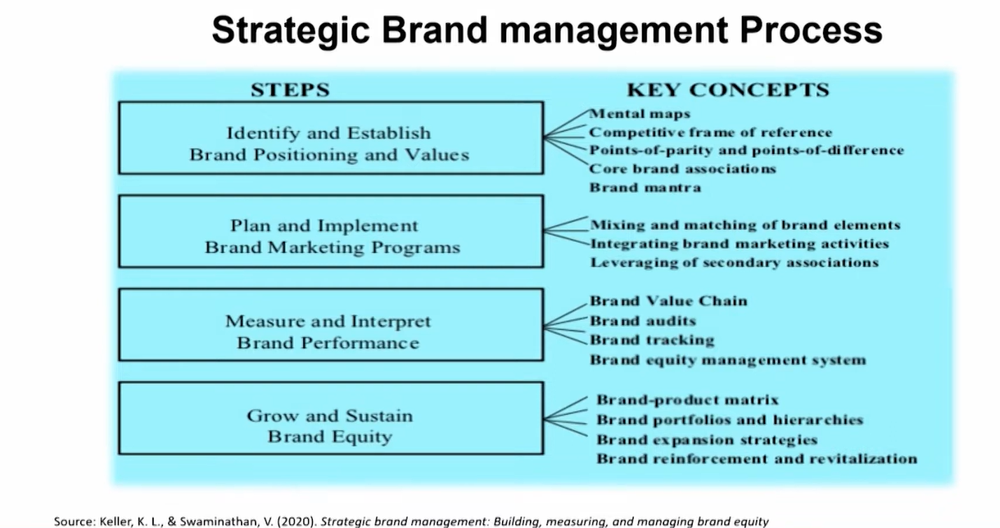

## Branding Challenges and Opportunities

. Unparalleled Access to Information and New Technologies  
. Downward Pressure on Prices  
. Ubiquitous Connectivity and Consumer Backlash  
. Sharing Information and Goods  
. Unexpected Sources of Competition  
. Disintermediation and Reintermediation  
. Alternative Sources of Information about Product Quality  
. Winner-Takes-All Markets  
. Media Transformation  
. Customer Centricity  

## Different Outlooks of "Brand"

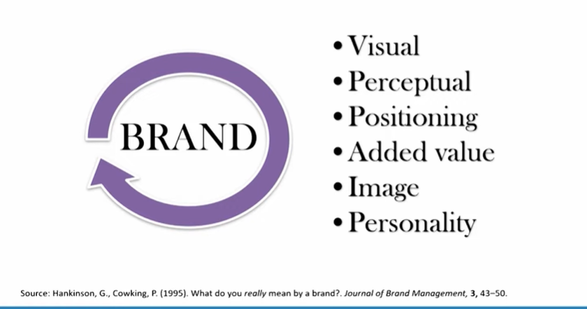

### Visual Definitions (Name and visual aspects)

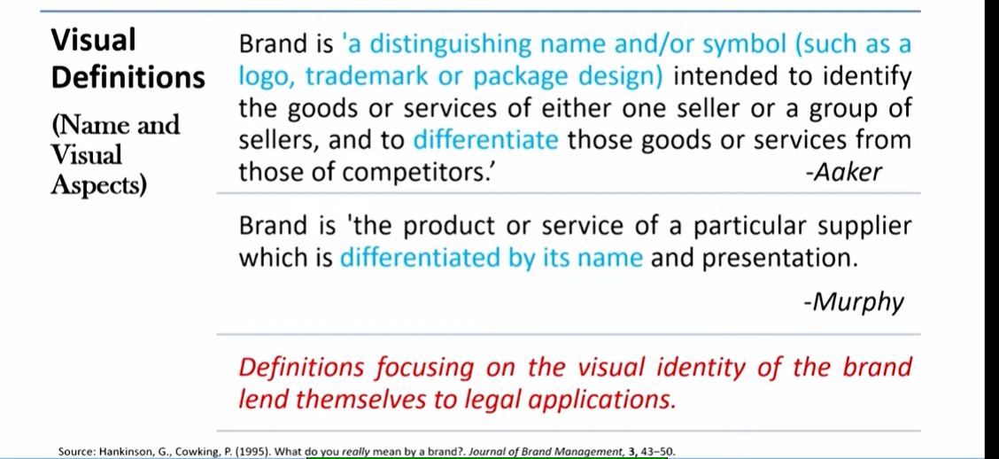

### Perceptual Definitions (consitituent parts of brand)

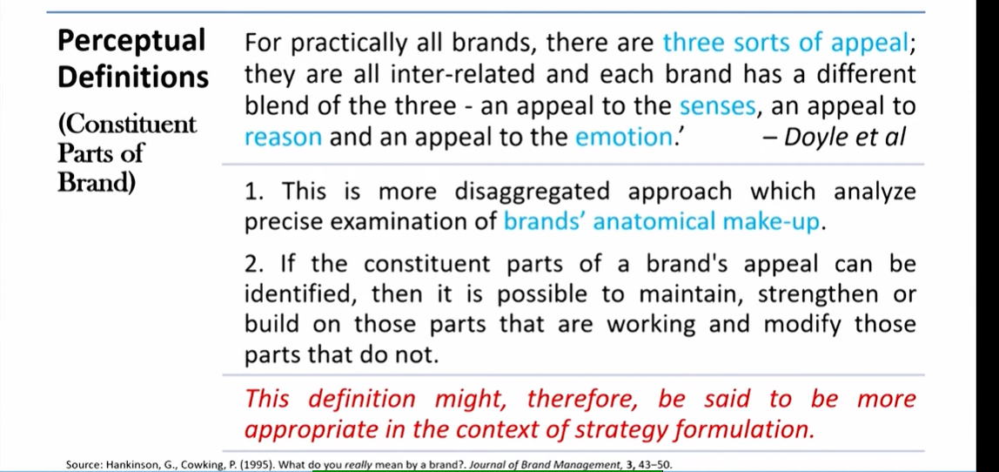

### Positioning Definitions (Battle of the mind)

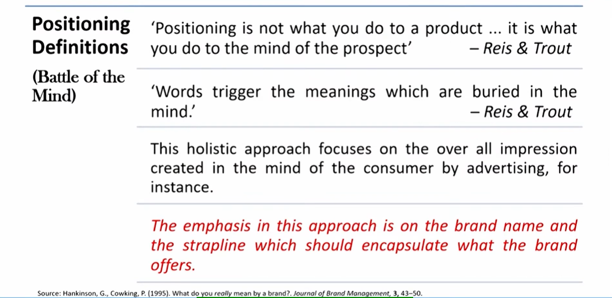

### Added-Value Definitions

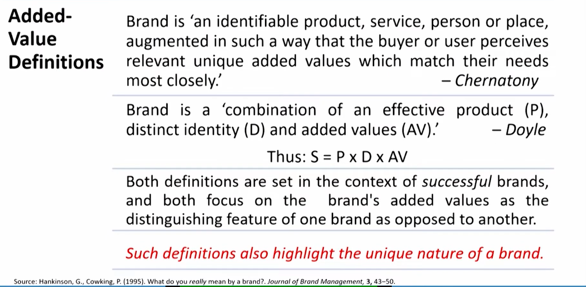

### Image Definitions

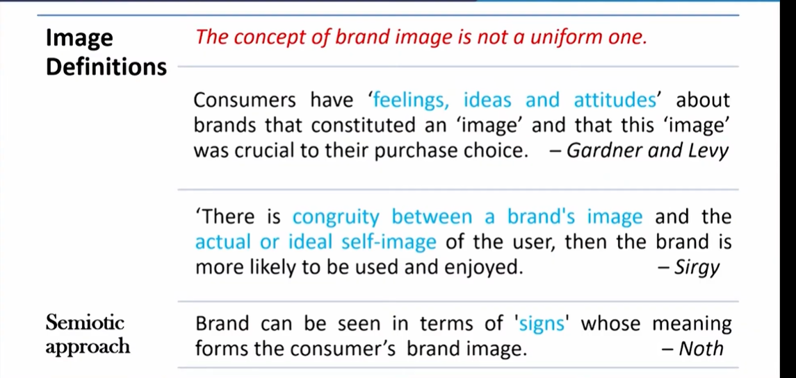

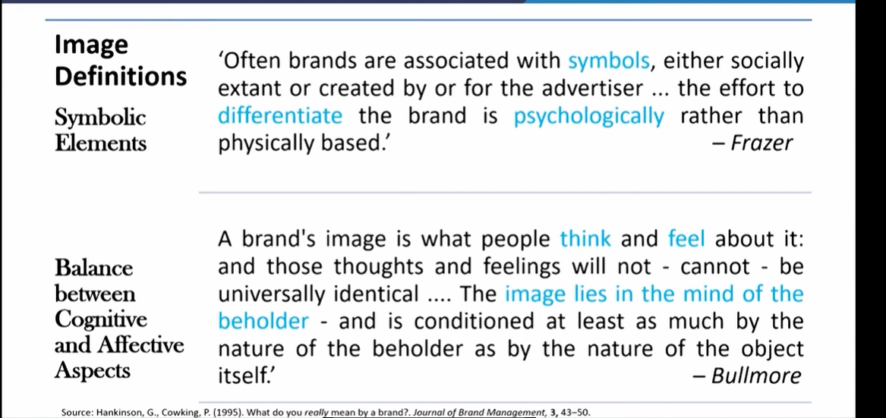

### Personality Definitions

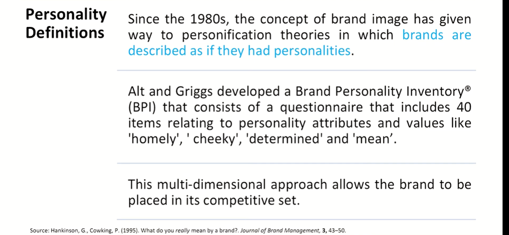

### Where to from here?

* Each of the six categories of brand definitions add something to the
understanding of the concept.
* Each, in some way, lends itself to at least one aspect of brand
management such as strategy formulation, creative execution, market
research or targeting.
* To bring these strands together, a brand management checklist system
has been put together based upon what the authors regard as a more
all-embracing definition of a brand.