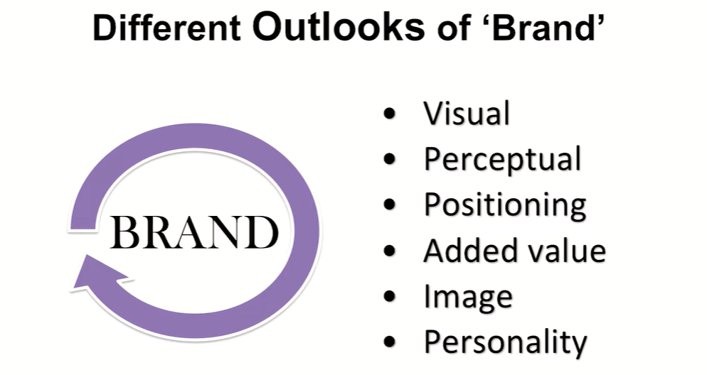
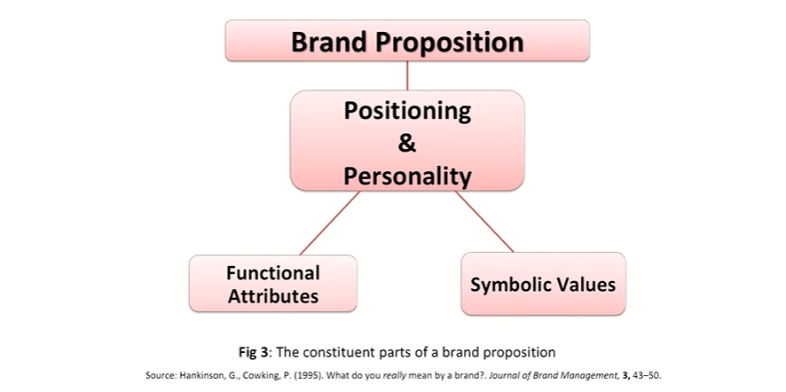
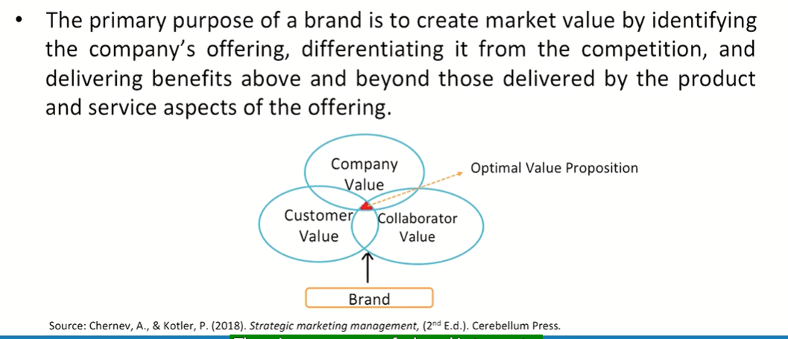
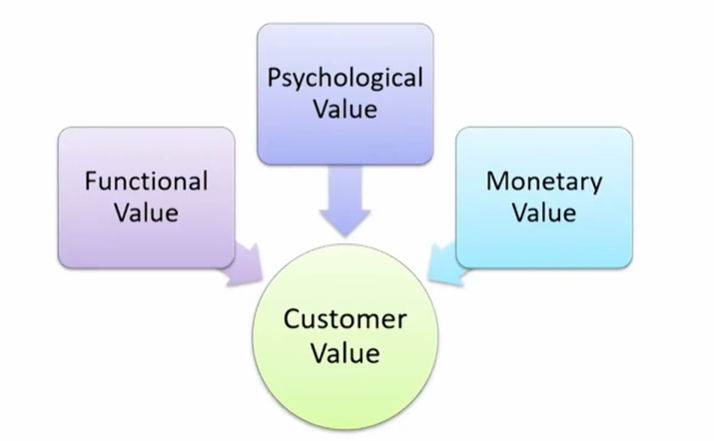
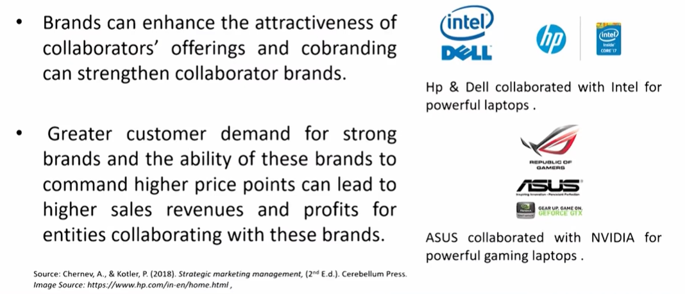

# Lecture 39: Brand Proposition

* To bring these strands together, a brand management checklist system has been put together based upon what the authors regard as a more all-embracing definition of a brand.

* 'A brand is a product or service made distinctive by its positioning,
relative to the competition, and by its personality ... Positioning defines
the brand's point of reference either by price or by usage. Personality
consists of a unique combination of functional attributes and symbolic
values with which the target consumer identifies.' -Hankinson & Cowking
* So, for the purposes of analysis, there is a three-part definition of a
brand involving:
  - Personality (Ruggedness- Levi's Jeans, Competence- Volvo,
Sophistication- Rolex)
  - positioning
  - target consumer.

## Value Proposition

## Brands as a Means of Creating Customer Value

* Customer value is intangible and idiosyncratic.
* Value is intangible because it is **not a property** of the company's offering
and **does not physically exist** in the market.
* Value is created when a customer interacts with the company's offering;
it reflects a **customer's subjective evaluation of the worth** (utility) of the
offering.
* As a customer's evaluation of the worth of the company's offering is
subjective, value is idiosyncratic, meaning that the **same offering can
have different value for different customers;** an offering that is
appealing to one customer might be of little or no value to another customer

## The three Dimensions of Customer Value

## Brands as a Means of creating functional value

* **Identifying the company's offering**
  * For example, Customers identify P&G's detergent brand name Tide.
* **Signaling an offering's performance**
  * For example, Tide brand signals cleaning power.
* **Enhancing customers' perception of an offering's performance**
  * For example, brands signaling wealth (e.g., Patek Philippe watches,
Bugatti cars) or professional expertise (Bosch construction tools and
Montblanc business accessories) can serve the functional benefit of
establishing an individual's credibility and facilitating business
transactions.

## Brands a a Means of Creating Psychological Value

* **Conveying emotions**
  * For example, Coco-Cola (open happiness), Tata Nano (Khushiyon ki
Chaabi) evokes feelings of happiness and affection, Nike (Just Do it)
evokes a sense of leadership, and Kodak (Share Moments, Share Life)
evokes memories of special occasions in people's lives.
* **Enabling self-expression**
  * For example, brands like Harley-Davidson and Abercrombie & Fitch
stand for different types of lifestyles.
* **Signaling societal value**
  * For example, UNICEF, CARE, World Wide Fund

## Brands as a Means of Creating Monetary Value

* **Signaling an offering's price**
* **Enhancing an offering's monetary value**
  * For example, The financial benefit of brands is particularly prominent in
the case of collectible items. To illustrate, a 1936 Bugatti sold for over
$30 million in 2010, significantly higher than warranted by its functional
value as a means of transportation.
    * Likewise, the Hermès Birkin bag commands a resale price as high as
$100,000, which is to a large degree attributed to the iconic status of
the brand.

## Brands as a Means of Creating Company Value

* Brands can encourage customer demand, amplify
the impact of other marketing efforts and can
facilitate the hiring and retaining of skilled
employees.
* Brands can generate incremental revenues and
profits, can increase the valuation of the company
and can create a separable company asset.

## Brands as a Means of Creating Collaborator Value

