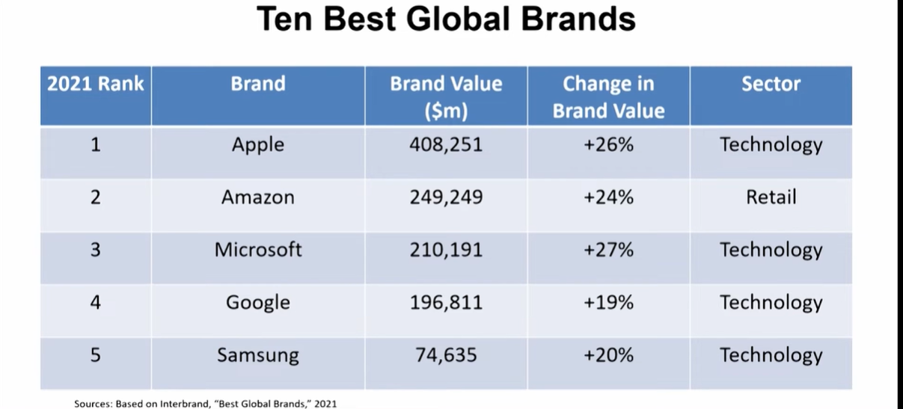
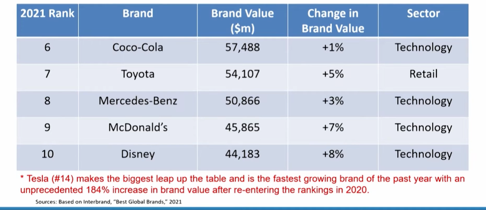
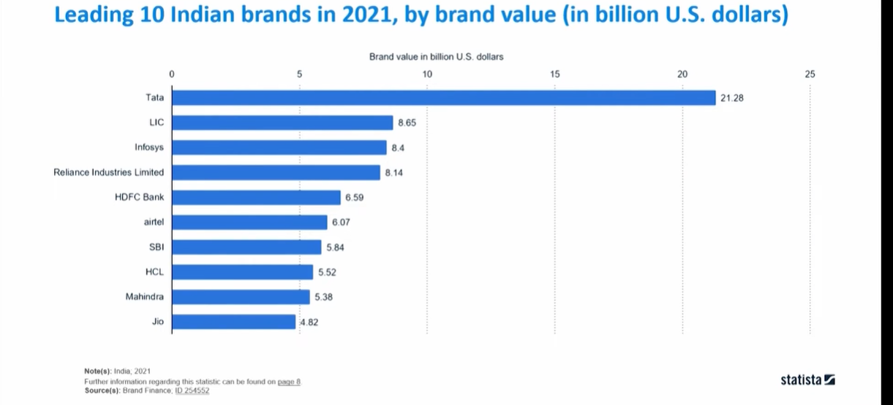
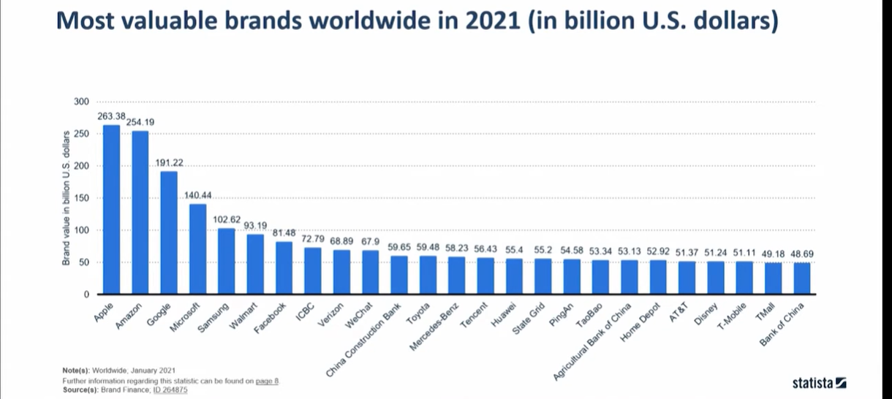

# Lecture 40: Customer-based Brand Equity - 1

## Brand Value

Brand value refers to the price (premium) a consumer is
willing to pay for a specific brand, over and above a
baseline.  

For example,  
"when people are asked in brand value surveys to place a
monetary value on a car (the same car is used in the
photographs, but different badges are superimposed on the
bonnet to suggest it is a different brand).

* **Brand Value**
  * **Brand Equity**
    * **Brand equity reflects the monetary value** of the brand and the premium that should be placed on a company's valuation because of brand ownership
  * **Brand Power**
    * Brand power reflects the brand's ability to influence the behavior of the relevant market entities-its target customers, its collaborators, and the company employees.


## Brand Power

* **Brand power** is a key indicator of brand equity. Power of the brand measures the size of company's audience and their perception toward company. Whereas, in marketing
term, brand power is calculation of familiarity and favourability of the organization. [2]
* Corebrand, a research firm, using the Brand Contribution to Market Cap method
concerted familiarity and favourability to size and quality of the firm in order to
measure the power of a brand.

* **Brand familiarity** is the how well known a company is. To measure this parameter in accounting terms 'Size' of the company is taken. Similarly, for measuring brand
favourability, reputation, perception, and potential of investment of an organization is calculated. According to the Corebrand, Familiarity and favourability of an organization will further help the firm to indicate the strength of its brand image.

* Brand Power* is a measure of size (familiarity) and quality (favorability).
* Familiarity and favorability are combined into a single Brand Power score.
* **Familiarity:** A weighted percentage of survey respondents who are familiar
with the brand being evaluated. Familiarity is rated on a five-point scale,
respondents are considered to be familiar with a brand, if they state that
they know more than the company name only.
* **Favorability:** Those familiar with a corporation are then asked favorability
dimensions, overall reputation, perception of management, and investment
potential. Favorability attributes are evaluated on a 4-point scale.

## Ten Best Global Brands









## David Aaker's 10 Attributes of Brand Equity

1. Differentiation,
2. Satisfaction or Loyalty,
3. Perceived Quality,
4. Leadership or Popularity,
5. Perceived Value,
6. Brand Personality,
7. Organizational Associations,
8. Brand Awareness,
9. Market Share,
10. Market Price and Distribution Coverage

```txt
how you would be playing a particular kind of
a role in terms of being a brand manager or a
product and a brand manager later on when
you join an organization or if you are working
somewhere. So you must be understanding on
what kind of and you know role you would be
able to play, what, what points you should be
choosing on to as far as generating a
particular kind of an impact goes.
```

## Principles of branding and brand equity

* Differences in outcomes arise from the "added value" endowed to
a product.
* The added value can be created for a brand in many different
ways.
* Brand equity provides a common denominator for interpreting
marketing strategies and assessing the value of a brand.
* There are many different ways in which the value of a brand can
be exploited to benefit the firm.

## Customer-based Brand Equity

* CBBE concept approaches brand equity from the perspective of the
consumer.
* Stresses that the power of a brand lies in what resides in the minds and
hearts of customers.
* Differential effect that brand knowledge has on consumer response to
the marketing of that brand.
* Consumers perception of the brand plays a key role in determining the
worth of the brand.
* Keller et al. (2017) defines Customer-based brand equity as the
***differential effect*** that **brand knowledge** has on ***consumer response to
the marketing*** of that brand.


