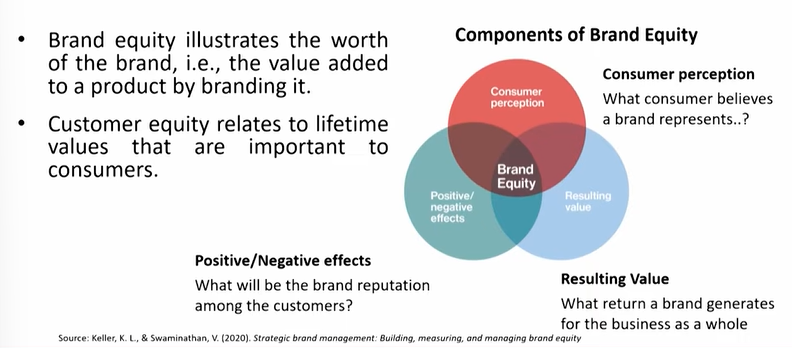
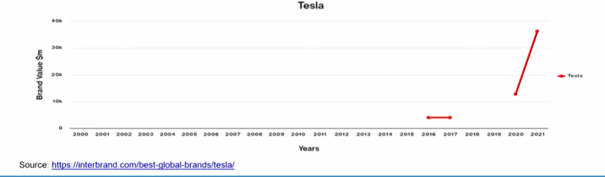
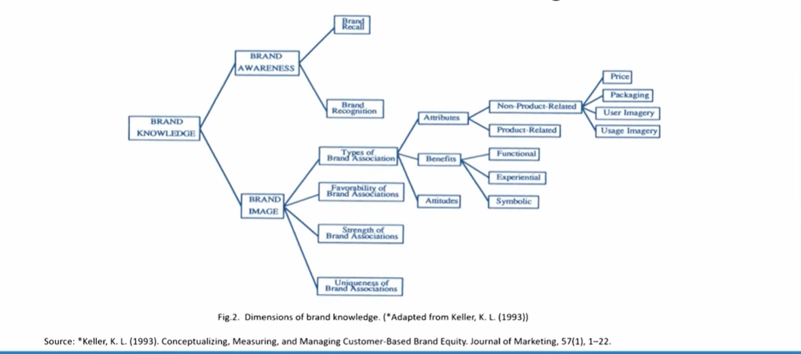

# Lecture 41: Customer-based Brand Equity 2

## Brand Equity vs Customer Equity

## Tesla Motors : Building Brand through Innovation

. Founded in July 2003, Tesla, Inc. is an electric vehicle and clean energy
company based in Palo Alto, California.  
. Tesla started with a desire to shift the car market from gas-powered to
electric (vision). While most other electric car companies failed, Tesla
cars are remarkably different, as they score high for performance and
style (focus).  
. Tesla saw an opportunity to break the usual thinking that energy-
efficient meant ugly, slow, and always needing a charge (identified
opportunity).  
. Tesla has capitalized on the consumer's readiness to do something for
the environment and has created a movement. So, Tesla took a different
approach. They started at the high end to create a strong desire for their
beautiful cars.  
. Tesla went public in June 2010 at a price of $17 per share. Eight years later,
the stock was trading at $335, making Tesla the most valuable car
manufacturer in the U.S.  
. Tesla is the 14th most valuable and fastest growing brand in the world with
an increased brand value of 184%. (Tesla spends nothing on traditional brand
advertising).  

## Making a Brand Strong : Brand Knowledge
. Brand knowledge is the key for creating brand equity, because it
creates the differential effect that drives brand equity.  
. Brand knowledge illustrates what comes to mind when a consumer
thinks about a brand.  
. Marketers need an insightful way to represent how brand
knowledge exists in consumer memory.  

## Dimensions of Brand Knowledge

