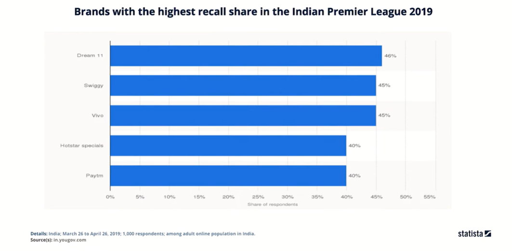
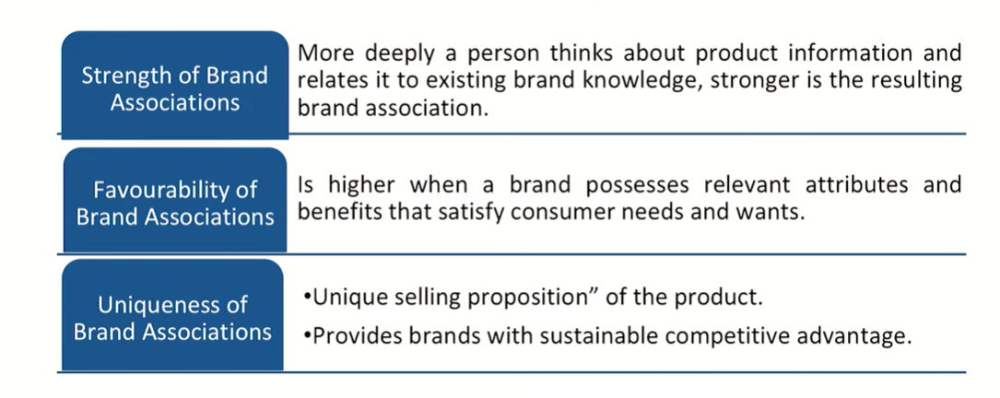

# Lecture 41: Customer-based Brand Equity 2

## Brand Equity vs Customer Equity


## Tesla Motors : Building Brand through Innovation

. Founded in July 2003, Tesla, Inc. is an electric vehicle and clean energy
company based in Palo Alto, California.  
. Tesla started with a desire to shift the car market from gas-powered to
electric (vision). While most other electric car companies failed, Tesla
cars are remarkably different, as they score high for performance and
style (focus).  
. Tesla saw an opportunity to break the usual thinking that energy-
efficient meant ugly, slow, and always needing a charge (identified
opportunity).  
. Tesla has capitalized on the consumer's readiness to do something for
the environment and has created a movement. So, Tesla took a different
approach. They started at the high end to create a strong desire for their
beautiful cars.  
. Tesla went public in June 2010 at a price of $17 per share. Eight years later,
the stock was trading at $335, making Tesla the most valuable car
manufacturer in the U.S.  
. Tesla is the 14th most valuable and fastest growing brand in the world with
an increased brand value of 184%. (Tesla spends nothing on traditional brand
advertising).  


## Making a Brand Strong : Brand Knowledge
. Brand knowledge is the key for creating brand equity, because it
creates the differential effect that drives brand equity.  
. Brand knowledge illustrates what comes to mind when a consumer
thinks about a brand.  
. Marketers need an insightful way to represent how brand
knowledge exists in consumer memory.  

## Dimensions of Brand Knowledge


## Brand Awareness

The strength of the brand node or trace in memory, which we can measure as
the consumer's ability to identify the brand under different conditions.  

Brand awareness consists of brand recognition and brand recall performance:  

* **Brand recognition** is consumers' ability to confirm prior exposure to
the brand when given the brand as a cue. (ability to recognize the
brand at a store which they have already been exposed)  
For example,  
1. Without reading the name, a customer can identify the brand as McDonalds
because it is highly recognizable "M" logo owing to extensive promotions and
customer exposure.
2. A half-eaten Apple logo helps customer recognize it as "Apple" company.

**Brand recall** is consumers' ability to retrieve the brand from memory
when given the product category, the needs fulfilled by the category,
or a purchase or usage situation as a cue.  
For e.g., If Someone ask about your favorite carbonated beverage, more then 50% will say
Pepsi or Coca cola.  
Whenever some talks about a premium or expensive watch, brand recall of companies like
Omega, Rolex, Swatch happens in our mind  
* There are primarily two types of brand recall i.e., aided brand recall and unaided
brand recall.
* Brand Recall can be estimated as percentage based on how many people were
able to recognize or recall the brand as compared to the total people.

**Brand Recall Percentage = (People able to recall/Total people in the experiment or survey)*100**



## Brand Image

. The consumers' perceptions about a brand, as reflected by the
brand associations held in consumer memory.  
. Brand image is the perception of a brand in the minds of persons.  
. It can be considered to be a mirror reflection of the brand
personality or product being. It is what people believe about a brand
-their thoughts, feelings, expectations.  
. Creating a positive brand image takes marketing programs that link
strong, favorable, and unique associations (brand associations) to
the brand in memory.  




```txt
Differential effect is the point of concentration.
Why Titan is different?
Why Coke is different? Why Huggies are different? Why Pampers
are different than Huggies?
Why Pepsi is different than Coke and Coke is different than Pepsi?
As why LIC is different to other insurance companies, why Patanjali
is different as compared to other you know organizations or their
products are different to other contemporary products?
Nike or or let's say a particular kind of a school you would have
visited as I said, a hospital. You would choose to think in terms of
any or for example, your headphones.
Headphones is one of my favorite examples because I have realized
that it has become the part of our body system. Now actually you
see, I have seen many people not putting off their headphones at
all for long parts of their day and that is why this is a very important
product, hence the brands.
Pens for example computers.
You see, this product stays with us and mobile. I should not be
mentioning that has already become the part of our.
Complete system.
```

## Associative Network Memory Model

* The **associative network memory model** views memory as a network
of nodes and connecting links, in which nodes represent stored
information or concepts, and links represent the strength of
association between the nodes.
* Any type of information-whether it's verbal, abstract, or contextual -
can be stored in the memory network.