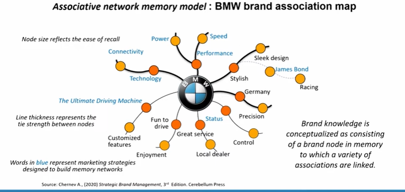
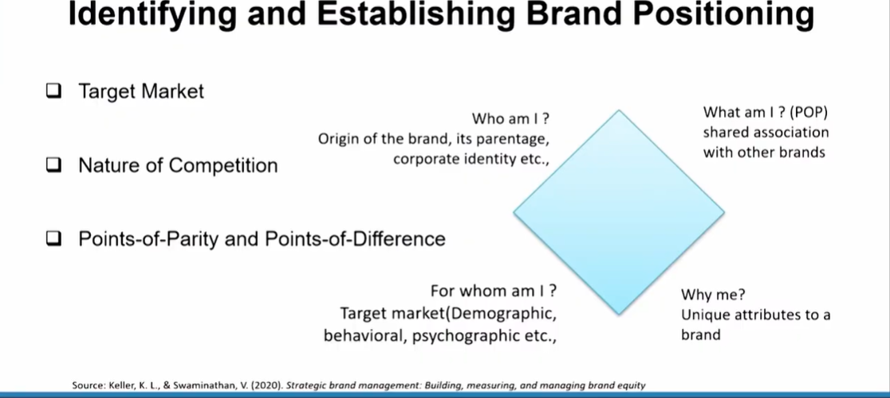

# Lecture 42: Brand Positioning

## Associative network memory model : BMW brand association map

## Types of Brand Associations

* Brand associations may be either brand attributes or benefits.
* **Brand attributes** are those descriptive features that characterize a
product or service. (What a consumer thinks the product or service is or
has and what is involved with its purchase or consumption)
    1. **Product-related attributes:** (Ingredients necessary or preforming the
product)
    2. **Non-product-related attributes:** (price information, packaging or
product appearance information, user imagery)

**Brand benefits** are the personal value and meaning that consumers attach
to the product or service attributes.
Benefits can be further distinguished into three categories
1. **Functional benefits** are the more intrinsic advantages of product or service
consumption and usually correspond to the product-related attribute.
2. **Experiential benefits** relate to what it feels like to use the product or service
and also usually correspond to the product-related attribute.
3. **Symbolic benefits** are the more extrinsic advantages of product. Consumers
may value the prestige, exclusivity, or fashionability of a brand because of
how it relates to their self-concept) For e.g., PUMA, ADIDAS, MONTE CARLO, USPA, LEE

## MAKING A BRAND STRONG : The Nike way "Just Do It"

* Nike products are made with cutting edge innovation and technology.
* **Nike swoosh logo** is one of the most identified logos across the world, giving
them points (high) on brand image.
* The slogan **"Just Do It"** is one of the most well associated slogans across
brands giving them an edge over others.
* The moment **customers start remembering** these minute details about your
brand is when the realization happens that they have **started associating**
themselves with the **brand on a personal level.**
* **Nike's association with Michael Jordan**, the basketball legend led to it's
uber **positive branding** and hence greater **brand knowledge**.
* Nike's **innovative way of collaborations with celebrities** led to greater
brand identity and hence a better hold on brand knowledge by its customers.
Source: https://www.nike.com/in/

## Brand Positioning

* Brand positioning is the "act of designing the company's offer and
image so that it occupies a distinct and valued place in the target
customer's minds."
* Finding the proper "location" in the minds of consumers or market
segment.
* Allows consumers to think about a product or service in the "right"
perspective.
* For E.g., Lifebuoy occupies the hygiene slot.
Mysore Sandal the pure and natural fragrance slot.
Medi mix occupies the herbal slot
* The concept of brand positioning is also related to that of the brand
value proposition. Even though both terms refer to the market value
created by the brand, they vary in scope.
* A **brand's value proposition** defines all benefits associated with a given
brand, including the less important benefits.
* In contrast, a brand's positioning focuses largely on those brand
benefits that define the most relevant and distinct aspect of the brand.

## Types of Brand Positioning

* Brand's positioning is identifying the reference point against which target
customers will evaluate the benefits of the brand.
* Based on the choice of a reference point, a brand can be positioned using
four different frames of reference:
1. **Need-based framing** directly links the brand to a particular customer need.
For e.g., Walmart positions its brand on savings to appeal everyday low
prices/ Save money live better.
2. **Category-based framing** defines the offering by relating it to an already
established product category. For e.g., BMW's positioning as The ultimate
driving machine defines its offerings relative to the automobile category.
3. **Competitive framing** defines the offering by explicitly contrasting it to
competitors' brands and highlighting those aspects of the offering that
differentiate it from the competition.  
*For e.g., Apple defined the value proposition of its Mac computers relative to
their Competitors.*
4. **Product-line framing** defines a brand by comparing it to other brands in the
company's product line. Rather than comparing its brand to the
competition, a company pits its own brands against one another-a brand
positioning strategy often used by market leaders seeking to nudge their
customers to upgrade.
*For example, Procter & Gamble positioned the Gillette Fusion brand as a
superior option to its predecessor, Gillette Mach3, in order to highlight the
differences between the two offerings.*

## Identifying and Establishing Brand Positioning

## Segmentation
* **Market segmentation:** Divides the market into distinct groups of
homogeneous consumers who have similar needs and consumer
behaviour.
* Involves identifying segmentation bases and criteria.
* **Consumer Segmentation Bases:** Behavioural, Demographic,
Psychographic, Geographic etc.
* **Business-to-Business Segmentation Bases:** Nature of Good, Buying
Condition Demographic etc.

## Target Market

A target market is a particular portion of the total
population which is identified (i.e., targeted) by the
marketer or retailer to be the most likely to purchase
its products or services.[1][2]

Source:   
1^ American Marketing Association, AMA Dictionary.  
2^ Nielsen Media Research. Glossary of Media Terms.

## Nature of Competition

* The choice of target customers also defines a company's competitors,
whose brands aim to fulfill the same need of the same target
customers.
* Brand competition is defined based on the needs a brand aims to fulfill,
not merely based on the fact that competitive brands share the same
customers.
For example,  
Tide, and Samsung do not compete with one another even though
they might target the same customers.