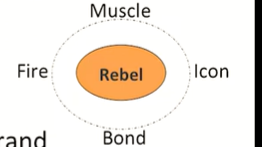
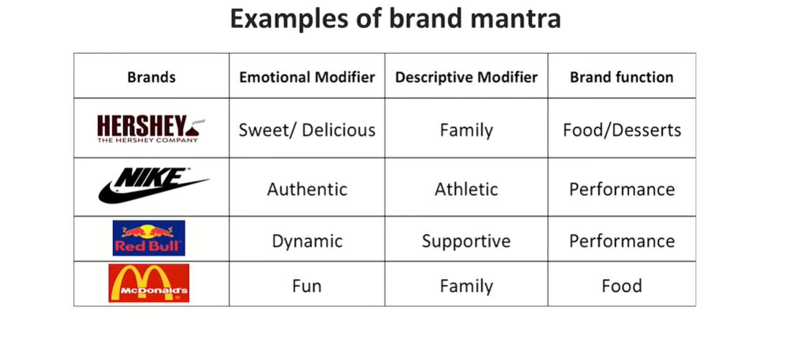
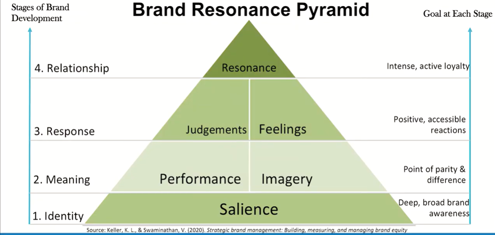
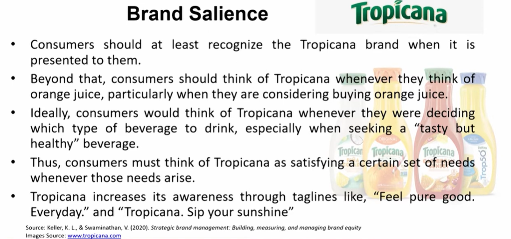
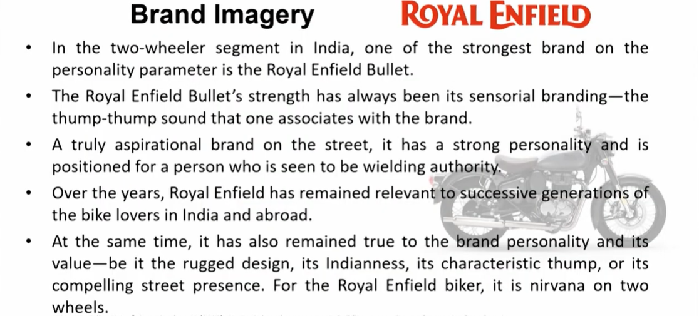
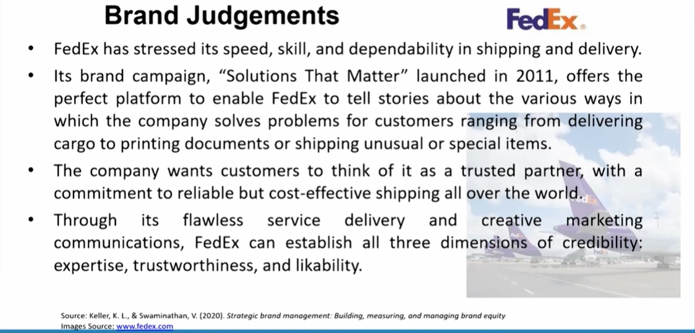
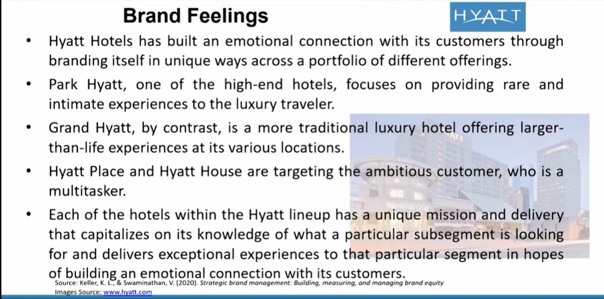

# Lecture 43: Brand Resonance Model

* The brand mantra is the brand's core promise to its customers.  
For example, Nike's brand mantra is authentic athletic performance,
Disney's brand mantra is fun family entertainment,  
BMW's brand mantra is a superior driving experience.  
* The brand mantra is not directly communicated to the brand's target
customers. Instead, it is typically captured in the brand motto, which is
communicated to customers.  
For example, Nike's brand mantra is reflected in its motto **'Just do it'**  
Disney's brand mantra is reflected in the brand motto **'Where dreams come true'**  

## Brand Mantra

* Harley-Davidson has identified five key concepts to convey its brand
mantra-personal freedom- fire, muscle, icon, bond, and rebel.
* **Fire** symbolizes passion, inspiration, and energy;
* **Muscle** stands for strength and power;
* **Icon** highlights the symbolic nature of the Harley-Davidson brand
representing personal freedom
* **Bond** represents the relationship between customers and the brand as
well as among customers themselves
* These four concepts are anchored by an overarching concept-**rebel**
(action verb, not a noun)-that permeates the concepts' individual
meanings and is intricately linked to the brand mantra (personal
freedom) and motto (American by birth. Rebel by choice).

## Designing a Brand Mantra

* Brand mantras must economically communicate what the brand is and what it is not.
* Brand mantra is made up of three components:
  1. **Brand functions** term describes the nature of the product or service or the type of experiences or benefits the brand provides.
  2. **Descriptive modifier** describes whom the brand is basically for.
  3. **Emotional modifier** describes how exactly does the brand provide benefits and in what ways?

### Examples of Brand Mantra

## Brand Resonance Model

* Brand resonance model, which describes how to create intense,
active loyalty relationships with customers.
* The model considers how brand positioning affects what consumers
think, feel, and do and the degree to which they resonate or
connect with a brand.
* Moreover, how brand resonance and these loyalty relationships, in
turn, create brand equity and or value.
* The brand resonance model looks at building a brand as a sequence of
steps which represent a set of fundamental questions that customers
invariably ask about brands-at least implicitly.
  - Who are you? **(brand identity)**
  - What are you? **(brand meaning)**
  - What about you? What do I think or feel about you? **(brand responses)**
  - What about you and me? What kind of association and how much
of a connection would I like to have with you? **(brand relationships)**

## Brand Resonance Pyramid

## Brand Salience

* Achieving the right brand identity means creating brand salience with
customers.
* **Brand salience** measures various aspects of the awareness of the brand
and how easily and often the brand is evoked under various situations
or circumstances.
* Subdimensions are-
  - Breadth and Depth of Awareness.
  - Product Category Structure.
  - Strategic Implications.

## Brand Performance

* **Brand performance** describes-
  - how well the product/service meets customers' more functional needs.
  - how well does the brand rate on objective assessments of quality.
  - to what extent does the brand satisfy utilitarian, aesthetic, and economic customer needs and wants in the product or service category.
* Five important types of attributes and benefits are as follows:
  - Primary ingredients and supplementary features.
  - Product reliability, durability, and serviceability.
  - Service effectiveness, efficiency, and empathy.
  - Style and design
  - Price

### Example - Subway

* Subway zoomed to the top as the biggest-selling quick-serve restaurant
through a clever positioning of offering healthy, good-tasting sandwiches.
* This straddle positioning allowed the brand to create a POP on taste and a
POD on health concerning quick-serve restaurants but, at the same time, a
POP on health and a POD on taste with respect to health food restaurants
and cafés.
* One of Subway's highly successful product launches was the $5 footlong
sandwich. The idea quickly took hold and was the perfect solution for
consumers during the recession.
* This strong performance and value message has allowed Subway to
significantly expand its market coverage and potential customer base.

## Brand Imagery

* **Brand imagery** depends on the extrinsic properties (intangible aspects)
of the product or service, including how the brand attempts to meet
customers' psychological or social needs.
* It is the way people think about a brand abstractly, rather than what
they think the brand actually does.
* Many kinds of intangibles can be linked to a brand, but four main ones
are:  
  - User imagery
  - Purchase and usage imagery
  - Brand personality and values
  - Brand history, heritage, and user experiences.

e.g. sleep well mattress

## Brand Judgements

* Brand judgments are customers' personal opinions about and
evaluations of the brand, which consumers form by putting together all
the different brand performance and imagery associations.
* Customers may make all types of judgments concerning a brand, but
four types are particularly important:
  - Brand quality
  - Brand credibility
  - Brand consideration
  - Brand superiority

## Brand Feelings

* Brand feelings are customers' emotional responses and reactions to
the brand.
* Brand feelings also relate to the social currency evoked by the brand.
* Feelings can be-
  - experiential and immediate, increasing in level of intensity
(warmth, fun and excitement)
  - private and enduring, increasing in level of gravity (security, social
approval and self-respect)

## Brand Resonance

* **Brand resonance** describes the nature of this relationship and the
extent to which customers feel that they are in sync with the brand.
* Resonance is characterized in terms of **intensity**, or the depth of the
psychological bond that customers have with the brand, as well as the
level of activity engendered by this loyalty.
* Resonance can be sub-divided as-
  - Behavioral loyalty
  - Attitudinal attachment
  - Sense of community
  - Active engagement