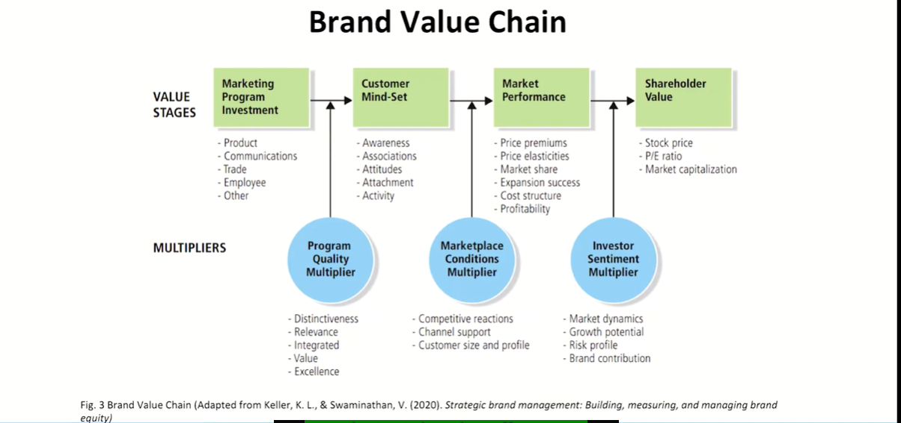
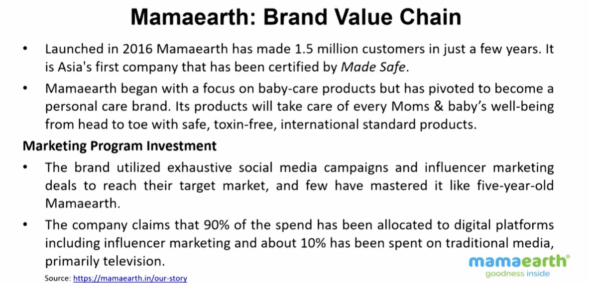
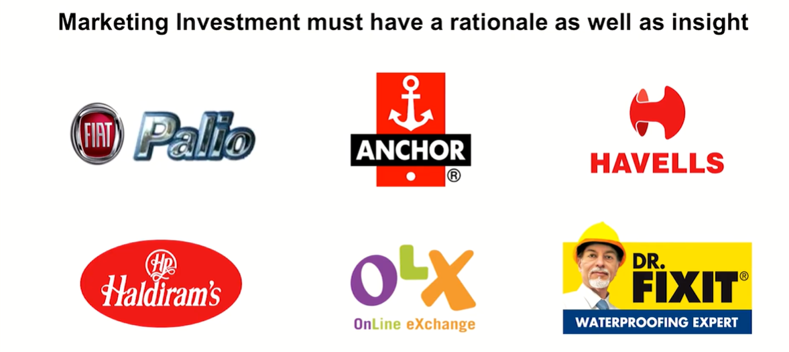

# Lecture 44: Brand Value Chain -1

## Brand Value Chain

* The Brand Value Chain is a means by which **marketers can trace the
value creation process** for their brands to better understand the
financial impact of their marketing expenditures and investments.
* Jonathan Knowles has expressed a perspective of a brand's
contribution in terms of :
    * To what extent the brand has an ability of generating future cash flows.
    * In terms of changing consumer behaviour.
    * Marketers should measure brand equity in a way that captures the **source** and the **scale of emotional component** the brand adds to the functionality of the product.  

> A product in its journey not only bring results in terms of revenue  
> , the major aspect is how it would associate the stockholders with an equity perspective  
> Brand Equity is the objective of brand management course largely  

* A brand value chain is a structured approach to assessing the sources
and outcomes of brand equity and the manner by which marketing
activities create brand value.
* Assumes that the value of a brand ultimately resides with customers.
* The brand value chain model was constructed in 2003, by Keller and
Lehman, to help marketers track brand value from the first stage to
the last stage.
* Brand value creation begins with marketing activity by the firm.
* In addition to providing insights; the model stresses that **each member of the company** contribute to the branding effort.

## 1. Marketing Program Investment

* Any marketing investment that can contribute to the value of the brand.
It consists of different types of investments such as product,
communications, trade, employees and others.
* All the marketing strategies and steps taken in product development
including product research, development and design; pricing and
promotion strategies; all communications like advertisement,
promotions, **publicity to the investment in employees**, their selection
and training.

### e.g. Mamaearth - Brand Value Chain

* Marketing investment must have a rationale as well as insight
