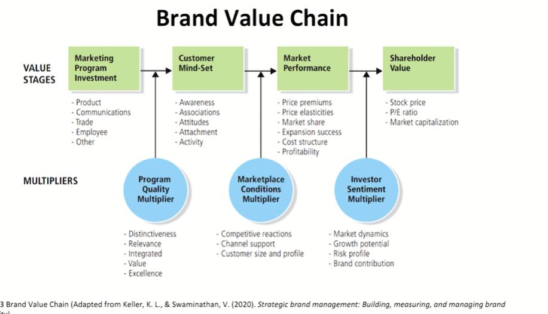
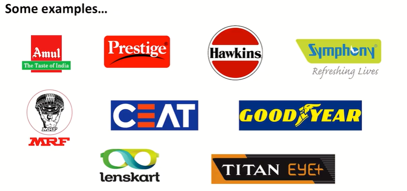

# Lecture 45: Brand Value Chain- 2

### Program Quality Multiplier

* **Clarity**: How well will consumers understand the message send by
the firms' marketing investment?
* **Relevance**: Will consumers find the brand to be more useful than
others in their search for a particular product?
* **Uniqueness**: How diverse is the marketing program compared to
competitors?
* **Consistency**: How well does the marketing program follow the
direction of previous programs? Do all the elements within the
program work together to create the largest value with the
customers?

## 2. Customer Mind-set
The customer mindset includes associations linked to the brand in a customers  
memory, or "everything that exist in the minds of customers with respect to a brand  
(e.g., thoughts, feelings, experiences, images, perceptions, beliefs and attitudes)  
making it the stage where brand equity is best measured and created.  
* **Awareness**: The extent to which customers recall and recognize the brand.
* **Associations**: Strength, favorability and uniqueness of perceived brand attributes.
* **Attitudes**: Overall evaluations of the brand
* **Attachments**: Degree of loyalty customers feel towards a brand
  * Adherence
  * Addiction
* **Activity**: Extent to which customers use the brand, talk about it, seek out
information, promotions and so on.

### Marketplace conditions multiplier

Marketplace conditions are the external factors that affect the overall
performance of a marketing program investment.
* **Competitive superiority:** how effective are the marketing investments
of competing brands.
* **Channel and other intermediary support:** how much brand
reinforcement and selling effort is being put forth by the marketing
partners
* **Customer size and profile:** what types of customers are attracted to
the brand.

## e.g. Mamaearth: Brand Value Chain | Marketplace conditions multiplier
* The customer acquisition strategy of Mamaearth is completely focused on digital
content. Almost 90% of the sale of Mamaearth products comes from online platforms.
* Their main aim is to sell as many products as possible online. They earn money by
selling products on Flipkart, Amazon, and other similar E-commerce websites. (**Channel Support)**
* Interestingly, only 20% of the Brand Revenue comes from baby products. On the other
hand, 80% of the Revenue comes from skincare and haircare products.
* As Mamaearth comes in the personal care category they enjoy a healthy gross margin
profile of about 65%. So, they can invest 40-50% of revenue in Marketing.
* The product range now comprises more than 80 natural and toxin-free products that
are used by over 15 lakhs Indian consumers. **(Brand Expansion).**

## 3. Market Performance

* Price Premiums and Elasticity
  * How much extra are consumers willing to spend on the product because of the brand?
  * Effect of price on demand
* Market share
  * Whether marketing programs are increasing sales?
* Brand Expansion
  * Brand extensions become easier
  * Adds enhancements to revenue systems
* Cost Structure
Reduced Marketing Expenditure?  
All efforts are likely to be more effective  
Same effectiveness can be achieved at lower cost  
* Brand Profitability

## 4. Shareholder Value

* The value a company creates and is reflected in the stock price and dividend
disbursed by the company.
* The fundamental assumption being that the true value of a company is based on
the future cash flows
* A company that fails to deliver value to the customer is acting against the long-term
interest of the shareholders
* The three indicators which react positively with an increase in brand value are:
  * Stock Prices
  * Price/Earnings Ratio
  * Market capitalization

### Investor Sentiment Multiplier

* How much of the value from stage three, brand performance, translates
to stage four, shareholder value.
* Four factors that influence investor sentiment are:
  * **Market dynamics:** What are the dynamics of the financial markets as a whole
(interest rates, investor sentiment, supply of capital)?
  * **Growth potential:** What is the growth potential or prospects for the brand and the industry in which it operates? For example, how helpful are the facilitating factors and how inhibiting are the hindering external factors that make up the firm's economic, social, physical, and legal environment?
  * **Risk profile:** What is the risk profile for the brand? How vulnerable is the brand to those facilitating and inhibiting factors?
  * **Brand contribution:** How important is the brand to the firm's brand portfolio?