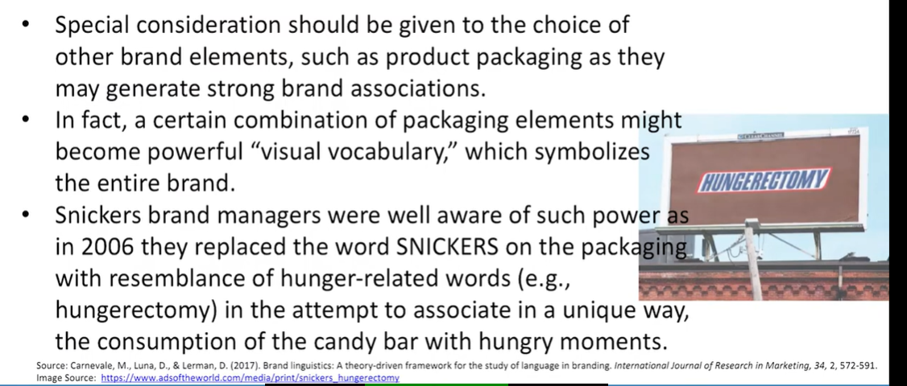
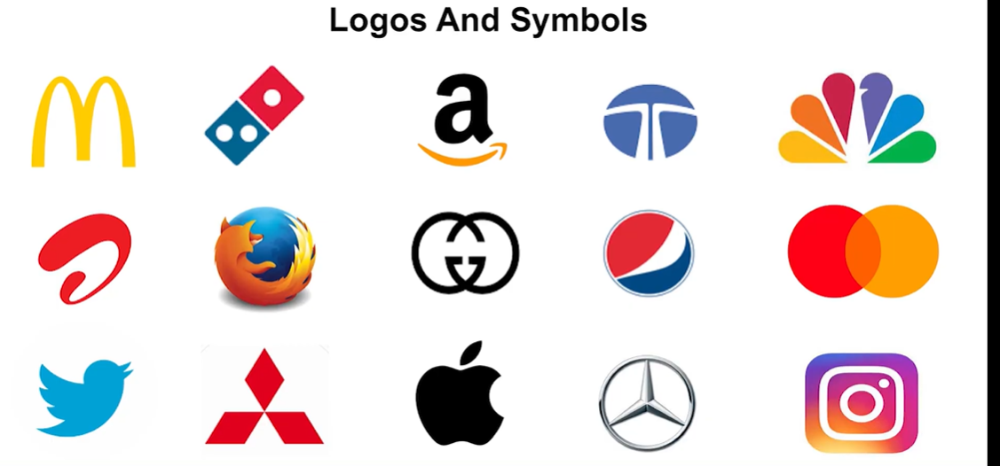

# Lecture 46: Brand Equity Elements - 1

## Brand Elements

The different brand elements include  
- Brand Names  
- URLs  
- Logos and Symbols  
- Characters  
- Slogans  
- Jingles  
- Packages and signage  

## Criteria for choosing Brand Elements

## 1. Brand Name

* The brand name is that part of a brand that can be spoken. It includes
letters, numbers, or words. [1]
* Brand names can be an extremely effective shorthand means of
communication.
* Few factors to keep in mind while naming a brand are:
  - Naming Guidelines
  - Simplicity and Ease of Pronunciation and Spelling
  - Familiarity and Meaningfulness
  - Differentiated, Distinctive, and Unique
  - Brand Awareness and Associations

## Brand Name & Linguistics

* Consumer understanding of a brand (its image and its meaning)
derives, at least, initially from the brand name.
* Imbuing a brand name with meaning has a number of advantages
because embedded meanings can affect:
  - brand evaluations
  - memory for ads carrying those brand names
  - memory for brand name themselves
* There are three ways brands names meanings can be sourced; **Phonetic symbolism, Orthographic symbolism and Semantic symbolism **

## Linguistics in Branding

* Branding relies heavily on language, and consumers often
come to know a brand through language-
  - the language in advertising or on packaging
  - the words used in social media or word-of-mouth
  - brand names themselves, serve to communicate the meaning of a
brand and influence perception, memory, attitudes, and behavior.
* Language plays a fundamental role primarily because its
structural properties affect how people think.

## Language in identification of brand-
## Language affect people's way of categorizing objects

* To help consumers identify a brand, managers should pay special
attention to several linguistic constructs.
* For instance, classifiers are one structural property of languages, such as
Mandarin and Japanese, but not of other languages, such as English and
German.
* Classifiers provide people with a reference point for object categorization.
* Like by adding a word we can classify which category that noun belongs to
(animate-inanimate, measurable-immeasurable etc.)
* Thus, Chinese speakers are more likely to perceive two distinct objects as
similar if they share a classifier than if they do not.
* From a managerial point of view, this has important consequences for
brand positioning and retail layout strategies.
* For example, Chinese department stores often group together objects
that share the same classifier, such as scarfs, whereas the same does not
happen in US stores.

## Language cue Brand Identities

* As the increasing use of pronoun brand nomenclature might suggest (e.g.,
iPhone, MySpace, YouTube), pronouns are yet another set of language
elements that have been shown to significantly affect consumers
perceptions.
* Most recently, Kachersky and Carnevale (2015) build on these findings by
incorporating product positioning.
* Specifically, they show that "I" brand names garner more favorable
responses only when the brand is positioned on personal benefits,
whereas "you" brands garner more favorable consumer responses when
the brand is positioned on social benefits.

## Integrating Linguistics for Intended Perceptions of Brand Personality
* To significantly influence consumers' integration of all brand information
through language, and thus their perceptions of brand personality and
brand relationships, managers should concentrate their efforts primarily
around the brand's linguistic identity.
* Even the mere font choices for the logo or the packaging will convey
specific brand personality traits.
* For instance, a serif type of font (e.g., Times New Roman of the **Time
magazine**) is perceived as elegant, charming, beautiful and interesting,
whereas a sans serif type of font (e.g., Helvetica used in **Skype** software) is
perceived as **manly, powerful, and smart.**

## Linguistics cue Brand associations

## Linguistics cue Emotional connection

* The order of words chosen, the words themselves, their rhythm, and tone
of voice will all evoke different emotions and actions.
* In the context of service encounters, several studies have explored the role
of auditory cues, such as the accent of a communication source (i.e.,
salesperson), on the receiver's evaluations, purchase intentions, and
overall perceptions.
* These findings show that a salesperson with a standard accent or dialect is
perceived more favorably and inspires more favorable purchase intentions
than foreign-accented salespersons.
* These implications of interactions ask for further research in case of
artificial intelligence agents, not only in text-based online communications,
but also in voice-based systems.

## Linguistics cue Brand Symbolism

* Special consideration should be given to the use of
verbal and visual metaphors as they tend to stimulate
deeper level of processing and curiosity about the brand
thus further enhancing brand symbolism.
* For example, the arrow from "a to z" within the Amazon
e-retailer logo suggests that the company sells
everything and at the same time depicts a smile that
their customers would experience by shopping on their
website.

Source: Carnevale, M., Luna, D., & Lerman, D. (2017). Brand linguistics: A theory-driven framework for the study of language in branding. International Journal of Research in Marketing, 34, 2, 572-591.
Image source: www.amoazon.com

## URLs

* URLs (uniform resource locators) specify locations of pages on the Web
and are also commonly referred to as domain names.
* Anyone wishing to own a specific URL must register and pay for the
name.
* URLs protects their brands from unauthorized use in other domain
names.
* Issue: Cybersquatting is registering, trafficking in, or using a domain
name with bad-faith intent to profit from the goodwill of a trademark
belonging to someone else.

## Logos and Symbols

* **Logos** have a long history as a means to indicate origin, ownership, or
association.
* Logos range from corporate names or trademarks (word marks with
text only) written in a distinctive form, to entirely abstract designs that
may be completely unrelated to the word mark, corporate name, or
corporate activities.
* Non-word mark logos are also often called **symbols**.

