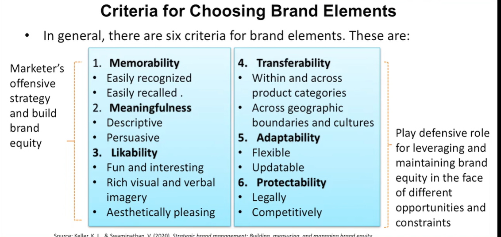
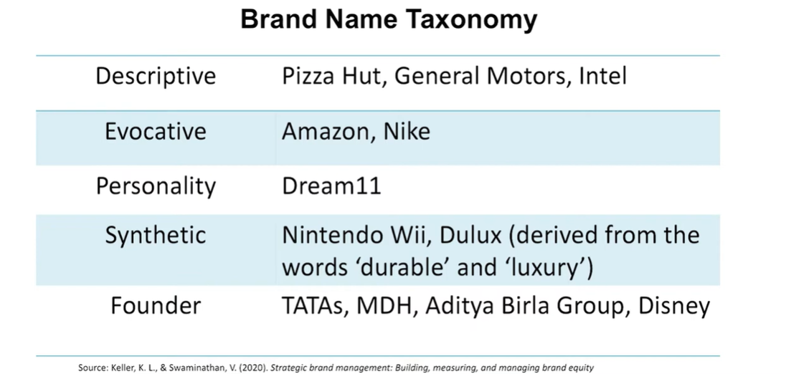
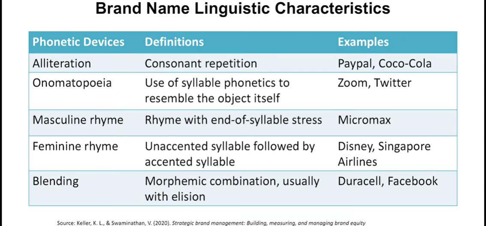
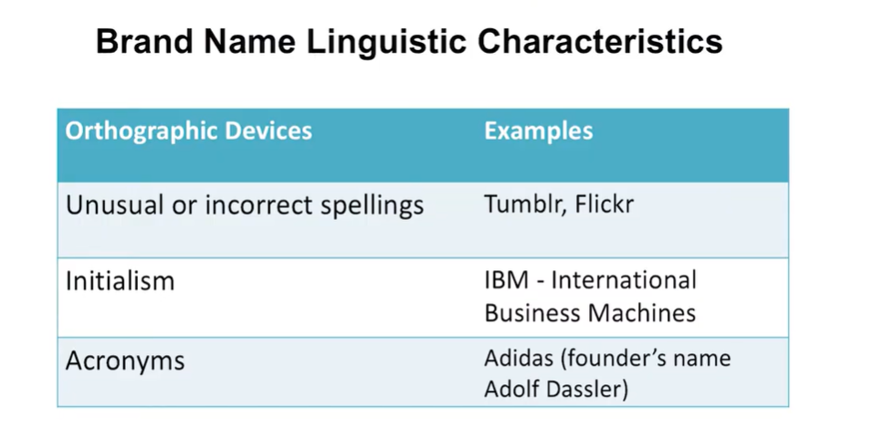
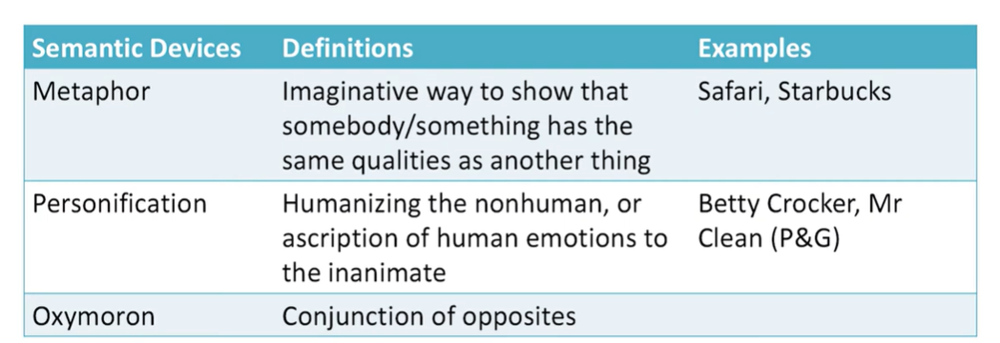

# Lecture 46: Brand Equity Elements - 1

## Brand Elements

The different brand elements include  
- Brand Names  
- URLs  
- Logos and Symbols  
- Characters  
- Slogans  
- Jingles  
- Packages and signage  

## Criteria for choosing Brand Elements

## 1. Brand Name

* The brand name is that part of a brand that can be spoken. It includes
letters, numbers, or words. [1]
* Brand names can be an extremely effective shorthand means of
communication.
* Few factors to keep in mind while naming a brand are:
  - Naming Guidelines
  - Simplicity and Ease of Pronunciation and Spelling
  - Familiarity and Meaningfulness
  - Differentiated, Distinctive, and Unique
  - Brand Awareness and Associations

## Brand Name & Linguistics

* Consumer understanding of a brand (its image and its meaning)
derives, at least, initially from the brand name.
* Imbuing a brand name with meaning has a number of advantages
because embedded meanings can affect:
  - brand evaluations
  - memory for ads carrying those brand names
  - memory for brand name themselves
* There are three ways brands names meanings can be sourced; **Phonetic symbolism, Orthographic symbolism and Semantic symbolism **

