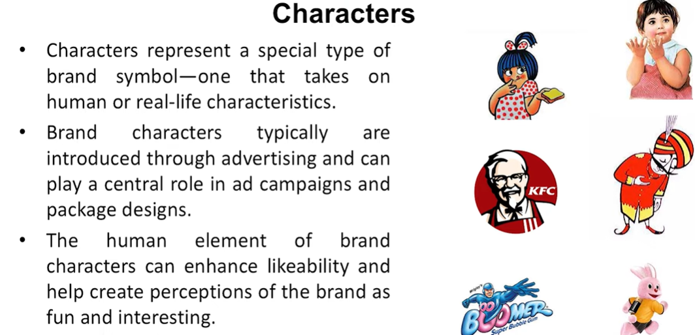
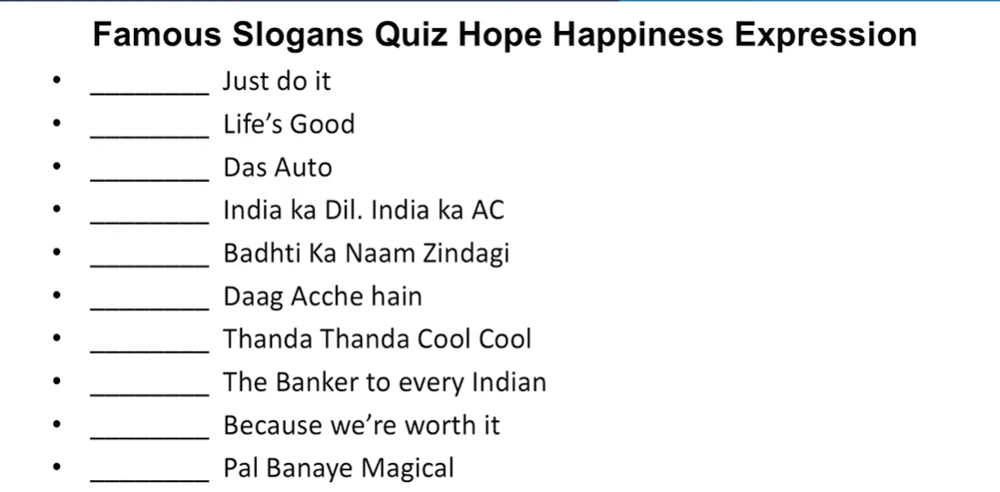
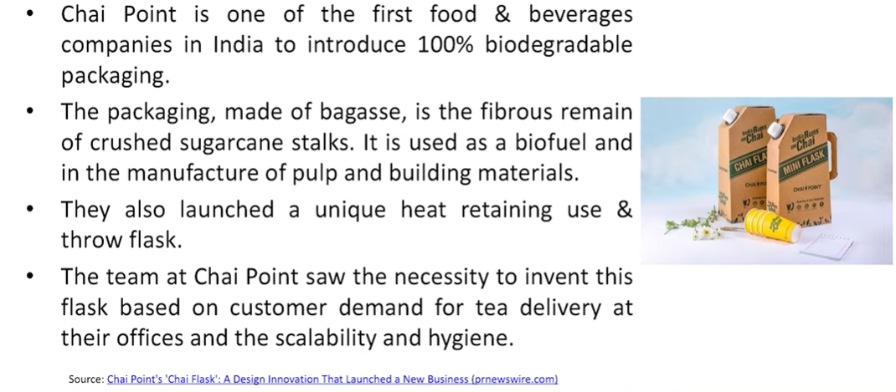

# Lecture 47: Brand Equity Elements- 2

## Characters

## Slogans

. Slogans are short phrases that communicate descriptive or persuasive
information about the brand.  
. They often appear in advertising but can play an important role on
packaging and in other aspects of the marketing program.  
. They can function as useful "hooks" or "handles" to help consumers
grasp the meaning of a brand-what it is and what makes it special.  
. They are an indispensable means of summarizing and translating the
intent of a marketing program in a few short words or phrases.  

## Jingles-Want to stay in your memory

. Jingles are musical messages written around the brand.  
. They often have enough catchy hooks and choruses to become almost
permanently registered in the mi  nds of listeners-sometimes whether
they want them to or not!  
. Jingles are not nearly as transferable as other brand elements because
of their musical nature.  
. Jingles are perhaps most valuable in enhancing brand awareness.
Often, they repeat the brand name in clever and amusing ways that
allow consumers multiple encoding opportunities.

. Hum Mein Hai Hero: Hero Moto Corp. 1 & 0
Motion Pictures. ...  
. The Taste Of India: Amul. Amul TV. ...  
. Googly Woogly Woosh: Ponds. Rajiv Jadhav. ...  
. You and I: Vodafone. videos4adlooDotIn. ...  
· Kya Aap Close Up Karte Hain. ...  
· Washing Powder: Nirma. ...  
· Airtel's Instrumental Ad. ...   
· Oye Bubbly: Pepsi.  

## Packaging

* Packaging is the activities of designing and producing containers or
wrappers for a product.  
* From the perspective of both the firm and consumers, packaging must
achieve a number of objectives:
  * Identify the brand.
  * Convey descriptive and persuasive information.  
  * Facilitate product transportation and protection.  
  * Assist in at-home storage.  
  * Aid product consumption.  

* Package can become an important means of Brand
Recognition.
* Packaging the Right Content.
* Packaging at the Point of Purchase.
* Packaging Innovations.
* Package Design.
* Packaging Changes.

## Packaging - Chai Point

## Branding Perspective on Marketing
* As firms are dealing with enormous shifts in their external marketing environments:
  * The marketing strategies and tactics have changed dramatically.  
  * Rapid technological developments  
  * Greater customer empowerment  
  * Fragmentation of traditional media  
  * Growth of interactive and mobile marketing options  
  * Channel transformation and disintermediation  
  * Increased competition and industry convergence  
  * Globalization and growth of developing markets  
  * Heightened environmental, community, and social concerns  
  * Severe economic recessions and COVID-19