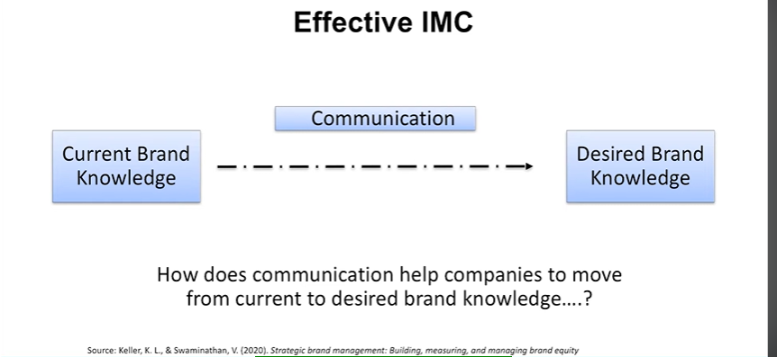
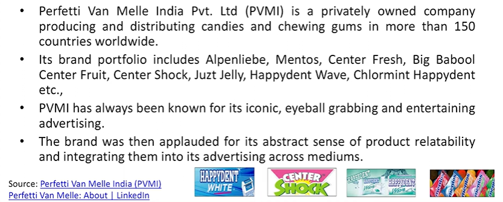
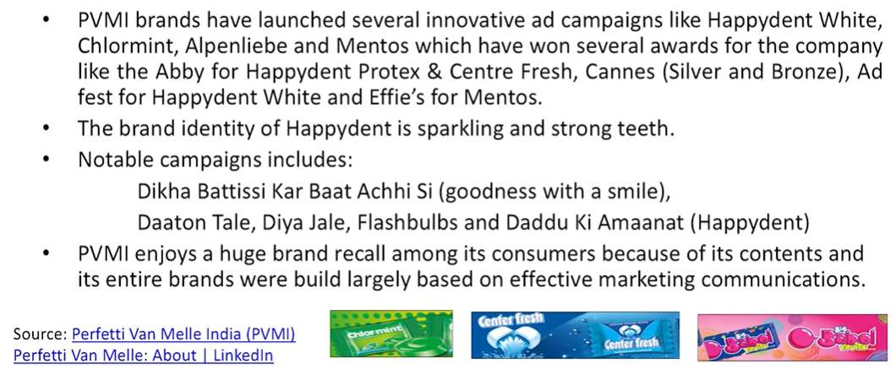
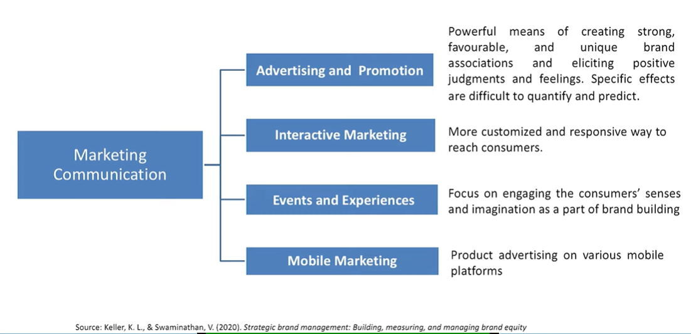
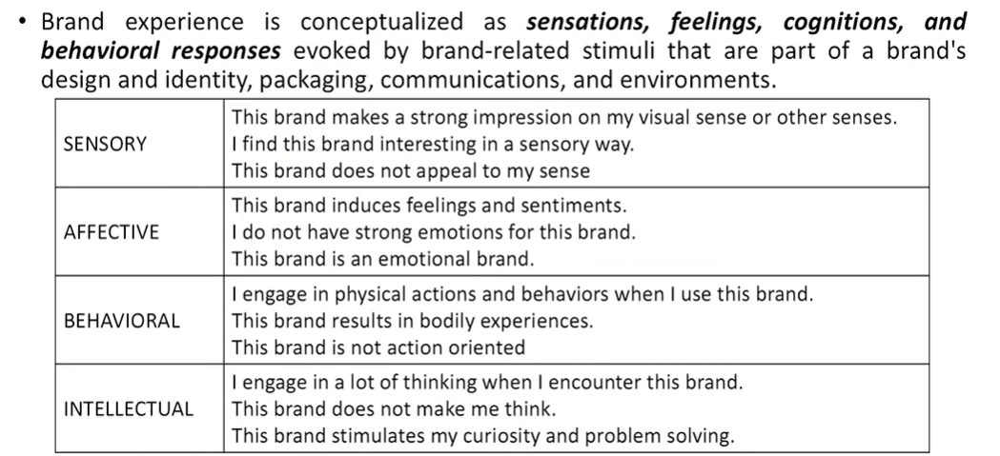
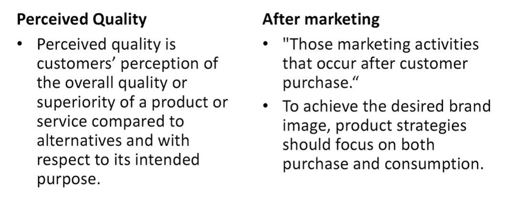

# Lecture 48: Designing Marketing Programs to Build Brand Equity

* The elements and selection of brands create value for the customer- based brand, and the most important strategy is brand-related marketing activities and marketing planning such as:\
  * Product strategy
  * Price strategy
  * Channel strategy
  * Marketing communication strategy

"IMC builds the relationships that build brands" - (Duncan, 2002)

* Brand building relies on creation and nurturing of profitable
relationships to meet objectives, which is the goal of all IMC
processes.
* IMC involves managing marketing communications in a holistic
manner to achieve strategic brand building objectives.
* IMC helps to establish a connection with consumer and able to
effectively communicate about brand, there by creating a strong
brand awareness and image.

## Effective IMC

## Information Processing Model of Communications

* For a person to be persuaded by any form of communication the following steps must occur:
  * Exposure - Seeing or hearing communication
  * Attention - Noticing communication
  * Comprehension - Understanding the intended message
  * Yielding - Responding favourably to the message
  * Intentions - Planning to act in the desired manner of communication
  * Behaviour - Actually acting in the desired manner

## Brand Saga of Perfetti Van Melle
* A Brand that Build on Communication

## Marketing Communication

## Brand Experience Scale

## Criteria for choosing IMC Program

**Coverage**: Proportion of the audience reached by each communication
option, as well as how much overlap exists among communication options.  
**Contribution**: Inherent ability of a marketing communication to create the
desired response and communication effects from consumers in the
absence of exposure to any other communication option.  
**Commonality**: Extent to which common information conveyed by different
communication options shares meaning across communication options.  
**Complementarity**: Describes the extent to which different associations and
linkages are emphasized across communication options.
**Conformability**: Extent that a marketing communication option is robust
and effective for different groups of consumers.

### **Types of conformability**
**Communication conformability:** Ability of the mode of communication to
effectively communicate with the diverse group of customers.  
**Consumer conformability:** Ability of the communication option to inform or
persuade consumers who vary on dimensions other than communication
history.  
**Cost**: To arrive at the most effective and efficient communication program
evaluations of marketing communications on all the preceding criteria must be
weighed against their cost.

## Lets Carry some examples along the discussion

A Movie-Let's say Gandhi and also
Jurassic Park -- Thoughtful  
Enfield  
Coursera  
Eureka Forbes  
A Song  
Readers Digest  
Bikaner  
UBER OLA  
Bookmyshow  

Harry Potter-Thoughtful though more
towards creativity  
Dainik Jagran  
A University  
A Celebrity  
A Place-Singapore-Incredible India  
An Airlines  
Panchi Petha  
Booking.com  
Makemytrip  

## PRODUCT STRATEGY
* The product itself is the primary determinant of what consumers
experience with a brand, what they hear about a brand from others,
and what the firm can tell customers about the brand.
* At the heart of a great brand is invariably a great product.
* For brand loyalty to exist, consumers' experiences with the product
must at least meet, if not surpass, their expectations.
* It will be based on :
  * Perceived Quality
  * After marketing

## Pricing Strategy

* Pricing policies are about maintaining and improving brand equity, and
decisions about them must be consistent with company values.
* Determining the "right" minimum prices is an art form that takes into
account brand positioning and goals, resellers' margin needs, and the
competitive environment.
* Prices set too high will discourage sales, while those that are too low
leave money on the table and can harm a brand's valued resellers by
allowing unhealthy discounts.
* Brands must justify their price point for sustainable growth.
* There are different kinds of price perceptions that consumers might form, and different pricing strategies that the firm might
adopt to build brand equity.
  * Consumer Price Perceptions
  * Setting Prices to Build Brand Equity