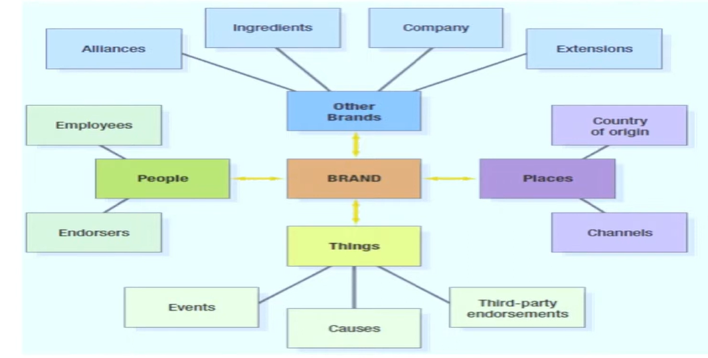
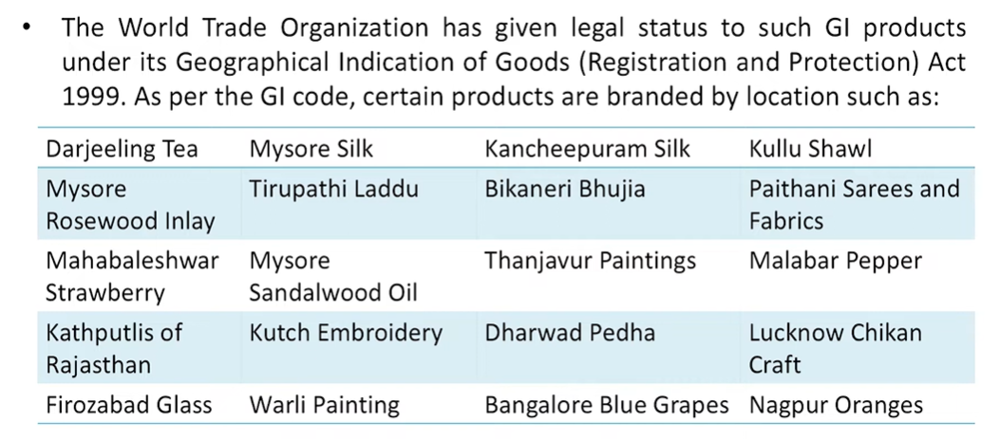
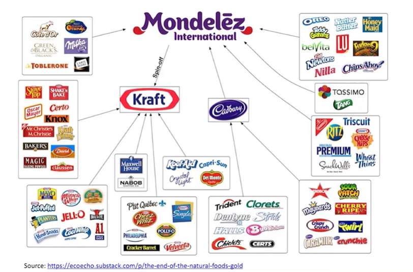
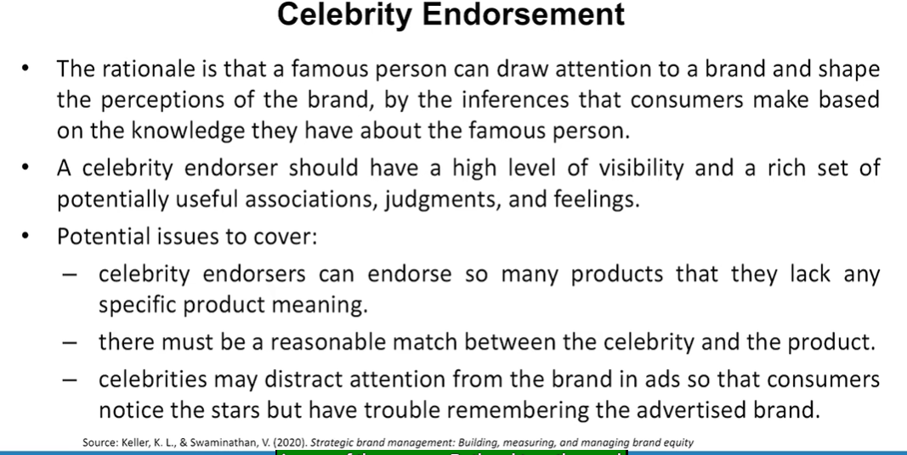
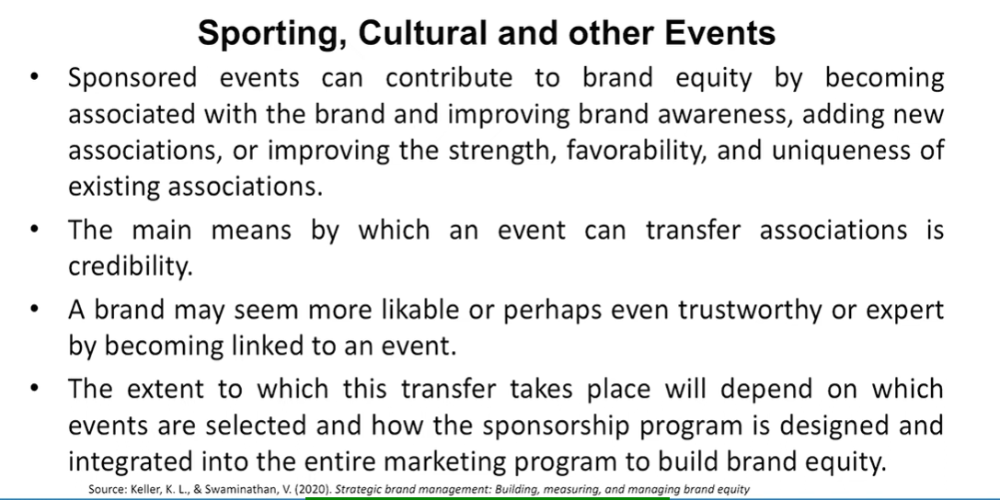
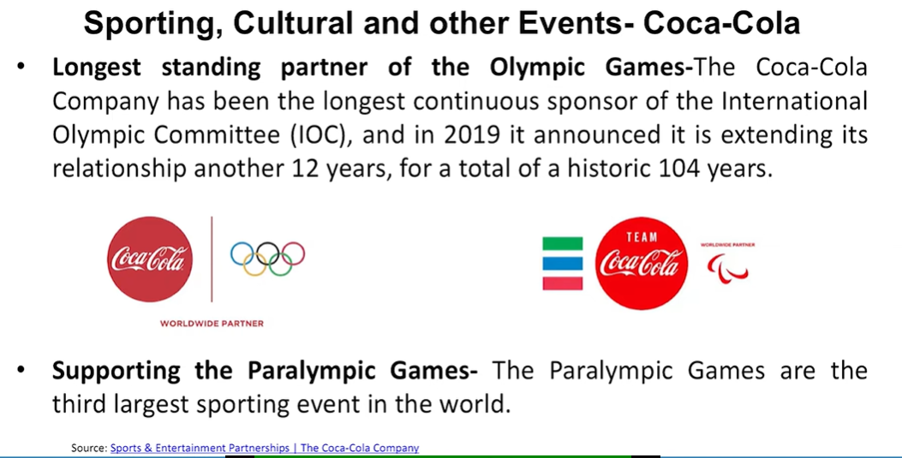

# Lecture 49: Secondary Brand Associations


## Secondary Sources of Brand Knowledge



## Company

* Branding strategies are an important determinant of the strength of
association from the brand to the company and any other existing
brands.
* Three main branding options exist for a new product:
  * Create a new brand.
  * Adopt or modify an existing brand.
  * Combine an existing and a new brand.

## Company - ITC e-choupal

* ITC's e-Choupal initiative is a powerful illustration of a unique model
that delivers large societal value by co-creating rural markets with local
communities.
* The e-Choupal digital infrastructure enables even small and marginal farmers in rural Indian who are delinked from the formal markets to access relevant knowledge, market prices, weather information, and
quality inputs to enhance farm productivity, quality, and command better prices, thus making them more competitive in the national and
global markets.
* ITC initiative has two infrastructures:
  * **Choupal Pradarshan Khet** (customised agri-extension services and farmer training
schools)
  * **Choupal Saagars** (Integrated Rural Service Hubs)
* The e-Choupal initiative has become a fulfillment channel for a two-way flow of goods and services and raised rural incomes.
* As a company,
  * ITC has gained from efficient sourcing and identity preserved procurement which add value to its packaged foods business.
  * It also created an inclusive model of empowering small and marginal farmers by giving them the power of digital connectivity and access to markets

## Country of Origin and other Geographical areas

* The world is becoming a "cultural bazaar" where consumers can pick
and choose brands originating in different countries, based on their
beliefs about the quality of certain types of products from certain
countries or the image that these brands or products communicate.
* Choosing brands with strong national ties may reflect a deliberate
decision to maximize product utility and communicate self-image,
based on what consumers believe about products from those
countries.
* For e.g., Levi's jeans-United States, Chanel perfume-France,
Cadbury-England, BMW-Germany etc.

* Chandigarh among the Indian Cities has, by far, the most organized
approach to branding - it has a symbol, the open hand.
* When Le Corbusier, the French architect who planned Chandigarh,
conceived the idea of the Open Hand logo he did so with the idea of
peace and harmony through an exchange of open and free ideas.
* The Brand Positioning of Chandigarh as 'City Beautiful' is used well too,
in consonance with the well-planned roads and infrastructure, modern
layout and strive to maintain its image as a clean, beautiful town.



## Channel of Distribution

* As a reason of associations to product assortment, pricing and credit
policy, quality of service, and so on, retailers have their own brand
images in consumers' minds.
* Retailers create these associations through the products and brands
they stock and the means by which they sell them.
* A consumer may infer certain characteristics about a brand by where it
is sold.
* Consumers may perceive the same brand differently depending on
whether it is sold in a store viewed as prestigious and exclusive, or in a
store designed for bargain shoppers and having more mass appeal.

## Co-branding

* Co-branding-also called brand bundling or brand alliances-occurs
when two or more existing brands are combined into a joint product or
are marketed together in some fashion.
* There are different ways to co-brand:
  * a new product can become linked to an existing brand
  * an existing brand can also leverage associations by linking itself to other brands from the same or different company.

* Kit Kat, Carnation, Toll House, Drumstick, Crunch, and Coffee-mate
are freestanding brands, all of which also feature the Nestle brand
that serves as an endorser.
* Similarly, Oreo, Ritz, Wheat Thins, Nilla, Triscuit, Chips Ahoy!, and Fig
Newtons are individual brands cobranded with Nabisco, which plays
secondary role as an umbrella brand (all of these brands are owned
by Mondelez International, which is a corporate brand not used in
consumer branding).

> Hero and Honda  



## Co-Branding (Ingredient Branding)

* A special case of co-branding strategy is ingredient branding, which
creates brand equity for materials, components, or parts that are
necessarily contained within other branded products.
* Ingredient brands attempt to create enough awareness and preference
for their product that consumers will not buy a host product that does
not contain the ingredient.
* In other words, ingredient brands can become, in effect, a category
point-of-parity. Consumers do not necessarily have to know exactly how
the ingredient works-just that it adds value.
* For e.g., Intel's Intel Inside cobranding campaign, which managed to
build customer loyalty for a product that most buyers never see or touch.

## Ingredient branding- Examples
. Teflon: nonstick coatings (cookware and kitchen utensils)  
. Microban: antimicrobial and antibacterial solutions  
. Corning: Gorilla Glass for smartphones  
. Mineral RO technology (Waster purifiers)  
. Dolby noise reduction in stereos  
. Android OS (Smart phones)  

## Licensing

* Licensing creates contractual arrangements whereby firms can use the
names, logos, characters, and so forth of other brands to market their
own brands for some fixed fee.
* Licensing can also provide legal protection for trademarks.
* Licensing the brand for use in certain product categories prevents other
firms or potential competitors from legally using the brand name to
enter those categories.

## Licensing- Disney
* Disney Consumer Products (DCP) is designed to keep the Disney name
and characters fresh in the consumer's mind through various lines of
business: Disney Toys, Disney Fashion & Home, Disney Food, Health &
Beauty, and Disney Stationery.
* DCP has a long history, which can be traced back to 1929 when Walt
Disney licensed the image of Mickey Mouse for use on a children's
writing tablet.
* Disney started licensing its characters for toys made by Mattel in the
1950s.
* Licensing continues to be an important source of revenue for Disney
particularly from the video game developers, publishers, and retailers.
* Disney also has merchandise licensing operations of its own including
toys, apparel, stationery, footwear, consumer electronics, and some of
the main licensing properties for Disney include Star Wars, Mickey and
Minnie, Frozen, Avengers, Disney Princess, etc.
* Over a five-year period (2010-2015), Disney added a total of $23.9
billion in retail sales of licensed merchandise-thereby retaining
Disney's no. 1 position in licensing revenues in the United States-a
fact which is indicative of the strength of the Disney brand.

## Celebrity Endorsement



## Sporting, Cultural and other Events





* Through their expanded relationship with the International Paralympic
Committee, The Coca-Cola Company will continue supporting elite
athletes who will make history at the Paralympic Games Tokyo 2020
and beyond.
* Supporting football from grassroots to the world stage- Their
association with football dates back to the beginning of the last century
and in 1958 to 100+ Professional Football clubs, federations and
National Teams.
* Locally Relevant Events & Organizations- NCCA, NASCAR

## Third-Party Sources
. Marketers can create secondary associations in several different ways
by linking the brand to various third-party sources.  
· Few examples are-  
· NIRF Rankings (academic institutions)  
. ISO certifications  
. Michelin ratings (restaurants)  
. Critic reviews of eminent personalities in the concerned fields etc.  

```txt
d
her

ras

ona

Drg

dar
bus

st

hts
pers

marketing program investment levels for enhancing the customer
mindset or should it be done, you know for strengthening.
The market performance as such in terms of when you are going
global and you want a larger market share for for your you know
product. So should it be there basically so country is there but how
to use it effectively same is the case with as far as other brand of
sections, let us say ingredient brands.
Intel must have failed that people should know that what kind of
credible business they are into and but but if they will you know
just tell people that Intel is doing this so people would not know
that what kind of a credibility Intel provides to its buyers its
customers for for whom you are the consumers basically end
customers. So Intel must have you know thought of this for
example many a times there are some parts of a particular footwear
being source by different kinds of organizations. Many times we do
not know about those but for example in case of.

let us see that these secondary associations, they sometimes are
always there that for example continue origin is always there. It is
up to us to capitalize upon the strength of country. So that is where
the brand intelligence or intelligence of a brand manager comes in
that where to infuse the feeling of entry of origin to the advantage
of brand in the brand value chain, should it be done at the
pany
```

```txt
I will be coming back to you with lots of insights on brand audit, brand research. That is now
we have to understand how all this is understood by the brand
managers. What do they do?
What, how do they decide that? What kind of marketing programs
they have to infuse, what kind of a secondary association they have
to project? How should they go about S? Let us see what do they
do? I will be coming back to you in the next session on brand audit
and brand search. Till then, goodbye.
```