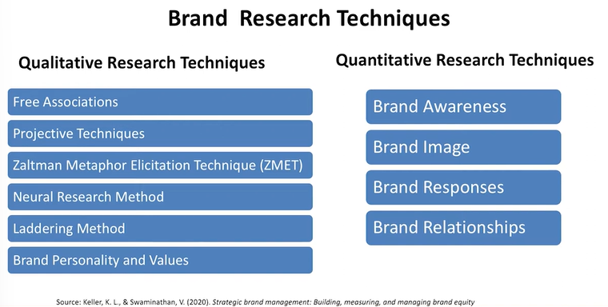
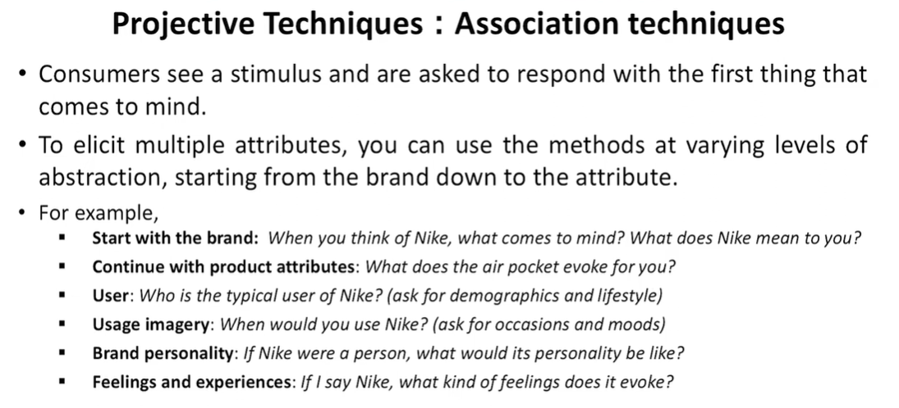
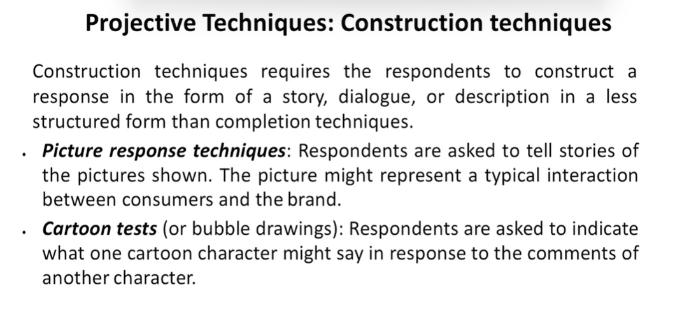
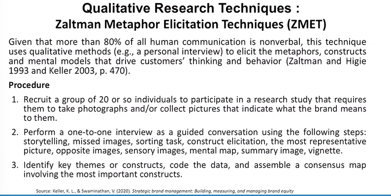
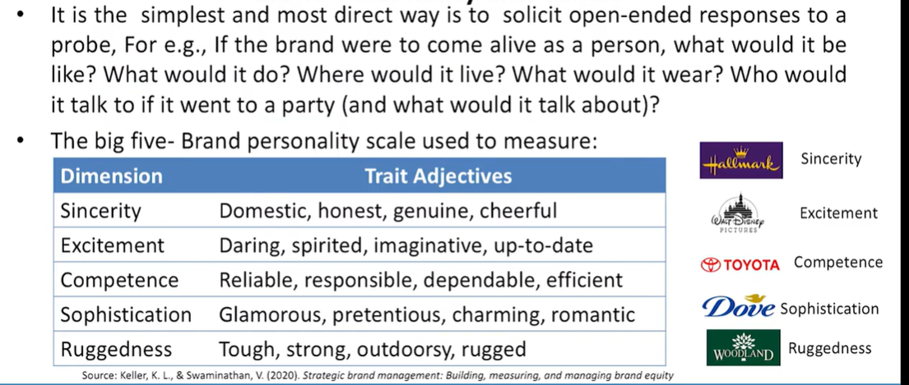
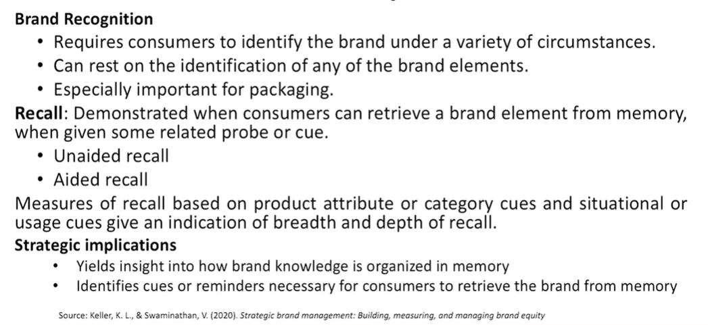
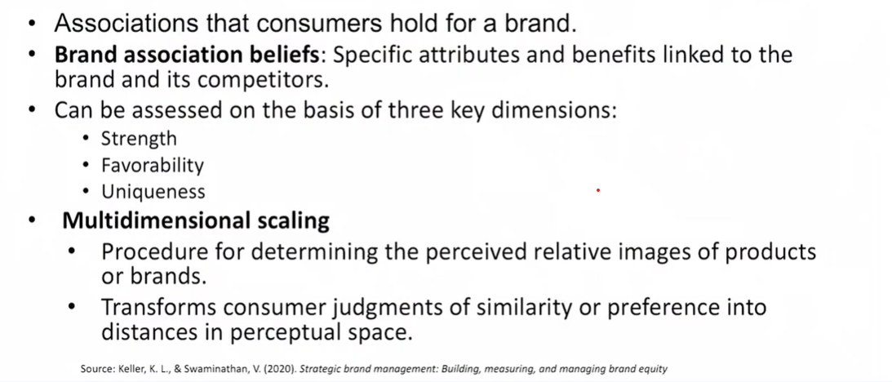
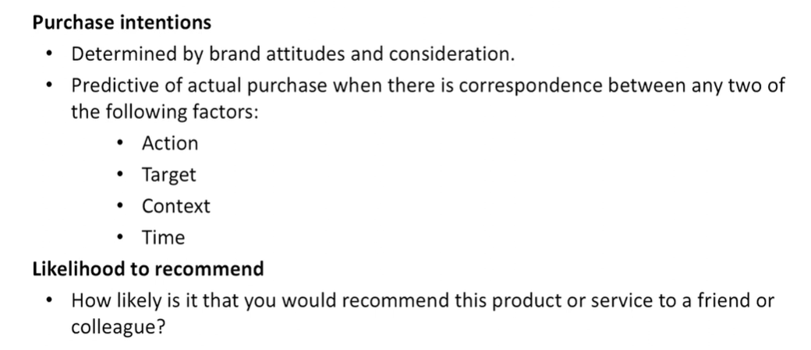
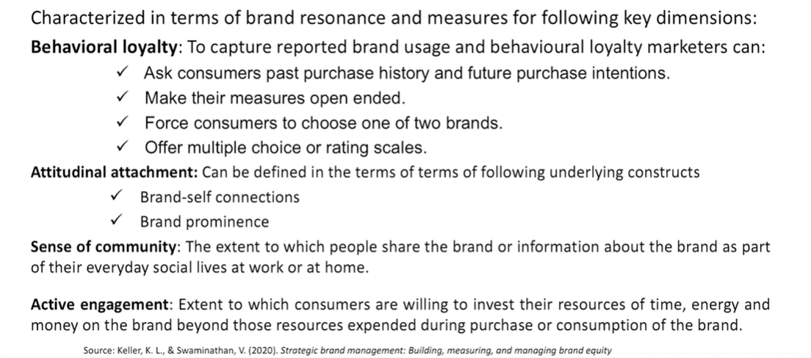

# Lecture 50: Brand Audit and Research

* Definition  
  - Brand audit is the comprehensive examination of a brand to discover its sources of brand equity - Keller et al, 2008

## Concept of Brand Audit

* External-oriented
* Customer-focused
* Assess the health of the brand
* Uncover the sources of brand equity
* Suggest ways to improve and leverage the brand equity

## Brand Audit Perspective

* A brand audit reguires understanding sources of brand equity
from the perspective of both the **firm** and the **consumer**.

* **The Firm perspective**
It is necessary to understand exactly what product and services
are currently being offered to the consumer and how they are
being marketed and branded.

* **The Consumer perspective**
It is necessary to dig deeply in their minds and tap perceptions
and beliefs to uncover the meaning of brands and products.

## Brand Audit Steps

The brand audit consists of two steps: the brand inventory and the brand
exploratory.  
1. **Brand Inventory** is to provide a current, comprehensive profile of how all the products and services sold by a company are marketed and branded.  

Brand inventory analysis includes the following descriptions:
1. The names, logos, symbols, characteristic, packaging, slogans, or other
trademark used.
2. The inherent product attributes or historical characteristics of the brand
and pricing, communications, distribution policies, and any other relevant
marketing activity related to the brand.

2. **Brand Exploratory** - 

Provide detailed information about what consumers think of the brand.  
Brand exploratory is reserach acitivity designed to identify potential
sources of brand equity.  

Activities that are useful for brand exploratory are :  
1. Reviewing past studies
2. Interviewing relevant personnel to get some insight.
3. Do qualitative and quantitave research for the wide range

## Brand Audit : Amazon

**Brand inventory**  
* **Product** : A variety of product classifications (Amazon Basic, Amazon Studios, Amazon Fresh, Amazon Kindle, Amazon warehouse, Amazon Prime, Amazon Student, Amazon Mom, One Click Service, Amazon Cloud Drive, Amazon Instant Video, Amazon App Store, Amazon Cloud Player, Amazon MP3, Amazon.com Rewards, Amazon Payments, Private label, Amazon Web Services,
Amazon Entrepreneur Store, Amazon Prime Air, Amazon Mayday, Amazon Publisher)
* **Pricing** : Amazon uses the "value pricing strategy" which is known as the every-day low pricing.
* **Distribution** : Online Channel: Significant cost benefit over other traditional distribution channels (Virtual delivery channel: Kindle, AmazonMP3 & Cloud Player, Amazon Cloud drive)
  * Physical Channel: Half million square feet storage capacity in distribution centers
  * Amazon's Next-Day and Same-Day Guaranteed delivery services
  * 34 fulfilment centers with more than 61 million cubic feet of storage capacity.

Link - https://www.aboutamazon.com.au/news/innovation/a-passon-for-inventing

**Brand Exploratory:**. 
  * Customer-centric online retailer in the world.
  * "Reliable, secure, trustworthy, customer-centric, fast, convenient with variety"
  * Amazon's brand resonance pyramid is well structured, and that there is a great
level of correlation between the rational side and the emotional side.
  * A very wide offering of products and multiple brand extensions place Amazon
competitively in industries involving web & data services (B2B, B2C), consumer
technology, multimedia hosting and streaming, booksellers, catalog-based retail,
and more.

## Objectives of Brand Research

Brand research aims to identify the processes by which brands create
value and develop a portfolio of methodologies for measuring the market
impact of a brand.  
Major objectives of Brand Research are:  
1. Assess customer perception about brand  
2. Assess brand health
3. Assess brand competition
4. Assess brand potentials
5. Assess market opportunities
6. Evaluate brand innovation

> Also I tried to mention on that you if you want to understand that how to reach to heart of someone especially customers then definitely you must understand a reflexive approach, reflexive research approach. 

## Brand Research Techniques

## Qualitative Research Techniques : Free Associations

* Its is a powerful way to profile brand associations, in which subjects are
asked what comes to mind when they think of the brand, without any more
specific probe or cue than perhaps the associated product category.
* For e.g.,
  * What comes to their mind when they think about the brand or the
associated product category
* Help form a rough mental map for the brand.
* Indicate the relative strength, favourability, and uniqueness of brand
associations

## Qualitative Research Techniques : Projective Techniques

* **Projective techniques** are unstructured, indirect forms of questioning
encourage respondents to project their underlying motivations, beliefs,
attitudes or feelings regarding the issues of concern.
* Consumers usually see an incomplete stimulus (e.g., a sentence) and
are asked to complete it. Alternatively, they see an ambiguous stimulus
and are asked to make sense of it. There are three types of projective
techniques:
  * Association techniques
  * Construction techniques
  * Expressive techniques

### 1. Projecive Techniques : Association techniques

### 2. Projective Techniques : Construction Techniques

### 3. Projective Techniques : Expressive Techniques

The respondents see a verbal or visual situation and are asked to
relate the feelings and attitudes of other people to the situation.
* **Role-playing:** Respondents are asked to play the role or to assume
the behavior of someone else.
* **Third-person techniques:** Respondents are presented with a verbal
or visual situation and are asked to relate the beliefs and attitudes
of a third person rather than directly expressing personal beliefs
and attitudes. This person can be entirely hypothetical.
(e.g., "Imagine that a Martian visits a Nike store. What would he tell
his friends when he goes back home?").

## Qualitative Research Techniques : Zaltman Metaphor Elicitation Techniques (ZMET)

## Qualitative Research Techniques : Zaltman Metaphor Elicitation Techniques (ZMET)

* Laddering methods are a useful way to elicit the higher-order benefits
and values offered by the brand beyond immediate product-, user- or
usage-related attributes.
* It works by asking consumers to explain why the first elicited
associations (e.g., a product attribute) are important for them (thus
eliciting the benefits) and then why these benefits are important (thus
eliciting terminal values).

## Qualitative Research Techniques : Neural Research Methods

* Neuromarketing is the study of how the brain responds to marketing
stimuli, including brands.
* For example, some firms are applying sophisticated techniques such as
**EEG (elector encephalograph)** technology to monitor brain activity and
better gauge consumer responses to marketing. 
* It has been used to measure the type of emotional response
consumers exhibit when presented with marketing stimuli.
* Frito-Lay hired neuromarketing firm NeuroFocus to study how
consumers responded to their Cheetos cheese-flavored snack.

## Qualitative Research Techniques : Brand Personality & Values

## Qualitative Research Techniques : Brand Awareness

## Qualitative Research Techniques : Brand Image

## Qualitative Research Techniques : Brand Responses

## Qualitative Research Techniques : Brand Relationships

